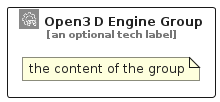

# Open3DEngine


```text
aws-q2-2023/Architecture/Games/Open3DEngine
```

```text
include('aws-q2-2023/Architecture/Games/Open3DEngine')
```


| Illustration | Open3DEngine | Open3DEngineCard | Open3DEngineGroup |
| :---: | :---: | :---: | :---: |
|  |  |  |  |


## Sprites
The item provides the following sriptes:

- `<$Open3DEngineXs>`
- `<$Open3DEngineSm>`
- `<$Open3DEngineMd>`
- `<$Open3DEngineLg>`


## Open3DEngine

### Load remotely
```plantuml
@startuml
' configures the library
!global $LIB_BASE_LOCATION="https://raw.githubusercontent.com/tmorin/plantuml-libs/master/distribution"

' loads the library's bootstrap
!include $LIB_BASE_LOCATION/bootstrap.puml

' loads the package bootstrap
include('aws-q2-2023/bootstrap')

' loads the Item which embeds the element Open3DEngine
include('aws-q2-2023/Architecture/Games/Open3DEngine')

' renders the element
Open3DEngine('Open3DEngine', 'Open3 D Engine', 'an optional tech label', 'an optional description')
@enduml
```

### Load locally
```plantuml
@startuml
' configures the library
!global $INCLUSION_MODE="local"
!global $LIB_BASE_LOCATION="../../.."

' loads the library's bootstrap
!include $LIB_BASE_LOCATION/bootstrap.puml

' loads the package bootstrap
include('aws-q2-2023/bootstrap')

' loads the Item which embeds the element Open3DEngine
include('aws-q2-2023/Architecture/Games/Open3DEngine')

' renders the element
Open3DEngine('Open3DEngine', 'Open3 D Engine', 'an optional tech label', 'an optional description')
@enduml
```

## Open3DEngineCard

### Load remotely
```plantuml
@startuml
' configures the library
!global $LIB_BASE_LOCATION="https://raw.githubusercontent.com/tmorin/plantuml-libs/master/distribution"

' loads the library's bootstrap
!include $LIB_BASE_LOCATION/bootstrap.puml

' loads the package bootstrap
include('aws-q2-2023/bootstrap')

' loads the Item which embeds the element Open3DEngineCard
include('aws-q2-2023/Architecture/Games/Open3DEngine')

' renders the element
Open3DEngineCard('Open3DEngineCard', 'Open3 D Engine Card', 'an optional description')
@enduml
```

### Load locally
```plantuml
@startuml
' configures the library
!global $INCLUSION_MODE="local"
!global $LIB_BASE_LOCATION="../../.."

' loads the library's bootstrap
!include $LIB_BASE_LOCATION/bootstrap.puml

' loads the package bootstrap
include('aws-q2-2023/bootstrap')

' loads the Item which embeds the element Open3DEngineCard
include('aws-q2-2023/Architecture/Games/Open3DEngine')

' renders the element
Open3DEngineCard('Open3DEngineCard', 'Open3 D Engine Card', 'an optional description')
@enduml
```

## Open3DEngineGroup

### Load remotely
```plantuml
@startuml
' configures the library
!global $LIB_BASE_LOCATION="https://raw.githubusercontent.com/tmorin/plantuml-libs/master/distribution"

' loads the library's bootstrap
!include $LIB_BASE_LOCATION/bootstrap.puml

' loads the package bootstrap
include('aws-q2-2023/bootstrap')

' loads the Item which embeds the element Open3DEngineGroup
include('aws-q2-2023/Architecture/Games/Open3DEngine')

' renders the element
Open3DEngineGroup('Open3DEngineGroup', 'Open3 D Engine Group', 'an optional tech label') {
    note as note
        the content of the group
    end note
}
@enduml
```

### Load locally
```plantuml
@startuml
' configures the library
!global $INCLUSION_MODE="local"
!global $LIB_BASE_LOCATION="../../.."

' loads the library's bootstrap
!include $LIB_BASE_LOCATION/bootstrap.puml

' loads the package bootstrap
include('aws-q2-2023/bootstrap')

' loads the Item which embeds the element Open3DEngineGroup
include('aws-q2-2023/Architecture/Games/Open3DEngine')

' renders the element
Open3DEngineGroup('Open3DEngineGroup', 'Open3 D Engine Group', 'an optional tech label') {
    note as note
        the content of the group
    end note
}
@enduml
```

