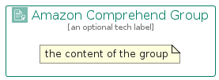

# AmazonComprehend


```text
aws-q2-2023/Architecture/MachineLearning/AmazonComprehend
```

```text
include('aws-q2-2023/Architecture/MachineLearning/AmazonComprehend')
```


| Illustration | AmazonComprehend | AmazonComprehendCard | AmazonComprehendGroup |
| :---: | :---: | :---: | :---: |
|  |  |  |  |


## Sprites
The item provides the following sriptes:

- `<$AmazonComprehendXs>`
- `<$AmazonComprehendSm>`
- `<$AmazonComprehendMd>`
- `<$AmazonComprehendLg>`


## AmazonComprehend

### Load remotely
```plantuml
@startuml
' configures the library
!global $LIB_BASE_LOCATION="https://raw.githubusercontent.com/tmorin/plantuml-libs/master/distribution"

' loads the library's bootstrap
!include $LIB_BASE_LOCATION/bootstrap.puml

' loads the package bootstrap
include('aws-q2-2023/bootstrap')

' loads the Item which embeds the element AmazonComprehend
include('aws-q2-2023/Architecture/MachineLearning/AmazonComprehend')

' renders the element
AmazonComprehend('AmazonComprehend', 'Amazon Comprehend', 'an optional tech label', 'an optional description')
@enduml
```

### Load locally
```plantuml
@startuml
' configures the library
!global $INCLUSION_MODE="local"
!global $LIB_BASE_LOCATION="../../.."

' loads the library's bootstrap
!include $LIB_BASE_LOCATION/bootstrap.puml

' loads the package bootstrap
include('aws-q2-2023/bootstrap')

' loads the Item which embeds the element AmazonComprehend
include('aws-q2-2023/Architecture/MachineLearning/AmazonComprehend')

' renders the element
AmazonComprehend('AmazonComprehend', 'Amazon Comprehend', 'an optional tech label', 'an optional description')
@enduml
```

## AmazonComprehendCard

### Load remotely
```plantuml
@startuml
' configures the library
!global $LIB_BASE_LOCATION="https://raw.githubusercontent.com/tmorin/plantuml-libs/master/distribution"

' loads the library's bootstrap
!include $LIB_BASE_LOCATION/bootstrap.puml

' loads the package bootstrap
include('aws-q2-2023/bootstrap')

' loads the Item which embeds the element AmazonComprehendCard
include('aws-q2-2023/Architecture/MachineLearning/AmazonComprehend')

' renders the element
AmazonComprehendCard('AmazonComprehendCard', 'Amazon Comprehend Card', 'an optional description')
@enduml
```

### Load locally
```plantuml
@startuml
' configures the library
!global $INCLUSION_MODE="local"
!global $LIB_BASE_LOCATION="../../.."

' loads the library's bootstrap
!include $LIB_BASE_LOCATION/bootstrap.puml

' loads the package bootstrap
include('aws-q2-2023/bootstrap')

' loads the Item which embeds the element AmazonComprehendCard
include('aws-q2-2023/Architecture/MachineLearning/AmazonComprehend')

' renders the element
AmazonComprehendCard('AmazonComprehendCard', 'Amazon Comprehend Card', 'an optional description')
@enduml
```

## AmazonComprehendGroup

### Load remotely
```plantuml
@startuml
' configures the library
!global $LIB_BASE_LOCATION="https://raw.githubusercontent.com/tmorin/plantuml-libs/master/distribution"

' loads the library's bootstrap
!include $LIB_BASE_LOCATION/bootstrap.puml

' loads the package bootstrap
include('aws-q2-2023/bootstrap')

' loads the Item which embeds the element AmazonComprehendGroup
include('aws-q2-2023/Architecture/MachineLearning/AmazonComprehend')

' renders the element
AmazonComprehendGroup('AmazonComprehendGroup', 'Amazon Comprehend Group', 'an optional tech label') {
    note as note
        the content of the group
    end note
}
@enduml
```

### Load locally
```plantuml
@startuml
' configures the library
!global $INCLUSION_MODE="local"
!global $LIB_BASE_LOCATION="../../.."

' loads the library's bootstrap
!include $LIB_BASE_LOCATION/bootstrap.puml

' loads the package bootstrap
include('aws-q2-2023/bootstrap')

' loads the Item which embeds the element AmazonComprehendGroup
include('aws-q2-2023/Architecture/MachineLearning/AmazonComprehend')

' renders the element
AmazonComprehendGroup('AmazonComprehendGroup', 'Amazon Comprehend Group', 'an optional tech label') {
    note as note
        the content of the group
    end note
}
@enduml
```

