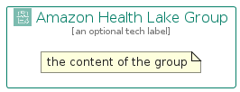

# AmazonHealthLake


```text
aws-q2-2023/Architecture/MachineLearning/AmazonHealthLake
```

```text
include('aws-q2-2023/Architecture/MachineLearning/AmazonHealthLake')
```


| Illustration | AmazonHealthLake | AmazonHealthLakeCard | AmazonHealthLakeGroup |
| :---: | :---: | :---: | :---: |
|  |  |  |  |


## Sprites
The item provides the following sriptes:

- `<$AmazonHealthLakeXs>`
- `<$AmazonHealthLakeSm>`
- `<$AmazonHealthLakeMd>`
- `<$AmazonHealthLakeLg>`


## AmazonHealthLake

### Load remotely
```plantuml
@startuml
' configures the library
!global $LIB_BASE_LOCATION="https://raw.githubusercontent.com/tmorin/plantuml-libs/master/distribution"

' loads the library's bootstrap
!include $LIB_BASE_LOCATION/bootstrap.puml

' loads the package bootstrap
include('aws-q2-2023/bootstrap')

' loads the Item which embeds the element AmazonHealthLake
include('aws-q2-2023/Architecture/MachineLearning/AmazonHealthLake')

' renders the element
AmazonHealthLake('AmazonHealthLake', 'Amazon Health Lake', 'an optional tech label', 'an optional description')
@enduml
```

### Load locally
```plantuml
@startuml
' configures the library
!global $INCLUSION_MODE="local"
!global $LIB_BASE_LOCATION="../../.."

' loads the library's bootstrap
!include $LIB_BASE_LOCATION/bootstrap.puml

' loads the package bootstrap
include('aws-q2-2023/bootstrap')

' loads the Item which embeds the element AmazonHealthLake
include('aws-q2-2023/Architecture/MachineLearning/AmazonHealthLake')

' renders the element
AmazonHealthLake('AmazonHealthLake', 'Amazon Health Lake', 'an optional tech label', 'an optional description')
@enduml
```

## AmazonHealthLakeCard

### Load remotely
```plantuml
@startuml
' configures the library
!global $LIB_BASE_LOCATION="https://raw.githubusercontent.com/tmorin/plantuml-libs/master/distribution"

' loads the library's bootstrap
!include $LIB_BASE_LOCATION/bootstrap.puml

' loads the package bootstrap
include('aws-q2-2023/bootstrap')

' loads the Item which embeds the element AmazonHealthLakeCard
include('aws-q2-2023/Architecture/MachineLearning/AmazonHealthLake')

' renders the element
AmazonHealthLakeCard('AmazonHealthLakeCard', 'Amazon Health Lake Card', 'an optional description')
@enduml
```

### Load locally
```plantuml
@startuml
' configures the library
!global $INCLUSION_MODE="local"
!global $LIB_BASE_LOCATION="../../.."

' loads the library's bootstrap
!include $LIB_BASE_LOCATION/bootstrap.puml

' loads the package bootstrap
include('aws-q2-2023/bootstrap')

' loads the Item which embeds the element AmazonHealthLakeCard
include('aws-q2-2023/Architecture/MachineLearning/AmazonHealthLake')

' renders the element
AmazonHealthLakeCard('AmazonHealthLakeCard', 'Amazon Health Lake Card', 'an optional description')
@enduml
```

## AmazonHealthLakeGroup

### Load remotely
```plantuml
@startuml
' configures the library
!global $LIB_BASE_LOCATION="https://raw.githubusercontent.com/tmorin/plantuml-libs/master/distribution"

' loads the library's bootstrap
!include $LIB_BASE_LOCATION/bootstrap.puml

' loads the package bootstrap
include('aws-q2-2023/bootstrap')

' loads the Item which embeds the element AmazonHealthLakeGroup
include('aws-q2-2023/Architecture/MachineLearning/AmazonHealthLake')

' renders the element
AmazonHealthLakeGroup('AmazonHealthLakeGroup', 'Amazon Health Lake Group', 'an optional tech label') {
    note as note
        the content of the group
    end note
}
@enduml
```

### Load locally
```plantuml
@startuml
' configures the library
!global $INCLUSION_MODE="local"
!global $LIB_BASE_LOCATION="../../.."

' loads the library's bootstrap
!include $LIB_BASE_LOCATION/bootstrap.puml

' loads the package bootstrap
include('aws-q2-2023/bootstrap')

' loads the Item which embeds the element AmazonHealthLakeGroup
include('aws-q2-2023/Architecture/MachineLearning/AmazonHealthLake')

' renders the element
AmazonHealthLakeGroup('AmazonHealthLakeGroup', 'Amazon Health Lake Group', 'an optional tech label') {
    note as note
        the content of the group
    end note
}
@enduml
```

