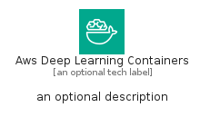

# AwsDeepLearningContainers


```text
aws-q2-2023/Architecture/MachineLearning/AwsDeepLearningContainers
```

```text
include('aws-q2-2023/Architecture/MachineLearning/AwsDeepLearningContainers')
```


| Illustration | AwsDeepLearningContainers | AwsDeepLearningContainersCard | AwsDeepLearningContainersGroup |
| :---: | :---: | :---: | :---: |
|  |  |  |  |


## Sprites
The item provides the following sriptes:

- `<$AwsDeepLearningContainersXs>`
- `<$AwsDeepLearningContainersSm>`
- `<$AwsDeepLearningContainersMd>`
- `<$AwsDeepLearningContainersLg>`


## AwsDeepLearningContainers

### Load remotely
```plantuml
@startuml
' configures the library
!global $LIB_BASE_LOCATION="https://raw.githubusercontent.com/tmorin/plantuml-libs/master/distribution"

' loads the library's bootstrap
!include $LIB_BASE_LOCATION/bootstrap.puml

' loads the package bootstrap
include('aws-q2-2023/bootstrap')

' loads the Item which embeds the element AwsDeepLearningContainers
include('aws-q2-2023/Architecture/MachineLearning/AwsDeepLearningContainers')

' renders the element
AwsDeepLearningContainers('AwsDeepLearningContainers', 'Aws Deep Learning Containers', 'an optional tech label', 'an optional description')
@enduml
```

### Load locally
```plantuml
@startuml
' configures the library
!global $INCLUSION_MODE="local"
!global $LIB_BASE_LOCATION="../../.."

' loads the library's bootstrap
!include $LIB_BASE_LOCATION/bootstrap.puml

' loads the package bootstrap
include('aws-q2-2023/bootstrap')

' loads the Item which embeds the element AwsDeepLearningContainers
include('aws-q2-2023/Architecture/MachineLearning/AwsDeepLearningContainers')

' renders the element
AwsDeepLearningContainers('AwsDeepLearningContainers', 'Aws Deep Learning Containers', 'an optional tech label', 'an optional description')
@enduml
```

## AwsDeepLearningContainersCard

### Load remotely
```plantuml
@startuml
' configures the library
!global $LIB_BASE_LOCATION="https://raw.githubusercontent.com/tmorin/plantuml-libs/master/distribution"

' loads the library's bootstrap
!include $LIB_BASE_LOCATION/bootstrap.puml

' loads the package bootstrap
include('aws-q2-2023/bootstrap')

' loads the Item which embeds the element AwsDeepLearningContainersCard
include('aws-q2-2023/Architecture/MachineLearning/AwsDeepLearningContainers')

' renders the element
AwsDeepLearningContainersCard('AwsDeepLearningContainersCard', 'Aws Deep Learning Containers Card', 'an optional description')
@enduml
```

### Load locally
```plantuml
@startuml
' configures the library
!global $INCLUSION_MODE="local"
!global $LIB_BASE_LOCATION="../../.."

' loads the library's bootstrap
!include $LIB_BASE_LOCATION/bootstrap.puml

' loads the package bootstrap
include('aws-q2-2023/bootstrap')

' loads the Item which embeds the element AwsDeepLearningContainersCard
include('aws-q2-2023/Architecture/MachineLearning/AwsDeepLearningContainers')

' renders the element
AwsDeepLearningContainersCard('AwsDeepLearningContainersCard', 'Aws Deep Learning Containers Card', 'an optional description')
@enduml
```

## AwsDeepLearningContainersGroup

### Load remotely
```plantuml
@startuml
' configures the library
!global $LIB_BASE_LOCATION="https://raw.githubusercontent.com/tmorin/plantuml-libs/master/distribution"

' loads the library's bootstrap
!include $LIB_BASE_LOCATION/bootstrap.puml

' loads the package bootstrap
include('aws-q2-2023/bootstrap')

' loads the Item which embeds the element AwsDeepLearningContainersGroup
include('aws-q2-2023/Architecture/MachineLearning/AwsDeepLearningContainers')

' renders the element
AwsDeepLearningContainersGroup('AwsDeepLearningContainersGroup', 'Aws Deep Learning Containers Group', 'an optional tech label') {
    note as note
        the content of the group
    end note
}
@enduml
```

### Load locally
```plantuml
@startuml
' configures the library
!global $INCLUSION_MODE="local"
!global $LIB_BASE_LOCATION="../../.."

' loads the library's bootstrap
!include $LIB_BASE_LOCATION/bootstrap.puml

' loads the package bootstrap
include('aws-q2-2023/bootstrap')

' loads the Item which embeds the element AwsDeepLearningContainersGroup
include('aws-q2-2023/Architecture/MachineLearning/AwsDeepLearningContainers')

' renders the element
AwsDeepLearningContainersGroup('AwsDeepLearningContainersGroup', 'Aws Deep Learning Containers Group', 'an optional tech label') {
    note as note
        the content of the group
    end note
}
@enduml
```

