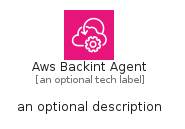
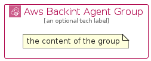

# AwsBackintAgent


```text
aws-q2-2023/Architecture/ManagementGovernance/AwsBackintAgent
```

```text
include('aws-q2-2023/Architecture/ManagementGovernance/AwsBackintAgent')
```


| Illustration | AwsBackintAgent | AwsBackintAgentCard | AwsBackintAgentGroup |
| :---: | :---: | :---: | :---: |
|  |  |  |  |


## Sprites
The item provides the following sriptes:

- `<$AwsBackintAgentXs>`
- `<$AwsBackintAgentSm>`
- `<$AwsBackintAgentMd>`
- `<$AwsBackintAgentLg>`


## AwsBackintAgent

### Load remotely
```plantuml
@startuml
' configures the library
!global $LIB_BASE_LOCATION="https://raw.githubusercontent.com/tmorin/plantuml-libs/master/distribution"

' loads the library's bootstrap
!include $LIB_BASE_LOCATION/bootstrap.puml

' loads the package bootstrap
include('aws-q2-2023/bootstrap')

' loads the Item which embeds the element AwsBackintAgent
include('aws-q2-2023/Architecture/ManagementGovernance/AwsBackintAgent')

' renders the element
AwsBackintAgent('AwsBackintAgent', 'Aws Backint Agent', 'an optional tech label', 'an optional description')
@enduml
```

### Load locally
```plantuml
@startuml
' configures the library
!global $INCLUSION_MODE="local"
!global $LIB_BASE_LOCATION="../../.."

' loads the library's bootstrap
!include $LIB_BASE_LOCATION/bootstrap.puml

' loads the package bootstrap
include('aws-q2-2023/bootstrap')

' loads the Item which embeds the element AwsBackintAgent
include('aws-q2-2023/Architecture/ManagementGovernance/AwsBackintAgent')

' renders the element
AwsBackintAgent('AwsBackintAgent', 'Aws Backint Agent', 'an optional tech label', 'an optional description')
@enduml
```

## AwsBackintAgentCard

### Load remotely
```plantuml
@startuml
' configures the library
!global $LIB_BASE_LOCATION="https://raw.githubusercontent.com/tmorin/plantuml-libs/master/distribution"

' loads the library's bootstrap
!include $LIB_BASE_LOCATION/bootstrap.puml

' loads the package bootstrap
include('aws-q2-2023/bootstrap')

' loads the Item which embeds the element AwsBackintAgentCard
include('aws-q2-2023/Architecture/ManagementGovernance/AwsBackintAgent')

' renders the element
AwsBackintAgentCard('AwsBackintAgentCard', 'Aws Backint Agent Card', 'an optional description')
@enduml
```

### Load locally
```plantuml
@startuml
' configures the library
!global $INCLUSION_MODE="local"
!global $LIB_BASE_LOCATION="../../.."

' loads the library's bootstrap
!include $LIB_BASE_LOCATION/bootstrap.puml

' loads the package bootstrap
include('aws-q2-2023/bootstrap')

' loads the Item which embeds the element AwsBackintAgentCard
include('aws-q2-2023/Architecture/ManagementGovernance/AwsBackintAgent')

' renders the element
AwsBackintAgentCard('AwsBackintAgentCard', 'Aws Backint Agent Card', 'an optional description')
@enduml
```

## AwsBackintAgentGroup

### Load remotely
```plantuml
@startuml
' configures the library
!global $LIB_BASE_LOCATION="https://raw.githubusercontent.com/tmorin/plantuml-libs/master/distribution"

' loads the library's bootstrap
!include $LIB_BASE_LOCATION/bootstrap.puml

' loads the package bootstrap
include('aws-q2-2023/bootstrap')

' loads the Item which embeds the element AwsBackintAgentGroup
include('aws-q2-2023/Architecture/ManagementGovernance/AwsBackintAgent')

' renders the element
AwsBackintAgentGroup('AwsBackintAgentGroup', 'Aws Backint Agent Group', 'an optional tech label') {
    note as note
        the content of the group
    end note
}
@enduml
```

### Load locally
```plantuml
@startuml
' configures the library
!global $INCLUSION_MODE="local"
!global $LIB_BASE_LOCATION="../../.."

' loads the library's bootstrap
!include $LIB_BASE_LOCATION/bootstrap.puml

' loads the package bootstrap
include('aws-q2-2023/bootstrap')

' loads the Item which embeds the element AwsBackintAgentGroup
include('aws-q2-2023/Architecture/ManagementGovernance/AwsBackintAgent')

' renders the element
AwsBackintAgentGroup('AwsBackintAgentGroup', 'Aws Backint Agent Group', 'an optional tech label') {
    note as note
        the content of the group
    end note
}
@enduml
```

