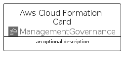
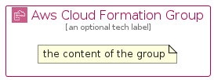

# AwsCloudFormation


```text
aws-q2-2023/Architecture/ManagementGovernance/AwsCloudFormation
```

```text
include('aws-q2-2023/Architecture/ManagementGovernance/AwsCloudFormation')
```


| Illustration | AwsCloudFormation | AwsCloudFormationCard | AwsCloudFormationGroup |
| :---: | :---: | :---: | :---: |
|  |  |  |  |


## Sprites
The item provides the following sriptes:

- `<$AwsCloudFormationXs>`
- `<$AwsCloudFormationSm>`
- `<$AwsCloudFormationMd>`
- `<$AwsCloudFormationLg>`


## AwsCloudFormation

### Load remotely
```plantuml
@startuml
' configures the library
!global $LIB_BASE_LOCATION="https://raw.githubusercontent.com/tmorin/plantuml-libs/master/distribution"

' loads the library's bootstrap
!include $LIB_BASE_LOCATION/bootstrap.puml

' loads the package bootstrap
include('aws-q2-2023/bootstrap')

' loads the Item which embeds the element AwsCloudFormation
include('aws-q2-2023/Architecture/ManagementGovernance/AwsCloudFormation')

' renders the element
AwsCloudFormation('AwsCloudFormation', 'Aws Cloud Formation', 'an optional tech label', 'an optional description')
@enduml
```

### Load locally
```plantuml
@startuml
' configures the library
!global $INCLUSION_MODE="local"
!global $LIB_BASE_LOCATION="../../.."

' loads the library's bootstrap
!include $LIB_BASE_LOCATION/bootstrap.puml

' loads the package bootstrap
include('aws-q2-2023/bootstrap')

' loads the Item which embeds the element AwsCloudFormation
include('aws-q2-2023/Architecture/ManagementGovernance/AwsCloudFormation')

' renders the element
AwsCloudFormation('AwsCloudFormation', 'Aws Cloud Formation', 'an optional tech label', 'an optional description')
@enduml
```

## AwsCloudFormationCard

### Load remotely
```plantuml
@startuml
' configures the library
!global $LIB_BASE_LOCATION="https://raw.githubusercontent.com/tmorin/plantuml-libs/master/distribution"

' loads the library's bootstrap
!include $LIB_BASE_LOCATION/bootstrap.puml

' loads the package bootstrap
include('aws-q2-2023/bootstrap')

' loads the Item which embeds the element AwsCloudFormationCard
include('aws-q2-2023/Architecture/ManagementGovernance/AwsCloudFormation')

' renders the element
AwsCloudFormationCard('AwsCloudFormationCard', 'Aws Cloud Formation Card', 'an optional description')
@enduml
```

### Load locally
```plantuml
@startuml
' configures the library
!global $INCLUSION_MODE="local"
!global $LIB_BASE_LOCATION="../../.."

' loads the library's bootstrap
!include $LIB_BASE_LOCATION/bootstrap.puml

' loads the package bootstrap
include('aws-q2-2023/bootstrap')

' loads the Item which embeds the element AwsCloudFormationCard
include('aws-q2-2023/Architecture/ManagementGovernance/AwsCloudFormation')

' renders the element
AwsCloudFormationCard('AwsCloudFormationCard', 'Aws Cloud Formation Card', 'an optional description')
@enduml
```

## AwsCloudFormationGroup

### Load remotely
```plantuml
@startuml
' configures the library
!global $LIB_BASE_LOCATION="https://raw.githubusercontent.com/tmorin/plantuml-libs/master/distribution"

' loads the library's bootstrap
!include $LIB_BASE_LOCATION/bootstrap.puml

' loads the package bootstrap
include('aws-q2-2023/bootstrap')

' loads the Item which embeds the element AwsCloudFormationGroup
include('aws-q2-2023/Architecture/ManagementGovernance/AwsCloudFormation')

' renders the element
AwsCloudFormationGroup('AwsCloudFormationGroup', 'Aws Cloud Formation Group', 'an optional tech label') {
    note as note
        the content of the group
    end note
}
@enduml
```

### Load locally
```plantuml
@startuml
' configures the library
!global $INCLUSION_MODE="local"
!global $LIB_BASE_LOCATION="../../.."

' loads the library's bootstrap
!include $LIB_BASE_LOCATION/bootstrap.puml

' loads the package bootstrap
include('aws-q2-2023/bootstrap')

' loads the Item which embeds the element AwsCloudFormationGroup
include('aws-q2-2023/Architecture/ManagementGovernance/AwsCloudFormation')

' renders the element
AwsCloudFormationGroup('AwsCloudFormationGroup', 'Aws Cloud Formation Group', 'an optional tech label') {
    note as note
        the content of the group
    end note
}
@enduml
```

