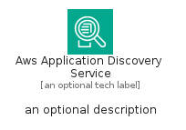
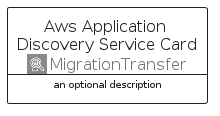

# AwsApplicationDiscoveryService


```text
aws-q2-2023/Architecture/MigrationTransfer/AwsApplicationDiscoveryService
```

```text
include('aws-q2-2023/Architecture/MigrationTransfer/AwsApplicationDiscoveryService')
```


| Illustration | AwsApplicationDiscoveryService | AwsApplicationDiscoveryServiceCard | AwsApplicationDiscoveryServiceGroup |
| :---: | :---: | :---: | :---: |
|  |  |  |  |


## Sprites
The item provides the following sriptes:

- `<$AwsApplicationDiscoveryServiceXs>`
- `<$AwsApplicationDiscoveryServiceSm>`
- `<$AwsApplicationDiscoveryServiceMd>`
- `<$AwsApplicationDiscoveryServiceLg>`


## AwsApplicationDiscoveryService

### Load remotely
```plantuml
@startuml
' configures the library
!global $LIB_BASE_LOCATION="https://raw.githubusercontent.com/tmorin/plantuml-libs/master/distribution"

' loads the library's bootstrap
!include $LIB_BASE_LOCATION/bootstrap.puml

' loads the package bootstrap
include('aws-q2-2023/bootstrap')

' loads the Item which embeds the element AwsApplicationDiscoveryService
include('aws-q2-2023/Architecture/MigrationTransfer/AwsApplicationDiscoveryService')

' renders the element
AwsApplicationDiscoveryService('AwsApplicationDiscoveryService', 'Aws Application Discovery Service', 'an optional tech label', 'an optional description')
@enduml
```

### Load locally
```plantuml
@startuml
' configures the library
!global $INCLUSION_MODE="local"
!global $LIB_BASE_LOCATION="../../.."

' loads the library's bootstrap
!include $LIB_BASE_LOCATION/bootstrap.puml

' loads the package bootstrap
include('aws-q2-2023/bootstrap')

' loads the Item which embeds the element AwsApplicationDiscoveryService
include('aws-q2-2023/Architecture/MigrationTransfer/AwsApplicationDiscoveryService')

' renders the element
AwsApplicationDiscoveryService('AwsApplicationDiscoveryService', 'Aws Application Discovery Service', 'an optional tech label', 'an optional description')
@enduml
```

## AwsApplicationDiscoveryServiceCard

### Load remotely
```plantuml
@startuml
' configures the library
!global $LIB_BASE_LOCATION="https://raw.githubusercontent.com/tmorin/plantuml-libs/master/distribution"

' loads the library's bootstrap
!include $LIB_BASE_LOCATION/bootstrap.puml

' loads the package bootstrap
include('aws-q2-2023/bootstrap')

' loads the Item which embeds the element AwsApplicationDiscoveryServiceCard
include('aws-q2-2023/Architecture/MigrationTransfer/AwsApplicationDiscoveryService')

' renders the element
AwsApplicationDiscoveryServiceCard('AwsApplicationDiscoveryServiceCard', 'Aws Application Discovery Service Card', 'an optional description')
@enduml
```

### Load locally
```plantuml
@startuml
' configures the library
!global $INCLUSION_MODE="local"
!global $LIB_BASE_LOCATION="../../.."

' loads the library's bootstrap
!include $LIB_BASE_LOCATION/bootstrap.puml

' loads the package bootstrap
include('aws-q2-2023/bootstrap')

' loads the Item which embeds the element AwsApplicationDiscoveryServiceCard
include('aws-q2-2023/Architecture/MigrationTransfer/AwsApplicationDiscoveryService')

' renders the element
AwsApplicationDiscoveryServiceCard('AwsApplicationDiscoveryServiceCard', 'Aws Application Discovery Service Card', 'an optional description')
@enduml
```

## AwsApplicationDiscoveryServiceGroup

### Load remotely
```plantuml
@startuml
' configures the library
!global $LIB_BASE_LOCATION="https://raw.githubusercontent.com/tmorin/plantuml-libs/master/distribution"

' loads the library's bootstrap
!include $LIB_BASE_LOCATION/bootstrap.puml

' loads the package bootstrap
include('aws-q2-2023/bootstrap')

' loads the Item which embeds the element AwsApplicationDiscoveryServiceGroup
include('aws-q2-2023/Architecture/MigrationTransfer/AwsApplicationDiscoveryService')

' renders the element
AwsApplicationDiscoveryServiceGroup('AwsApplicationDiscoveryServiceGroup', 'Aws Application Discovery Service Group', 'an optional tech label') {
    note as note
        the content of the group
    end note
}
@enduml
```

### Load locally
```plantuml
@startuml
' configures the library
!global $INCLUSION_MODE="local"
!global $LIB_BASE_LOCATION="../../.."

' loads the library's bootstrap
!include $LIB_BASE_LOCATION/bootstrap.puml

' loads the package bootstrap
include('aws-q2-2023/bootstrap')

' loads the Item which embeds the element AwsApplicationDiscoveryServiceGroup
include('aws-q2-2023/Architecture/MigrationTransfer/AwsApplicationDiscoveryService')

' renders the element
AwsApplicationDiscoveryServiceGroup('AwsApplicationDiscoveryServiceGroup', 'Aws Application Discovery Service Group', 'an optional tech label') {
    note as note
        the content of the group
    end note
}
@enduml
```

