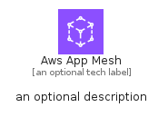

# AwsAppMesh


```text
aws-q2-2023/Architecture/NetworkingContentDelivery/AwsAppMesh
```

```text
include('aws-q2-2023/Architecture/NetworkingContentDelivery/AwsAppMesh')
```


| Illustration | AwsAppMesh | AwsAppMeshCard | AwsAppMeshGroup |
| :---: | :---: | :---: | :---: |
|  |  |  |  |


## Sprites
The item provides the following sriptes:

- `<$AwsAppMeshXs>`
- `<$AwsAppMeshSm>`
- `<$AwsAppMeshMd>`
- `<$AwsAppMeshLg>`


## AwsAppMesh

### Load remotely
```plantuml
@startuml
' configures the library
!global $LIB_BASE_LOCATION="https://raw.githubusercontent.com/tmorin/plantuml-libs/master/distribution"

' loads the library's bootstrap
!include $LIB_BASE_LOCATION/bootstrap.puml

' loads the package bootstrap
include('aws-q2-2023/bootstrap')

' loads the Item which embeds the element AwsAppMesh
include('aws-q2-2023/Architecture/NetworkingContentDelivery/AwsAppMesh')

' renders the element
AwsAppMesh('AwsAppMesh', 'Aws App Mesh', 'an optional tech label', 'an optional description')
@enduml
```

### Load locally
```plantuml
@startuml
' configures the library
!global $INCLUSION_MODE="local"
!global $LIB_BASE_LOCATION="../../.."

' loads the library's bootstrap
!include $LIB_BASE_LOCATION/bootstrap.puml

' loads the package bootstrap
include('aws-q2-2023/bootstrap')

' loads the Item which embeds the element AwsAppMesh
include('aws-q2-2023/Architecture/NetworkingContentDelivery/AwsAppMesh')

' renders the element
AwsAppMesh('AwsAppMesh', 'Aws App Mesh', 'an optional tech label', 'an optional description')
@enduml
```

## AwsAppMeshCard

### Load remotely
```plantuml
@startuml
' configures the library
!global $LIB_BASE_LOCATION="https://raw.githubusercontent.com/tmorin/plantuml-libs/master/distribution"

' loads the library's bootstrap
!include $LIB_BASE_LOCATION/bootstrap.puml

' loads the package bootstrap
include('aws-q2-2023/bootstrap')

' loads the Item which embeds the element AwsAppMeshCard
include('aws-q2-2023/Architecture/NetworkingContentDelivery/AwsAppMesh')

' renders the element
AwsAppMeshCard('AwsAppMeshCard', 'Aws App Mesh Card', 'an optional description')
@enduml
```

### Load locally
```plantuml
@startuml
' configures the library
!global $INCLUSION_MODE="local"
!global $LIB_BASE_LOCATION="../../.."

' loads the library's bootstrap
!include $LIB_BASE_LOCATION/bootstrap.puml

' loads the package bootstrap
include('aws-q2-2023/bootstrap')

' loads the Item which embeds the element AwsAppMeshCard
include('aws-q2-2023/Architecture/NetworkingContentDelivery/AwsAppMesh')

' renders the element
AwsAppMeshCard('AwsAppMeshCard', 'Aws App Mesh Card', 'an optional description')
@enduml
```

## AwsAppMeshGroup

### Load remotely
```plantuml
@startuml
' configures the library
!global $LIB_BASE_LOCATION="https://raw.githubusercontent.com/tmorin/plantuml-libs/master/distribution"

' loads the library's bootstrap
!include $LIB_BASE_LOCATION/bootstrap.puml

' loads the package bootstrap
include('aws-q2-2023/bootstrap')

' loads the Item which embeds the element AwsAppMeshGroup
include('aws-q2-2023/Architecture/NetworkingContentDelivery/AwsAppMesh')

' renders the element
AwsAppMeshGroup('AwsAppMeshGroup', 'Aws App Mesh Group', 'an optional tech label') {
    note as note
        the content of the group
    end note
}
@enduml
```

### Load locally
```plantuml
@startuml
' configures the library
!global $INCLUSION_MODE="local"
!global $LIB_BASE_LOCATION="../../.."

' loads the library's bootstrap
!include $LIB_BASE_LOCATION/bootstrap.puml

' loads the package bootstrap
include('aws-q2-2023/bootstrap')

' loads the Item which embeds the element AwsAppMeshGroup
include('aws-q2-2023/Architecture/NetworkingContentDelivery/AwsAppMesh')

' renders the element
AwsAppMeshGroup('AwsAppMeshGroup', 'Aws App Mesh Group', 'an optional tech label') {
    note as note
        the content of the group
    end note
}
@enduml
```

