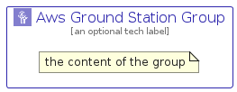

# AwsGroundStation


```text
aws-q2-2023/Architecture/Satellite/AwsGroundStation
```

```text
include('aws-q2-2023/Architecture/Satellite/AwsGroundStation')
```


| Illustration | AwsGroundStation | AwsGroundStationCard | AwsGroundStationGroup |
| :---: | :---: | :---: | :---: |
|  |  |  |  |


## Sprites
The item provides the following sriptes:

- `<$AwsGroundStationXs>`
- `<$AwsGroundStationSm>`
- `<$AwsGroundStationMd>`
- `<$AwsGroundStationLg>`


## AwsGroundStation

### Load remotely
```plantuml
@startuml
' configures the library
!global $LIB_BASE_LOCATION="https://raw.githubusercontent.com/tmorin/plantuml-libs/master/distribution"

' loads the library's bootstrap
!include $LIB_BASE_LOCATION/bootstrap.puml

' loads the package bootstrap
include('aws-q2-2023/bootstrap')

' loads the Item which embeds the element AwsGroundStation
include('aws-q2-2023/Architecture/Satellite/AwsGroundStation')

' renders the element
AwsGroundStation('AwsGroundStation', 'Aws Ground Station', 'an optional tech label', 'an optional description')
@enduml
```

### Load locally
```plantuml
@startuml
' configures the library
!global $INCLUSION_MODE="local"
!global $LIB_BASE_LOCATION="../../.."

' loads the library's bootstrap
!include $LIB_BASE_LOCATION/bootstrap.puml

' loads the package bootstrap
include('aws-q2-2023/bootstrap')

' loads the Item which embeds the element AwsGroundStation
include('aws-q2-2023/Architecture/Satellite/AwsGroundStation')

' renders the element
AwsGroundStation('AwsGroundStation', 'Aws Ground Station', 'an optional tech label', 'an optional description')
@enduml
```

## AwsGroundStationCard

### Load remotely
```plantuml
@startuml
' configures the library
!global $LIB_BASE_LOCATION="https://raw.githubusercontent.com/tmorin/plantuml-libs/master/distribution"

' loads the library's bootstrap
!include $LIB_BASE_LOCATION/bootstrap.puml

' loads the package bootstrap
include('aws-q2-2023/bootstrap')

' loads the Item which embeds the element AwsGroundStationCard
include('aws-q2-2023/Architecture/Satellite/AwsGroundStation')

' renders the element
AwsGroundStationCard('AwsGroundStationCard', 'Aws Ground Station Card', 'an optional description')
@enduml
```

### Load locally
```plantuml
@startuml
' configures the library
!global $INCLUSION_MODE="local"
!global $LIB_BASE_LOCATION="../../.."

' loads the library's bootstrap
!include $LIB_BASE_LOCATION/bootstrap.puml

' loads the package bootstrap
include('aws-q2-2023/bootstrap')

' loads the Item which embeds the element AwsGroundStationCard
include('aws-q2-2023/Architecture/Satellite/AwsGroundStation')

' renders the element
AwsGroundStationCard('AwsGroundStationCard', 'Aws Ground Station Card', 'an optional description')
@enduml
```

## AwsGroundStationGroup

### Load remotely
```plantuml
@startuml
' configures the library
!global $LIB_BASE_LOCATION="https://raw.githubusercontent.com/tmorin/plantuml-libs/master/distribution"

' loads the library's bootstrap
!include $LIB_BASE_LOCATION/bootstrap.puml

' loads the package bootstrap
include('aws-q2-2023/bootstrap')

' loads the Item which embeds the element AwsGroundStationGroup
include('aws-q2-2023/Architecture/Satellite/AwsGroundStation')

' renders the element
AwsGroundStationGroup('AwsGroundStationGroup', 'Aws Ground Station Group', 'an optional tech label') {
    note as note
        the content of the group
    end note
}
@enduml
```

### Load locally
```plantuml
@startuml
' configures the library
!global $INCLUSION_MODE="local"
!global $LIB_BASE_LOCATION="../../.."

' loads the library's bootstrap
!include $LIB_BASE_LOCATION/bootstrap.puml

' loads the package bootstrap
include('aws-q2-2023/bootstrap')

' loads the Item which embeds the element AwsGroundStationGroup
include('aws-q2-2023/Architecture/Satellite/AwsGroundStation')

' renders the element
AwsGroundStationGroup('AwsGroundStationGroup', 'Aws Ground Station Group', 'an optional tech label') {
    note as note
        the content of the group
    end note
}
@enduml
```

