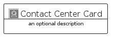

# ContactCenter


```text
aws-q2-2023/Category/ContactCenter
```

```text
include('aws-q2-2023/Category/ContactCenter')
```


| Illustration | ContactCenter | ContactCenterCard | ContactCenterGroup |
| :---: | :---: | :---: | :---: |
|  |  |  |  |


## Sprites
The item provides the following sriptes:

- `<$ContactCenterXs>`
- `<$ContactCenterSm>`
- `<$ContactCenterMd>`
- `<$ContactCenterLg>`


## ContactCenter

### Load remotely
```plantuml
@startuml
' configures the library
!global $LIB_BASE_LOCATION="https://raw.githubusercontent.com/tmorin/plantuml-libs/master/distribution"

' loads the library's bootstrap
!include $LIB_BASE_LOCATION/bootstrap.puml

' loads the package bootstrap
include('aws-q2-2023/bootstrap')

' loads the Item which embeds the element ContactCenter
include('aws-q2-2023/Category/ContactCenter')

' renders the element
ContactCenter('ContactCenter', 'Contact Center', 'an optional tech label', 'an optional description')
@enduml
```

### Load locally
```plantuml
@startuml
' configures the library
!global $INCLUSION_MODE="local"
!global $LIB_BASE_LOCATION="../.."

' loads the library's bootstrap
!include $LIB_BASE_LOCATION/bootstrap.puml

' loads the package bootstrap
include('aws-q2-2023/bootstrap')

' loads the Item which embeds the element ContactCenter
include('aws-q2-2023/Category/ContactCenter')

' renders the element
ContactCenter('ContactCenter', 'Contact Center', 'an optional tech label', 'an optional description')
@enduml
```

## ContactCenterCard

### Load remotely
```plantuml
@startuml
' configures the library
!global $LIB_BASE_LOCATION="https://raw.githubusercontent.com/tmorin/plantuml-libs/master/distribution"

' loads the library's bootstrap
!include $LIB_BASE_LOCATION/bootstrap.puml

' loads the package bootstrap
include('aws-q2-2023/bootstrap')

' loads the Item which embeds the element ContactCenterCard
include('aws-q2-2023/Category/ContactCenter')

' renders the element
ContactCenterCard('ContactCenterCard', 'Contact Center Card', 'an optional description')
@enduml
```

### Load locally
```plantuml
@startuml
' configures the library
!global $INCLUSION_MODE="local"
!global $LIB_BASE_LOCATION="../.."

' loads the library's bootstrap
!include $LIB_BASE_LOCATION/bootstrap.puml

' loads the package bootstrap
include('aws-q2-2023/bootstrap')

' loads the Item which embeds the element ContactCenterCard
include('aws-q2-2023/Category/ContactCenter')

' renders the element
ContactCenterCard('ContactCenterCard', 'Contact Center Card', 'an optional description')
@enduml
```

## ContactCenterGroup

### Load remotely
```plantuml
@startuml
' configures the library
!global $LIB_BASE_LOCATION="https://raw.githubusercontent.com/tmorin/plantuml-libs/master/distribution"

' loads the library's bootstrap
!include $LIB_BASE_LOCATION/bootstrap.puml

' loads the package bootstrap
include('aws-q2-2023/bootstrap')

' loads the Item which embeds the element ContactCenterGroup
include('aws-q2-2023/Category/ContactCenter')

' renders the element
ContactCenterGroup('ContactCenterGroup', 'Contact Center Group', 'an optional tech label') {
    note as note
        the content of the group
    end note
}
@enduml
```

### Load locally
```plantuml
@startuml
' configures the library
!global $INCLUSION_MODE="local"
!global $LIB_BASE_LOCATION="../.."

' loads the library's bootstrap
!include $LIB_BASE_LOCATION/bootstrap.puml

' loads the package bootstrap
include('aws-q2-2023/bootstrap')

' loads the Item which embeds the element ContactCenterGroup
include('aws-q2-2023/Category/ContactCenter')

' renders the element
ContactCenterGroup('ContactCenterGroup', 'Contact Center Group', 'an optional tech label') {
    note as note
        the content of the group
    end note
}
@enduml
```

