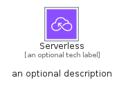
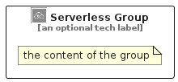

# Serverless


```text
aws-q2-2023/Category/Serverless
```

```text
include('aws-q2-2023/Category/Serverless')
```


| Illustration | Serverless | ServerlessCard | ServerlessGroup |
| :---: | :---: | :---: | :---: |
|  |  |  |  |


## Sprites
The item provides the following sriptes:

- `<$ServerlessXs>`
- `<$ServerlessSm>`
- `<$ServerlessMd>`
- `<$ServerlessLg>`


## Serverless

### Load remotely
```plantuml
@startuml
' configures the library
!global $LIB_BASE_LOCATION="https://raw.githubusercontent.com/tmorin/plantuml-libs/master/distribution"

' loads the library's bootstrap
!include $LIB_BASE_LOCATION/bootstrap.puml

' loads the package bootstrap
include('aws-q2-2023/bootstrap')

' loads the Item which embeds the element Serverless
include('aws-q2-2023/Category/Serverless')

' renders the element
Serverless('Serverless', 'Serverless', 'an optional tech label', 'an optional description')
@enduml
```

### Load locally
```plantuml
@startuml
' configures the library
!global $INCLUSION_MODE="local"
!global $LIB_BASE_LOCATION="../.."

' loads the library's bootstrap
!include $LIB_BASE_LOCATION/bootstrap.puml

' loads the package bootstrap
include('aws-q2-2023/bootstrap')

' loads the Item which embeds the element Serverless
include('aws-q2-2023/Category/Serverless')

' renders the element
Serverless('Serverless', 'Serverless', 'an optional tech label', 'an optional description')
@enduml
```

## ServerlessCard

### Load remotely
```plantuml
@startuml
' configures the library
!global $LIB_BASE_LOCATION="https://raw.githubusercontent.com/tmorin/plantuml-libs/master/distribution"

' loads the library's bootstrap
!include $LIB_BASE_LOCATION/bootstrap.puml

' loads the package bootstrap
include('aws-q2-2023/bootstrap')

' loads the Item which embeds the element ServerlessCard
include('aws-q2-2023/Category/Serverless')

' renders the element
ServerlessCard('ServerlessCard', 'Serverless Card', 'an optional description')
@enduml
```

### Load locally
```plantuml
@startuml
' configures the library
!global $INCLUSION_MODE="local"
!global $LIB_BASE_LOCATION="../.."

' loads the library's bootstrap
!include $LIB_BASE_LOCATION/bootstrap.puml

' loads the package bootstrap
include('aws-q2-2023/bootstrap')

' loads the Item which embeds the element ServerlessCard
include('aws-q2-2023/Category/Serverless')

' renders the element
ServerlessCard('ServerlessCard', 'Serverless Card', 'an optional description')
@enduml
```

## ServerlessGroup

### Load remotely
```plantuml
@startuml
' configures the library
!global $LIB_BASE_LOCATION="https://raw.githubusercontent.com/tmorin/plantuml-libs/master/distribution"

' loads the library's bootstrap
!include $LIB_BASE_LOCATION/bootstrap.puml

' loads the package bootstrap
include('aws-q2-2023/bootstrap')

' loads the Item which embeds the element ServerlessGroup
include('aws-q2-2023/Category/Serverless')

' renders the element
ServerlessGroup('ServerlessGroup', 'Serverless Group', 'an optional tech label') {
    note as note
        the content of the group
    end note
}
@enduml
```

### Load locally
```plantuml
@startuml
' configures the library
!global $INCLUSION_MODE="local"
!global $LIB_BASE_LOCATION="../.."

' loads the library's bootstrap
!include $LIB_BASE_LOCATION/bootstrap.puml

' loads the package bootstrap
include('aws-q2-2023/bootstrap')

' loads the Item which embeds the element ServerlessGroup
include('aws-q2-2023/Category/Serverless')

' renders the element
ServerlessGroup('ServerlessGroup', 'Serverless Group', 'an optional tech label') {
    note as note
        the content of the group
    end note
}
@enduml
```

