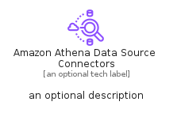
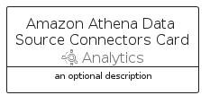

# AmazonAthenaDataSourceConnectors


```text
aws-q2-2023/Resource/Analytics/AmazonAthenaDataSourceConnectors
```

```text
include('aws-q2-2023/Resource/Analytics/AmazonAthenaDataSourceConnectors')
```


| Illustration | AmazonAthenaDataSourceConnectors | AmazonAthenaDataSourceConnectorsCard | AmazonAthenaDataSourceConnectorsGroup |
| :---: | :---: | :---: | :---: |
|  |  |  |  |


## Sprites
The item provides the following sriptes:

- `<$AmazonAthenaDataSourceConnectorsXs>`
- `<$AmazonAthenaDataSourceConnectorsSm>`
- `<$AmazonAthenaDataSourceConnectorsMd>`
- `<$AmazonAthenaDataSourceConnectorsLg>`


## AmazonAthenaDataSourceConnectors

### Load remotely
```plantuml
@startuml
' configures the library
!global $LIB_BASE_LOCATION="https://raw.githubusercontent.com/tmorin/plantuml-libs/master/distribution"

' loads the library's bootstrap
!include $LIB_BASE_LOCATION/bootstrap.puml

' loads the package bootstrap
include('aws-q2-2023/bootstrap')

' loads the Item which embeds the element AmazonAthenaDataSourceConnectors
include('aws-q2-2023/Resource/Analytics/AmazonAthenaDataSourceConnectors')

' renders the element
AmazonAthenaDataSourceConnectors('AmazonAthenaDataSourceConnectors', 'Amazon Athena Data Source Connectors', 'an optional tech label', 'an optional description')
@enduml
```

### Load locally
```plantuml
@startuml
' configures the library
!global $INCLUSION_MODE="local"
!global $LIB_BASE_LOCATION="../../.."

' loads the library's bootstrap
!include $LIB_BASE_LOCATION/bootstrap.puml

' loads the package bootstrap
include('aws-q2-2023/bootstrap')

' loads the Item which embeds the element AmazonAthenaDataSourceConnectors
include('aws-q2-2023/Resource/Analytics/AmazonAthenaDataSourceConnectors')

' renders the element
AmazonAthenaDataSourceConnectors('AmazonAthenaDataSourceConnectors', 'Amazon Athena Data Source Connectors', 'an optional tech label', 'an optional description')
@enduml
```

## AmazonAthenaDataSourceConnectorsCard

### Load remotely
```plantuml
@startuml
' configures the library
!global $LIB_BASE_LOCATION="https://raw.githubusercontent.com/tmorin/plantuml-libs/master/distribution"

' loads the library's bootstrap
!include $LIB_BASE_LOCATION/bootstrap.puml

' loads the package bootstrap
include('aws-q2-2023/bootstrap')

' loads the Item which embeds the element AmazonAthenaDataSourceConnectorsCard
include('aws-q2-2023/Resource/Analytics/AmazonAthenaDataSourceConnectors')

' renders the element
AmazonAthenaDataSourceConnectorsCard('AmazonAthenaDataSourceConnectorsCard', 'Amazon Athena Data Source Connectors Card', 'an optional description')
@enduml
```

### Load locally
```plantuml
@startuml
' configures the library
!global $INCLUSION_MODE="local"
!global $LIB_BASE_LOCATION="../../.."

' loads the library's bootstrap
!include $LIB_BASE_LOCATION/bootstrap.puml

' loads the package bootstrap
include('aws-q2-2023/bootstrap')

' loads the Item which embeds the element AmazonAthenaDataSourceConnectorsCard
include('aws-q2-2023/Resource/Analytics/AmazonAthenaDataSourceConnectors')

' renders the element
AmazonAthenaDataSourceConnectorsCard('AmazonAthenaDataSourceConnectorsCard', 'Amazon Athena Data Source Connectors Card', 'an optional description')
@enduml
```

## AmazonAthenaDataSourceConnectorsGroup

### Load remotely
```plantuml
@startuml
' configures the library
!global $LIB_BASE_LOCATION="https://raw.githubusercontent.com/tmorin/plantuml-libs/master/distribution"

' loads the library's bootstrap
!include $LIB_BASE_LOCATION/bootstrap.puml

' loads the package bootstrap
include('aws-q2-2023/bootstrap')

' loads the Item which embeds the element AmazonAthenaDataSourceConnectorsGroup
include('aws-q2-2023/Resource/Analytics/AmazonAthenaDataSourceConnectors')

' renders the element
AmazonAthenaDataSourceConnectorsGroup('AmazonAthenaDataSourceConnectorsGroup', 'Amazon Athena Data Source Connectors Group', 'an optional tech label') {
    note as note
        the content of the group
    end note
}
@enduml
```

### Load locally
```plantuml
@startuml
' configures the library
!global $INCLUSION_MODE="local"
!global $LIB_BASE_LOCATION="../../.."

' loads the library's bootstrap
!include $LIB_BASE_LOCATION/bootstrap.puml

' loads the package bootstrap
include('aws-q2-2023/bootstrap')

' loads the Item which embeds the element AmazonAthenaDataSourceConnectorsGroup
include('aws-q2-2023/Resource/Analytics/AmazonAthenaDataSourceConnectors')

' renders the element
AmazonAthenaDataSourceConnectorsGroup('AmazonAthenaDataSourceConnectorsGroup', 'Amazon Athena Data Source Connectors Group', 'an optional tech label') {
    note as note
        the content of the group
    end note
}
@enduml
```

