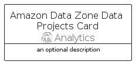
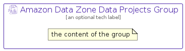

# AmazonDataZoneDataProjects


```text
aws-q2-2023/Resource/Analytics/AmazonDataZoneDataProjects
```

```text
include('aws-q2-2023/Resource/Analytics/AmazonDataZoneDataProjects')
```


| Illustration | AmazonDataZoneDataProjects | AmazonDataZoneDataProjectsCard | AmazonDataZoneDataProjectsGroup |
| :---: | :---: | :---: | :---: |
|  |  |  |  |


## Sprites
The item provides the following sriptes:

- `<$AmazonDataZoneDataProjectsXs>`
- `<$AmazonDataZoneDataProjectsSm>`
- `<$AmazonDataZoneDataProjectsMd>`
- `<$AmazonDataZoneDataProjectsLg>`


## AmazonDataZoneDataProjects

### Load remotely
```plantuml
@startuml
' configures the library
!global $LIB_BASE_LOCATION="https://raw.githubusercontent.com/tmorin/plantuml-libs/master/distribution"

' loads the library's bootstrap
!include $LIB_BASE_LOCATION/bootstrap.puml

' loads the package bootstrap
include('aws-q2-2023/bootstrap')

' loads the Item which embeds the element AmazonDataZoneDataProjects
include('aws-q2-2023/Resource/Analytics/AmazonDataZoneDataProjects')

' renders the element
AmazonDataZoneDataProjects('AmazonDataZoneDataProjects', 'Amazon Data Zone Data Projects', 'an optional tech label', 'an optional description')
@enduml
```

### Load locally
```plantuml
@startuml
' configures the library
!global $INCLUSION_MODE="local"
!global $LIB_BASE_LOCATION="../../.."

' loads the library's bootstrap
!include $LIB_BASE_LOCATION/bootstrap.puml

' loads the package bootstrap
include('aws-q2-2023/bootstrap')

' loads the Item which embeds the element AmazonDataZoneDataProjects
include('aws-q2-2023/Resource/Analytics/AmazonDataZoneDataProjects')

' renders the element
AmazonDataZoneDataProjects('AmazonDataZoneDataProjects', 'Amazon Data Zone Data Projects', 'an optional tech label', 'an optional description')
@enduml
```

## AmazonDataZoneDataProjectsCard

### Load remotely
```plantuml
@startuml
' configures the library
!global $LIB_BASE_LOCATION="https://raw.githubusercontent.com/tmorin/plantuml-libs/master/distribution"

' loads the library's bootstrap
!include $LIB_BASE_LOCATION/bootstrap.puml

' loads the package bootstrap
include('aws-q2-2023/bootstrap')

' loads the Item which embeds the element AmazonDataZoneDataProjectsCard
include('aws-q2-2023/Resource/Analytics/AmazonDataZoneDataProjects')

' renders the element
AmazonDataZoneDataProjectsCard('AmazonDataZoneDataProjectsCard', 'Amazon Data Zone Data Projects Card', 'an optional description')
@enduml
```

### Load locally
```plantuml
@startuml
' configures the library
!global $INCLUSION_MODE="local"
!global $LIB_BASE_LOCATION="../../.."

' loads the library's bootstrap
!include $LIB_BASE_LOCATION/bootstrap.puml

' loads the package bootstrap
include('aws-q2-2023/bootstrap')

' loads the Item which embeds the element AmazonDataZoneDataProjectsCard
include('aws-q2-2023/Resource/Analytics/AmazonDataZoneDataProjects')

' renders the element
AmazonDataZoneDataProjectsCard('AmazonDataZoneDataProjectsCard', 'Amazon Data Zone Data Projects Card', 'an optional description')
@enduml
```

## AmazonDataZoneDataProjectsGroup

### Load remotely
```plantuml
@startuml
' configures the library
!global $LIB_BASE_LOCATION="https://raw.githubusercontent.com/tmorin/plantuml-libs/master/distribution"

' loads the library's bootstrap
!include $LIB_BASE_LOCATION/bootstrap.puml

' loads the package bootstrap
include('aws-q2-2023/bootstrap')

' loads the Item which embeds the element AmazonDataZoneDataProjectsGroup
include('aws-q2-2023/Resource/Analytics/AmazonDataZoneDataProjects')

' renders the element
AmazonDataZoneDataProjectsGroup('AmazonDataZoneDataProjectsGroup', 'Amazon Data Zone Data Projects Group', 'an optional tech label') {
    note as note
        the content of the group
    end note
}
@enduml
```

### Load locally
```plantuml
@startuml
' configures the library
!global $INCLUSION_MODE="local"
!global $LIB_BASE_LOCATION="../../.."

' loads the library's bootstrap
!include $LIB_BASE_LOCATION/bootstrap.puml

' loads the package bootstrap
include('aws-q2-2023/bootstrap')

' loads the Item which embeds the element AmazonDataZoneDataProjectsGroup
include('aws-q2-2023/Resource/Analytics/AmazonDataZoneDataProjects')

' renders the element
AmazonDataZoneDataProjectsGroup('AmazonDataZoneDataProjectsGroup', 'Amazon Data Zone Data Projects Group', 'an optional tech label') {
    note as note
        the content of the group
    end note
}
@enduml
```

