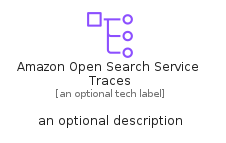

# AmazonOpenSearchServiceTraces


```text
aws-q2-2023/Resource/Analytics/AmazonOpenSearchServiceTraces
```

```text
include('aws-q2-2023/Resource/Analytics/AmazonOpenSearchServiceTraces')
```


| Illustration | AmazonOpenSearchServiceTraces | AmazonOpenSearchServiceTracesCard | AmazonOpenSearchServiceTracesGroup |
| :---: | :---: | :---: | :---: |
|  |  |  |  |


## Sprites
The item provides the following sriptes:

- `<$AmazonOpenSearchServiceTracesXs>`
- `<$AmazonOpenSearchServiceTracesSm>`
- `<$AmazonOpenSearchServiceTracesMd>`
- `<$AmazonOpenSearchServiceTracesLg>`


## AmazonOpenSearchServiceTraces

### Load remotely
```plantuml
@startuml
' configures the library
!global $LIB_BASE_LOCATION="https://raw.githubusercontent.com/tmorin/plantuml-libs/master/distribution"

' loads the library's bootstrap
!include $LIB_BASE_LOCATION/bootstrap.puml

' loads the package bootstrap
include('aws-q2-2023/bootstrap')

' loads the Item which embeds the element AmazonOpenSearchServiceTraces
include('aws-q2-2023/Resource/Analytics/AmazonOpenSearchServiceTraces')

' renders the element
AmazonOpenSearchServiceTraces('AmazonOpenSearchServiceTraces', 'Amazon Open Search Service Traces', 'an optional tech label', 'an optional description')
@enduml
```

### Load locally
```plantuml
@startuml
' configures the library
!global $INCLUSION_MODE="local"
!global $LIB_BASE_LOCATION="../../.."

' loads the library's bootstrap
!include $LIB_BASE_LOCATION/bootstrap.puml

' loads the package bootstrap
include('aws-q2-2023/bootstrap')

' loads the Item which embeds the element AmazonOpenSearchServiceTraces
include('aws-q2-2023/Resource/Analytics/AmazonOpenSearchServiceTraces')

' renders the element
AmazonOpenSearchServiceTraces('AmazonOpenSearchServiceTraces', 'Amazon Open Search Service Traces', 'an optional tech label', 'an optional description')
@enduml
```

## AmazonOpenSearchServiceTracesCard

### Load remotely
```plantuml
@startuml
' configures the library
!global $LIB_BASE_LOCATION="https://raw.githubusercontent.com/tmorin/plantuml-libs/master/distribution"

' loads the library's bootstrap
!include $LIB_BASE_LOCATION/bootstrap.puml

' loads the package bootstrap
include('aws-q2-2023/bootstrap')

' loads the Item which embeds the element AmazonOpenSearchServiceTracesCard
include('aws-q2-2023/Resource/Analytics/AmazonOpenSearchServiceTraces')

' renders the element
AmazonOpenSearchServiceTracesCard('AmazonOpenSearchServiceTracesCard', 'Amazon Open Search Service Traces Card', 'an optional description')
@enduml
```

### Load locally
```plantuml
@startuml
' configures the library
!global $INCLUSION_MODE="local"
!global $LIB_BASE_LOCATION="../../.."

' loads the library's bootstrap
!include $LIB_BASE_LOCATION/bootstrap.puml

' loads the package bootstrap
include('aws-q2-2023/bootstrap')

' loads the Item which embeds the element AmazonOpenSearchServiceTracesCard
include('aws-q2-2023/Resource/Analytics/AmazonOpenSearchServiceTraces')

' renders the element
AmazonOpenSearchServiceTracesCard('AmazonOpenSearchServiceTracesCard', 'Amazon Open Search Service Traces Card', 'an optional description')
@enduml
```

## AmazonOpenSearchServiceTracesGroup

### Load remotely
```plantuml
@startuml
' configures the library
!global $LIB_BASE_LOCATION="https://raw.githubusercontent.com/tmorin/plantuml-libs/master/distribution"

' loads the library's bootstrap
!include $LIB_BASE_LOCATION/bootstrap.puml

' loads the package bootstrap
include('aws-q2-2023/bootstrap')

' loads the Item which embeds the element AmazonOpenSearchServiceTracesGroup
include('aws-q2-2023/Resource/Analytics/AmazonOpenSearchServiceTraces')

' renders the element
AmazonOpenSearchServiceTracesGroup('AmazonOpenSearchServiceTracesGroup', 'Amazon Open Search Service Traces Group', 'an optional tech label') {
    note as note
        the content of the group
    end note
}
@enduml
```

### Load locally
```plantuml
@startuml
' configures the library
!global $INCLUSION_MODE="local"
!global $LIB_BASE_LOCATION="../../.."

' loads the library's bootstrap
!include $LIB_BASE_LOCATION/bootstrap.puml

' loads the package bootstrap
include('aws-q2-2023/bootstrap')

' loads the Item which embeds the element AmazonOpenSearchServiceTracesGroup
include('aws-q2-2023/Resource/Analytics/AmazonOpenSearchServiceTraces')

' renders the element
AmazonOpenSearchServiceTracesGroup('AmazonOpenSearchServiceTracesGroup', 'Amazon Open Search Service Traces Group', 'an optional tech label') {
    note as note
        the content of the group
    end note
}
@enduml
```

