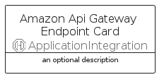
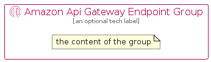

# AmazonApiGatewayEndpoint


```text
aws-q2-2023/Resource/ApplicationIntegration/AmazonApiGatewayEndpoint
```

```text
include('aws-q2-2023/Resource/ApplicationIntegration/AmazonApiGatewayEndpoint')
```


| Illustration | AmazonApiGatewayEndpoint | AmazonApiGatewayEndpointCard | AmazonApiGatewayEndpointGroup |
| :---: | :---: | :---: | :---: |
|  |  |  |  |


## Sprites
The item provides the following sriptes:

- `<$AmazonApiGatewayEndpointXs>`
- `<$AmazonApiGatewayEndpointSm>`
- `<$AmazonApiGatewayEndpointMd>`
- `<$AmazonApiGatewayEndpointLg>`


## AmazonApiGatewayEndpoint

### Load remotely
```plantuml
@startuml
' configures the library
!global $LIB_BASE_LOCATION="https://raw.githubusercontent.com/tmorin/plantuml-libs/master/distribution"

' loads the library's bootstrap
!include $LIB_BASE_LOCATION/bootstrap.puml

' loads the package bootstrap
include('aws-q2-2023/bootstrap')

' loads the Item which embeds the element AmazonApiGatewayEndpoint
include('aws-q2-2023/Resource/ApplicationIntegration/AmazonApiGatewayEndpoint')

' renders the element
AmazonApiGatewayEndpoint('AmazonApiGatewayEndpoint', 'Amazon Api Gateway Endpoint', 'an optional tech label', 'an optional description')
@enduml
```

### Load locally
```plantuml
@startuml
' configures the library
!global $INCLUSION_MODE="local"
!global $LIB_BASE_LOCATION="../../.."

' loads the library's bootstrap
!include $LIB_BASE_LOCATION/bootstrap.puml

' loads the package bootstrap
include('aws-q2-2023/bootstrap')

' loads the Item which embeds the element AmazonApiGatewayEndpoint
include('aws-q2-2023/Resource/ApplicationIntegration/AmazonApiGatewayEndpoint')

' renders the element
AmazonApiGatewayEndpoint('AmazonApiGatewayEndpoint', 'Amazon Api Gateway Endpoint', 'an optional tech label', 'an optional description')
@enduml
```

## AmazonApiGatewayEndpointCard

### Load remotely
```plantuml
@startuml
' configures the library
!global $LIB_BASE_LOCATION="https://raw.githubusercontent.com/tmorin/plantuml-libs/master/distribution"

' loads the library's bootstrap
!include $LIB_BASE_LOCATION/bootstrap.puml

' loads the package bootstrap
include('aws-q2-2023/bootstrap')

' loads the Item which embeds the element AmazonApiGatewayEndpointCard
include('aws-q2-2023/Resource/ApplicationIntegration/AmazonApiGatewayEndpoint')

' renders the element
AmazonApiGatewayEndpointCard('AmazonApiGatewayEndpointCard', 'Amazon Api Gateway Endpoint Card', 'an optional description')
@enduml
```

### Load locally
```plantuml
@startuml
' configures the library
!global $INCLUSION_MODE="local"
!global $LIB_BASE_LOCATION="../../.."

' loads the library's bootstrap
!include $LIB_BASE_LOCATION/bootstrap.puml

' loads the package bootstrap
include('aws-q2-2023/bootstrap')

' loads the Item which embeds the element AmazonApiGatewayEndpointCard
include('aws-q2-2023/Resource/ApplicationIntegration/AmazonApiGatewayEndpoint')

' renders the element
AmazonApiGatewayEndpointCard('AmazonApiGatewayEndpointCard', 'Amazon Api Gateway Endpoint Card', 'an optional description')
@enduml
```

## AmazonApiGatewayEndpointGroup

### Load remotely
```plantuml
@startuml
' configures the library
!global $LIB_BASE_LOCATION="https://raw.githubusercontent.com/tmorin/plantuml-libs/master/distribution"

' loads the library's bootstrap
!include $LIB_BASE_LOCATION/bootstrap.puml

' loads the package bootstrap
include('aws-q2-2023/bootstrap')

' loads the Item which embeds the element AmazonApiGatewayEndpointGroup
include('aws-q2-2023/Resource/ApplicationIntegration/AmazonApiGatewayEndpoint')

' renders the element
AmazonApiGatewayEndpointGroup('AmazonApiGatewayEndpointGroup', 'Amazon Api Gateway Endpoint Group', 'an optional tech label') {
    note as note
        the content of the group
    end note
}
@enduml
```

### Load locally
```plantuml
@startuml
' configures the library
!global $INCLUSION_MODE="local"
!global $LIB_BASE_LOCATION="../../.."

' loads the library's bootstrap
!include $LIB_BASE_LOCATION/bootstrap.puml

' loads the package bootstrap
include('aws-q2-2023/bootstrap')

' loads the Item which embeds the element AmazonApiGatewayEndpointGroup
include('aws-q2-2023/Resource/ApplicationIntegration/AmazonApiGatewayEndpoint')

' renders the element
AmazonApiGatewayEndpointGroup('AmazonApiGatewayEndpointGroup', 'Amazon Api Gateway Endpoint Group', 'an optional tech label') {
    note as note
        the content of the group
    end note
}
@enduml
```

