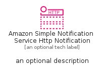
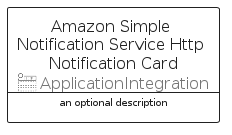

# AmazonSimpleNotificationServiceHttpNotification


```text
aws-q2-2023/Resource/ApplicationIntegration/AmazonSimpleNotificationServiceHttpNotification
```

```text
include('aws-q2-2023/Resource/ApplicationIntegration/AmazonSimpleNotificationServiceHttpNotification')
```


| Illustration | AmazonSimpleNotificationServiceHttpNotification | AmazonSimpleNotificationServiceHttpNotificationCard | AmazonSimpleNotificationServiceHttpNotificationGroup |
| :---: | :---: | :---: | :---: |
|  |  |  |  |


## Sprites
The item provides the following sriptes:

- `<$AmazonSimpleNotificationServiceHttpNotificationXs>`
- `<$AmazonSimpleNotificationServiceHttpNotificationSm>`
- `<$AmazonSimpleNotificationServiceHttpNotificationMd>`
- `<$AmazonSimpleNotificationServiceHttpNotificationLg>`


## AmazonSimpleNotificationServiceHttpNotification

### Load remotely
```plantuml
@startuml
' configures the library
!global $LIB_BASE_LOCATION="https://raw.githubusercontent.com/tmorin/plantuml-libs/master/distribution"

' loads the library's bootstrap
!include $LIB_BASE_LOCATION/bootstrap.puml

' loads the package bootstrap
include('aws-q2-2023/bootstrap')

' loads the Item which embeds the element AmazonSimpleNotificationServiceHttpNotification
include('aws-q2-2023/Resource/ApplicationIntegration/AmazonSimpleNotificationServiceHttpNotification')

' renders the element
AmazonSimpleNotificationServiceHttpNotification('AmazonSimpleNotificationServiceHttpNotification', 'Amazon Simple Notification Service Http Notification', 'an optional tech label', 'an optional description')
@enduml
```

### Load locally
```plantuml
@startuml
' configures the library
!global $INCLUSION_MODE="local"
!global $LIB_BASE_LOCATION="../../.."

' loads the library's bootstrap
!include $LIB_BASE_LOCATION/bootstrap.puml

' loads the package bootstrap
include('aws-q2-2023/bootstrap')

' loads the Item which embeds the element AmazonSimpleNotificationServiceHttpNotification
include('aws-q2-2023/Resource/ApplicationIntegration/AmazonSimpleNotificationServiceHttpNotification')

' renders the element
AmazonSimpleNotificationServiceHttpNotification('AmazonSimpleNotificationServiceHttpNotification', 'Amazon Simple Notification Service Http Notification', 'an optional tech label', 'an optional description')
@enduml
```

## AmazonSimpleNotificationServiceHttpNotificationCard

### Load remotely
```plantuml
@startuml
' configures the library
!global $LIB_BASE_LOCATION="https://raw.githubusercontent.com/tmorin/plantuml-libs/master/distribution"

' loads the library's bootstrap
!include $LIB_BASE_LOCATION/bootstrap.puml

' loads the package bootstrap
include('aws-q2-2023/bootstrap')

' loads the Item which embeds the element AmazonSimpleNotificationServiceHttpNotificationCard
include('aws-q2-2023/Resource/ApplicationIntegration/AmazonSimpleNotificationServiceHttpNotification')

' renders the element
AmazonSimpleNotificationServiceHttpNotificationCard('AmazonSimpleNotificationServiceHttpNotificationCard', 'Amazon Simple Notification Service Http Notification Card', 'an optional description')
@enduml
```

### Load locally
```plantuml
@startuml
' configures the library
!global $INCLUSION_MODE="local"
!global $LIB_BASE_LOCATION="../../.."

' loads the library's bootstrap
!include $LIB_BASE_LOCATION/bootstrap.puml

' loads the package bootstrap
include('aws-q2-2023/bootstrap')

' loads the Item which embeds the element AmazonSimpleNotificationServiceHttpNotificationCard
include('aws-q2-2023/Resource/ApplicationIntegration/AmazonSimpleNotificationServiceHttpNotification')

' renders the element
AmazonSimpleNotificationServiceHttpNotificationCard('AmazonSimpleNotificationServiceHttpNotificationCard', 'Amazon Simple Notification Service Http Notification Card', 'an optional description')
@enduml
```

## AmazonSimpleNotificationServiceHttpNotificationGroup

### Load remotely
```plantuml
@startuml
' configures the library
!global $LIB_BASE_LOCATION="https://raw.githubusercontent.com/tmorin/plantuml-libs/master/distribution"

' loads the library's bootstrap
!include $LIB_BASE_LOCATION/bootstrap.puml

' loads the package bootstrap
include('aws-q2-2023/bootstrap')

' loads the Item which embeds the element AmazonSimpleNotificationServiceHttpNotificationGroup
include('aws-q2-2023/Resource/ApplicationIntegration/AmazonSimpleNotificationServiceHttpNotification')

' renders the element
AmazonSimpleNotificationServiceHttpNotificationGroup('AmazonSimpleNotificationServiceHttpNotificationGroup', 'Amazon Simple Notification Service Http Notification Group', 'an optional tech label') {
    note as note
        the content of the group
    end note
}
@enduml
```

### Load locally
```plantuml
@startuml
' configures the library
!global $INCLUSION_MODE="local"
!global $LIB_BASE_LOCATION="../../.."

' loads the library's bootstrap
!include $LIB_BASE_LOCATION/bootstrap.puml

' loads the package bootstrap
include('aws-q2-2023/bootstrap')

' loads the Item which embeds the element AmazonSimpleNotificationServiceHttpNotificationGroup
include('aws-q2-2023/Resource/ApplicationIntegration/AmazonSimpleNotificationServiceHttpNotification')

' renders the element
AmazonSimpleNotificationServiceHttpNotificationGroup('AmazonSimpleNotificationServiceHttpNotificationGroup', 'Amazon Simple Notification Service Http Notification Group', 'an optional tech label') {
    note as note
        the content of the group
    end note
}
@enduml
```

