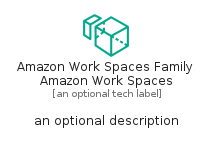
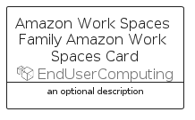

# AmazonWorkSpacesFamilyAmazonWorkSpaces


```text
aws-q2-2023/Resource/EndUserComputing/AmazonWorkSpacesFamilyAmazonWorkSpaces
```

```text
include('aws-q2-2023/Resource/EndUserComputing/AmazonWorkSpacesFamilyAmazonWorkSpaces')
```


| Illustration | AmazonWorkSpacesFamilyAmazonWorkSpaces | AmazonWorkSpacesFamilyAmazonWorkSpacesCard | AmazonWorkSpacesFamilyAmazonWorkSpacesGroup |
| :---: | :---: | :---: | :---: |
|  |  |  |  |


## Sprites
The item provides the following sriptes:

- `<$AmazonWorkSpacesFamilyAmazonWorkSpacesXs>`
- `<$AmazonWorkSpacesFamilyAmazonWorkSpacesSm>`
- `<$AmazonWorkSpacesFamilyAmazonWorkSpacesMd>`
- `<$AmazonWorkSpacesFamilyAmazonWorkSpacesLg>`


## AmazonWorkSpacesFamilyAmazonWorkSpaces

### Load remotely
```plantuml
@startuml
' configures the library
!global $LIB_BASE_LOCATION="https://raw.githubusercontent.com/tmorin/plantuml-libs/master/distribution"

' loads the library's bootstrap
!include $LIB_BASE_LOCATION/bootstrap.puml

' loads the package bootstrap
include('aws-q2-2023/bootstrap')

' loads the Item which embeds the element AmazonWorkSpacesFamilyAmazonWorkSpaces
include('aws-q2-2023/Resource/EndUserComputing/AmazonWorkSpacesFamilyAmazonWorkSpaces')

' renders the element
AmazonWorkSpacesFamilyAmazonWorkSpaces('AmazonWorkSpacesFamilyAmazonWorkSpaces', 'Amazon Work Spaces Family Amazon Work Spaces', 'an optional tech label', 'an optional description')
@enduml
```

### Load locally
```plantuml
@startuml
' configures the library
!global $INCLUSION_MODE="local"
!global $LIB_BASE_LOCATION="../../.."

' loads the library's bootstrap
!include $LIB_BASE_LOCATION/bootstrap.puml

' loads the package bootstrap
include('aws-q2-2023/bootstrap')

' loads the Item which embeds the element AmazonWorkSpacesFamilyAmazonWorkSpaces
include('aws-q2-2023/Resource/EndUserComputing/AmazonWorkSpacesFamilyAmazonWorkSpaces')

' renders the element
AmazonWorkSpacesFamilyAmazonWorkSpaces('AmazonWorkSpacesFamilyAmazonWorkSpaces', 'Amazon Work Spaces Family Amazon Work Spaces', 'an optional tech label', 'an optional description')
@enduml
```

## AmazonWorkSpacesFamilyAmazonWorkSpacesCard

### Load remotely
```plantuml
@startuml
' configures the library
!global $LIB_BASE_LOCATION="https://raw.githubusercontent.com/tmorin/plantuml-libs/master/distribution"

' loads the library's bootstrap
!include $LIB_BASE_LOCATION/bootstrap.puml

' loads the package bootstrap
include('aws-q2-2023/bootstrap')

' loads the Item which embeds the element AmazonWorkSpacesFamilyAmazonWorkSpacesCard
include('aws-q2-2023/Resource/EndUserComputing/AmazonWorkSpacesFamilyAmazonWorkSpaces')

' renders the element
AmazonWorkSpacesFamilyAmazonWorkSpacesCard('AmazonWorkSpacesFamilyAmazonWorkSpacesCard', 'Amazon Work Spaces Family Amazon Work Spaces Card', 'an optional description')
@enduml
```

### Load locally
```plantuml
@startuml
' configures the library
!global $INCLUSION_MODE="local"
!global $LIB_BASE_LOCATION="../../.."

' loads the library's bootstrap
!include $LIB_BASE_LOCATION/bootstrap.puml

' loads the package bootstrap
include('aws-q2-2023/bootstrap')

' loads the Item which embeds the element AmazonWorkSpacesFamilyAmazonWorkSpacesCard
include('aws-q2-2023/Resource/EndUserComputing/AmazonWorkSpacesFamilyAmazonWorkSpaces')

' renders the element
AmazonWorkSpacesFamilyAmazonWorkSpacesCard('AmazonWorkSpacesFamilyAmazonWorkSpacesCard', 'Amazon Work Spaces Family Amazon Work Spaces Card', 'an optional description')
@enduml
```

## AmazonWorkSpacesFamilyAmazonWorkSpacesGroup

### Load remotely
```plantuml
@startuml
' configures the library
!global $LIB_BASE_LOCATION="https://raw.githubusercontent.com/tmorin/plantuml-libs/master/distribution"

' loads the library's bootstrap
!include $LIB_BASE_LOCATION/bootstrap.puml

' loads the package bootstrap
include('aws-q2-2023/bootstrap')

' loads the Item which embeds the element AmazonWorkSpacesFamilyAmazonWorkSpacesGroup
include('aws-q2-2023/Resource/EndUserComputing/AmazonWorkSpacesFamilyAmazonWorkSpaces')

' renders the element
AmazonWorkSpacesFamilyAmazonWorkSpacesGroup('AmazonWorkSpacesFamilyAmazonWorkSpacesGroup', 'Amazon Work Spaces Family Amazon Work Spaces Group', 'an optional tech label') {
    note as note
        the content of the group
    end note
}
@enduml
```

### Load locally
```plantuml
@startuml
' configures the library
!global $INCLUSION_MODE="local"
!global $LIB_BASE_LOCATION="../../.."

' loads the library's bootstrap
!include $LIB_BASE_LOCATION/bootstrap.puml

' loads the package bootstrap
include('aws-q2-2023/bootstrap')

' loads the Item which embeds the element AmazonWorkSpacesFamilyAmazonWorkSpacesGroup
include('aws-q2-2023/Resource/EndUserComputing/AmazonWorkSpacesFamilyAmazonWorkSpaces')

' renders the element
AmazonWorkSpacesFamilyAmazonWorkSpacesGroup('AmazonWorkSpacesFamilyAmazonWorkSpacesGroup', 'Amazon Work Spaces Family Amazon Work Spaces Group', 'an optional tech label') {
    note as note
        the content of the group
    end note
}
@enduml
```

