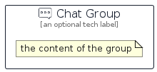

# Chat


```text
aws-q2-2023/Resource/GeneralIcons/Chat
```

```text
include('aws-q2-2023/Resource/GeneralIcons/Chat')
```


| Illustration | Chat | ChatCard | ChatGroup |
| :---: | :---: | :---: | :---: |
|  |  |  |  |


## Sprites
The item provides the following sriptes:

- `<$ChatXs>`
- `<$ChatSm>`
- `<$ChatMd>`
- `<$ChatLg>`


## Chat

### Load remotely
```plantuml
@startuml
' configures the library
!global $LIB_BASE_LOCATION="https://raw.githubusercontent.com/tmorin/plantuml-libs/master/distribution"

' loads the library's bootstrap
!include $LIB_BASE_LOCATION/bootstrap.puml

' loads the package bootstrap
include('aws-q2-2023/bootstrap')

' loads the Item which embeds the element Chat
include('aws-q2-2023/Resource/GeneralIcons/Chat')

' renders the element
Chat('Chat', 'Chat', 'an optional tech label', 'an optional description')
@enduml
```

### Load locally
```plantuml
@startuml
' configures the library
!global $INCLUSION_MODE="local"
!global $LIB_BASE_LOCATION="../../.."

' loads the library's bootstrap
!include $LIB_BASE_LOCATION/bootstrap.puml

' loads the package bootstrap
include('aws-q2-2023/bootstrap')

' loads the Item which embeds the element Chat
include('aws-q2-2023/Resource/GeneralIcons/Chat')

' renders the element
Chat('Chat', 'Chat', 'an optional tech label', 'an optional description')
@enduml
```

## ChatCard

### Load remotely
```plantuml
@startuml
' configures the library
!global $LIB_BASE_LOCATION="https://raw.githubusercontent.com/tmorin/plantuml-libs/master/distribution"

' loads the library's bootstrap
!include $LIB_BASE_LOCATION/bootstrap.puml

' loads the package bootstrap
include('aws-q2-2023/bootstrap')

' loads the Item which embeds the element ChatCard
include('aws-q2-2023/Resource/GeneralIcons/Chat')

' renders the element
ChatCard('ChatCard', 'Chat Card', 'an optional description')
@enduml
```

### Load locally
```plantuml
@startuml
' configures the library
!global $INCLUSION_MODE="local"
!global $LIB_BASE_LOCATION="../../.."

' loads the library's bootstrap
!include $LIB_BASE_LOCATION/bootstrap.puml

' loads the package bootstrap
include('aws-q2-2023/bootstrap')

' loads the Item which embeds the element ChatCard
include('aws-q2-2023/Resource/GeneralIcons/Chat')

' renders the element
ChatCard('ChatCard', 'Chat Card', 'an optional description')
@enduml
```

## ChatGroup

### Load remotely
```plantuml
@startuml
' configures the library
!global $LIB_BASE_LOCATION="https://raw.githubusercontent.com/tmorin/plantuml-libs/master/distribution"

' loads the library's bootstrap
!include $LIB_BASE_LOCATION/bootstrap.puml

' loads the package bootstrap
include('aws-q2-2023/bootstrap')

' loads the Item which embeds the element ChatGroup
include('aws-q2-2023/Resource/GeneralIcons/Chat')

' renders the element
ChatGroup('ChatGroup', 'Chat Group', 'an optional tech label') {
    note as note
        the content of the group
    end note
}
@enduml
```

### Load locally
```plantuml
@startuml
' configures the library
!global $INCLUSION_MODE="local"
!global $LIB_BASE_LOCATION="../../.."

' loads the library's bootstrap
!include $LIB_BASE_LOCATION/bootstrap.puml

' loads the package bootstrap
include('aws-q2-2023/bootstrap')

' loads the Item which embeds the element ChatGroup
include('aws-q2-2023/Resource/GeneralIcons/Chat')

' renders the element
ChatGroup('ChatGroup', 'Chat Group', 'an optional tech label') {
    note as note
        the content of the group
    end note
}
@enduml
```

