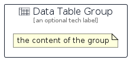

# DataTable


```text
aws-q2-2023/Resource/GeneralIcons/DataTable
```

```text
include('aws-q2-2023/Resource/GeneralIcons/DataTable')
```


| Illustration | DataTable | DataTableCard | DataTableGroup |
| :---: | :---: | :---: | :---: |
|  |  |  |  |


## Sprites
The item provides the following sriptes:

- `<$DataTableXs>`
- `<$DataTableSm>`
- `<$DataTableMd>`
- `<$DataTableLg>`


## DataTable

### Load remotely
```plantuml
@startuml
' configures the library
!global $LIB_BASE_LOCATION="https://raw.githubusercontent.com/tmorin/plantuml-libs/master/distribution"

' loads the library's bootstrap
!include $LIB_BASE_LOCATION/bootstrap.puml

' loads the package bootstrap
include('aws-q2-2023/bootstrap')

' loads the Item which embeds the element DataTable
include('aws-q2-2023/Resource/GeneralIcons/DataTable')

' renders the element
DataTable('DataTable', 'Data Table', 'an optional tech label', 'an optional description')
@enduml
```

### Load locally
```plantuml
@startuml
' configures the library
!global $INCLUSION_MODE="local"
!global $LIB_BASE_LOCATION="../../.."

' loads the library's bootstrap
!include $LIB_BASE_LOCATION/bootstrap.puml

' loads the package bootstrap
include('aws-q2-2023/bootstrap')

' loads the Item which embeds the element DataTable
include('aws-q2-2023/Resource/GeneralIcons/DataTable')

' renders the element
DataTable('DataTable', 'Data Table', 'an optional tech label', 'an optional description')
@enduml
```

## DataTableCard

### Load remotely
```plantuml
@startuml
' configures the library
!global $LIB_BASE_LOCATION="https://raw.githubusercontent.com/tmorin/plantuml-libs/master/distribution"

' loads the library's bootstrap
!include $LIB_BASE_LOCATION/bootstrap.puml

' loads the package bootstrap
include('aws-q2-2023/bootstrap')

' loads the Item which embeds the element DataTableCard
include('aws-q2-2023/Resource/GeneralIcons/DataTable')

' renders the element
DataTableCard('DataTableCard', 'Data Table Card', 'an optional description')
@enduml
```

### Load locally
```plantuml
@startuml
' configures the library
!global $INCLUSION_MODE="local"
!global $LIB_BASE_LOCATION="../../.."

' loads the library's bootstrap
!include $LIB_BASE_LOCATION/bootstrap.puml

' loads the package bootstrap
include('aws-q2-2023/bootstrap')

' loads the Item which embeds the element DataTableCard
include('aws-q2-2023/Resource/GeneralIcons/DataTable')

' renders the element
DataTableCard('DataTableCard', 'Data Table Card', 'an optional description')
@enduml
```

## DataTableGroup

### Load remotely
```plantuml
@startuml
' configures the library
!global $LIB_BASE_LOCATION="https://raw.githubusercontent.com/tmorin/plantuml-libs/master/distribution"

' loads the library's bootstrap
!include $LIB_BASE_LOCATION/bootstrap.puml

' loads the package bootstrap
include('aws-q2-2023/bootstrap')

' loads the Item which embeds the element DataTableGroup
include('aws-q2-2023/Resource/GeneralIcons/DataTable')

' renders the element
DataTableGroup('DataTableGroup', 'Data Table Group', 'an optional tech label') {
    note as note
        the content of the group
    end note
}
@enduml
```

### Load locally
```plantuml
@startuml
' configures the library
!global $INCLUSION_MODE="local"
!global $LIB_BASE_LOCATION="../../.."

' loads the library's bootstrap
!include $LIB_BASE_LOCATION/bootstrap.puml

' loads the package bootstrap
include('aws-q2-2023/bootstrap')

' loads the Item which embeds the element DataTableGroup
include('aws-q2-2023/Resource/GeneralIcons/DataTable')

' renders the element
DataTableGroup('DataTableGroup', 'Data Table Group', 'an optional tech label') {
    note as note
        the content of the group
    end note
}
@enduml
```

