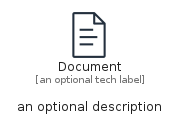

# Document


```text
aws-q2-2023/Resource/GeneralIcons/Document
```

```text
include('aws-q2-2023/Resource/GeneralIcons/Document')
```


| Illustration | Document | DocumentCard | DocumentGroup |
| :---: | :---: | :---: | :---: |
|  |  |  |  |


## Sprites
The item provides the following sriptes:

- `<$DocumentXs>`
- `<$DocumentSm>`
- `<$DocumentMd>`
- `<$DocumentLg>`


## Document

### Load remotely
```plantuml
@startuml
' configures the library
!global $LIB_BASE_LOCATION="https://raw.githubusercontent.com/tmorin/plantuml-libs/master/distribution"

' loads the library's bootstrap
!include $LIB_BASE_LOCATION/bootstrap.puml

' loads the package bootstrap
include('aws-q2-2023/bootstrap')

' loads the Item which embeds the element Document
include('aws-q2-2023/Resource/GeneralIcons/Document')

' renders the element
Document('Document', 'Document', 'an optional tech label', 'an optional description')
@enduml
```

### Load locally
```plantuml
@startuml
' configures the library
!global $INCLUSION_MODE="local"
!global $LIB_BASE_LOCATION="../../.."

' loads the library's bootstrap
!include $LIB_BASE_LOCATION/bootstrap.puml

' loads the package bootstrap
include('aws-q2-2023/bootstrap')

' loads the Item which embeds the element Document
include('aws-q2-2023/Resource/GeneralIcons/Document')

' renders the element
Document('Document', 'Document', 'an optional tech label', 'an optional description')
@enduml
```

## DocumentCard

### Load remotely
```plantuml
@startuml
' configures the library
!global $LIB_BASE_LOCATION="https://raw.githubusercontent.com/tmorin/plantuml-libs/master/distribution"

' loads the library's bootstrap
!include $LIB_BASE_LOCATION/bootstrap.puml

' loads the package bootstrap
include('aws-q2-2023/bootstrap')

' loads the Item which embeds the element DocumentCard
include('aws-q2-2023/Resource/GeneralIcons/Document')

' renders the element
DocumentCard('DocumentCard', 'Document Card', 'an optional description')
@enduml
```

### Load locally
```plantuml
@startuml
' configures the library
!global $INCLUSION_MODE="local"
!global $LIB_BASE_LOCATION="../../.."

' loads the library's bootstrap
!include $LIB_BASE_LOCATION/bootstrap.puml

' loads the package bootstrap
include('aws-q2-2023/bootstrap')

' loads the Item which embeds the element DocumentCard
include('aws-q2-2023/Resource/GeneralIcons/Document')

' renders the element
DocumentCard('DocumentCard', 'Document Card', 'an optional description')
@enduml
```

## DocumentGroup

### Load remotely
```plantuml
@startuml
' configures the library
!global $LIB_BASE_LOCATION="https://raw.githubusercontent.com/tmorin/plantuml-libs/master/distribution"

' loads the library's bootstrap
!include $LIB_BASE_LOCATION/bootstrap.puml

' loads the package bootstrap
include('aws-q2-2023/bootstrap')

' loads the Item which embeds the element DocumentGroup
include('aws-q2-2023/Resource/GeneralIcons/Document')

' renders the element
DocumentGroup('DocumentGroup', 'Document Group', 'an optional tech label') {
    note as note
        the content of the group
    end note
}
@enduml
```

### Load locally
```plantuml
@startuml
' configures the library
!global $INCLUSION_MODE="local"
!global $LIB_BASE_LOCATION="../../.."

' loads the library's bootstrap
!include $LIB_BASE_LOCATION/bootstrap.puml

' loads the package bootstrap
include('aws-q2-2023/bootstrap')

' loads the Item which embeds the element DocumentGroup
include('aws-q2-2023/Resource/GeneralIcons/Document')

' renders the element
DocumentGroup('DocumentGroup', 'Document Group', 'an optional tech label') {
    note as note
        the content of the group
    end note
}
@enduml
```

