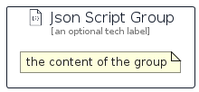

# JsonScript


```text
aws-q2-2023/Resource/GeneralIcons/JsonScript
```

```text
include('aws-q2-2023/Resource/GeneralIcons/JsonScript')
```


| Illustration | JsonScript | JsonScriptCard | JsonScriptGroup |
| :---: | :---: | :---: | :---: |
|  |  |  |  |


## Sprites
The item provides the following sriptes:

- `<$JsonScriptXs>`
- `<$JsonScriptSm>`
- `<$JsonScriptMd>`
- `<$JsonScriptLg>`


## JsonScript

### Load remotely
```plantuml
@startuml
' configures the library
!global $LIB_BASE_LOCATION="https://raw.githubusercontent.com/tmorin/plantuml-libs/master/distribution"

' loads the library's bootstrap
!include $LIB_BASE_LOCATION/bootstrap.puml

' loads the package bootstrap
include('aws-q2-2023/bootstrap')

' loads the Item which embeds the element JsonScript
include('aws-q2-2023/Resource/GeneralIcons/JsonScript')

' renders the element
JsonScript('JsonScript', 'Json Script', 'an optional tech label', 'an optional description')
@enduml
```

### Load locally
```plantuml
@startuml
' configures the library
!global $INCLUSION_MODE="local"
!global $LIB_BASE_LOCATION="../../.."

' loads the library's bootstrap
!include $LIB_BASE_LOCATION/bootstrap.puml

' loads the package bootstrap
include('aws-q2-2023/bootstrap')

' loads the Item which embeds the element JsonScript
include('aws-q2-2023/Resource/GeneralIcons/JsonScript')

' renders the element
JsonScript('JsonScript', 'Json Script', 'an optional tech label', 'an optional description')
@enduml
```

## JsonScriptCard

### Load remotely
```plantuml
@startuml
' configures the library
!global $LIB_BASE_LOCATION="https://raw.githubusercontent.com/tmorin/plantuml-libs/master/distribution"

' loads the library's bootstrap
!include $LIB_BASE_LOCATION/bootstrap.puml

' loads the package bootstrap
include('aws-q2-2023/bootstrap')

' loads the Item which embeds the element JsonScriptCard
include('aws-q2-2023/Resource/GeneralIcons/JsonScript')

' renders the element
JsonScriptCard('JsonScriptCard', 'Json Script Card', 'an optional description')
@enduml
```

### Load locally
```plantuml
@startuml
' configures the library
!global $INCLUSION_MODE="local"
!global $LIB_BASE_LOCATION="../../.."

' loads the library's bootstrap
!include $LIB_BASE_LOCATION/bootstrap.puml

' loads the package bootstrap
include('aws-q2-2023/bootstrap')

' loads the Item which embeds the element JsonScriptCard
include('aws-q2-2023/Resource/GeneralIcons/JsonScript')

' renders the element
JsonScriptCard('JsonScriptCard', 'Json Script Card', 'an optional description')
@enduml
```

## JsonScriptGroup

### Load remotely
```plantuml
@startuml
' configures the library
!global $LIB_BASE_LOCATION="https://raw.githubusercontent.com/tmorin/plantuml-libs/master/distribution"

' loads the library's bootstrap
!include $LIB_BASE_LOCATION/bootstrap.puml

' loads the package bootstrap
include('aws-q2-2023/bootstrap')

' loads the Item which embeds the element JsonScriptGroup
include('aws-q2-2023/Resource/GeneralIcons/JsonScript')

' renders the element
JsonScriptGroup('JsonScriptGroup', 'Json Script Group', 'an optional tech label') {
    note as note
        the content of the group
    end note
}
@enduml
```

### Load locally
```plantuml
@startuml
' configures the library
!global $INCLUSION_MODE="local"
!global $LIB_BASE_LOCATION="../../.."

' loads the library's bootstrap
!include $LIB_BASE_LOCATION/bootstrap.puml

' loads the package bootstrap
include('aws-q2-2023/bootstrap')

' loads the Item which embeds the element JsonScriptGroup
include('aws-q2-2023/Resource/GeneralIcons/JsonScript')

' renders the element
JsonScriptGroup('JsonScriptGroup', 'Json Script Group', 'an optional tech label') {
    note as note
        the content of the group
    end note
}
@enduml
```

