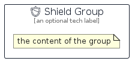

# Shield


```text
aws-q2-2023/Resource/GeneralIcons/Shield
```

```text
include('aws-q2-2023/Resource/GeneralIcons/Shield')
```


| Illustration | Shield | ShieldCard | ShieldGroup |
| :---: | :---: | :---: | :---: |
|  |  |  |  |


## Sprites
The item provides the following sriptes:

- `<$ShieldXs>`
- `<$ShieldSm>`
- `<$ShieldMd>`
- `<$ShieldLg>`


## Shield

### Load remotely
```plantuml
@startuml
' configures the library
!global $LIB_BASE_LOCATION="https://raw.githubusercontent.com/tmorin/plantuml-libs/master/distribution"

' loads the library's bootstrap
!include $LIB_BASE_LOCATION/bootstrap.puml

' loads the package bootstrap
include('aws-q2-2023/bootstrap')

' loads the Item which embeds the element Shield
include('aws-q2-2023/Resource/GeneralIcons/Shield')

' renders the element
Shield('Shield', 'Shield', 'an optional tech label', 'an optional description')
@enduml
```

### Load locally
```plantuml
@startuml
' configures the library
!global $INCLUSION_MODE="local"
!global $LIB_BASE_LOCATION="../../.."

' loads the library's bootstrap
!include $LIB_BASE_LOCATION/bootstrap.puml

' loads the package bootstrap
include('aws-q2-2023/bootstrap')

' loads the Item which embeds the element Shield
include('aws-q2-2023/Resource/GeneralIcons/Shield')

' renders the element
Shield('Shield', 'Shield', 'an optional tech label', 'an optional description')
@enduml
```

## ShieldCard

### Load remotely
```plantuml
@startuml
' configures the library
!global $LIB_BASE_LOCATION="https://raw.githubusercontent.com/tmorin/plantuml-libs/master/distribution"

' loads the library's bootstrap
!include $LIB_BASE_LOCATION/bootstrap.puml

' loads the package bootstrap
include('aws-q2-2023/bootstrap')

' loads the Item which embeds the element ShieldCard
include('aws-q2-2023/Resource/GeneralIcons/Shield')

' renders the element
ShieldCard('ShieldCard', 'Shield Card', 'an optional description')
@enduml
```

### Load locally
```plantuml
@startuml
' configures the library
!global $INCLUSION_MODE="local"
!global $LIB_BASE_LOCATION="../../.."

' loads the library's bootstrap
!include $LIB_BASE_LOCATION/bootstrap.puml

' loads the package bootstrap
include('aws-q2-2023/bootstrap')

' loads the Item which embeds the element ShieldCard
include('aws-q2-2023/Resource/GeneralIcons/Shield')

' renders the element
ShieldCard('ShieldCard', 'Shield Card', 'an optional description')
@enduml
```

## ShieldGroup

### Load remotely
```plantuml
@startuml
' configures the library
!global $LIB_BASE_LOCATION="https://raw.githubusercontent.com/tmorin/plantuml-libs/master/distribution"

' loads the library's bootstrap
!include $LIB_BASE_LOCATION/bootstrap.puml

' loads the package bootstrap
include('aws-q2-2023/bootstrap')

' loads the Item which embeds the element ShieldGroup
include('aws-q2-2023/Resource/GeneralIcons/Shield')

' renders the element
ShieldGroup('ShieldGroup', 'Shield Group', 'an optional tech label') {
    note as note
        the content of the group
    end note
}
@enduml
```

### Load locally
```plantuml
@startuml
' configures the library
!global $INCLUSION_MODE="local"
!global $LIB_BASE_LOCATION="../../.."

' loads the library's bootstrap
!include $LIB_BASE_LOCATION/bootstrap.puml

' loads the package bootstrap
include('aws-q2-2023/bootstrap')

' loads the Item which embeds the element ShieldGroup
include('aws-q2-2023/Resource/GeneralIcons/Shield')

' renders the element
ShieldGroup('ShieldGroup', 'Shield Group', 'an optional tech label') {
    note as note
        the content of the group
    end note
}
@enduml
```

