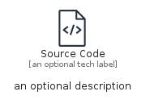
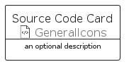

# SourceCode


```text
aws-q2-2023/Resource/GeneralIcons/SourceCode
```

```text
include('aws-q2-2023/Resource/GeneralIcons/SourceCode')
```


| Illustration | SourceCode | SourceCodeCard | SourceCodeGroup |
| :---: | :---: | :---: | :---: |
|  |  |  |  |


## Sprites
The item provides the following sriptes:

- `<$SourceCodeXs>`
- `<$SourceCodeSm>`
- `<$SourceCodeMd>`
- `<$SourceCodeLg>`


## SourceCode

### Load remotely
```plantuml
@startuml
' configures the library
!global $LIB_BASE_LOCATION="https://raw.githubusercontent.com/tmorin/plantuml-libs/master/distribution"

' loads the library's bootstrap
!include $LIB_BASE_LOCATION/bootstrap.puml

' loads the package bootstrap
include('aws-q2-2023/bootstrap')

' loads the Item which embeds the element SourceCode
include('aws-q2-2023/Resource/GeneralIcons/SourceCode')

' renders the element
SourceCode('SourceCode', 'Source Code', 'an optional tech label', 'an optional description')
@enduml
```

### Load locally
```plantuml
@startuml
' configures the library
!global $INCLUSION_MODE="local"
!global $LIB_BASE_LOCATION="../../.."

' loads the library's bootstrap
!include $LIB_BASE_LOCATION/bootstrap.puml

' loads the package bootstrap
include('aws-q2-2023/bootstrap')

' loads the Item which embeds the element SourceCode
include('aws-q2-2023/Resource/GeneralIcons/SourceCode')

' renders the element
SourceCode('SourceCode', 'Source Code', 'an optional tech label', 'an optional description')
@enduml
```

## SourceCodeCard

### Load remotely
```plantuml
@startuml
' configures the library
!global $LIB_BASE_LOCATION="https://raw.githubusercontent.com/tmorin/plantuml-libs/master/distribution"

' loads the library's bootstrap
!include $LIB_BASE_LOCATION/bootstrap.puml

' loads the package bootstrap
include('aws-q2-2023/bootstrap')

' loads the Item which embeds the element SourceCodeCard
include('aws-q2-2023/Resource/GeneralIcons/SourceCode')

' renders the element
SourceCodeCard('SourceCodeCard', 'Source Code Card', 'an optional description')
@enduml
```

### Load locally
```plantuml
@startuml
' configures the library
!global $INCLUSION_MODE="local"
!global $LIB_BASE_LOCATION="../../.."

' loads the library's bootstrap
!include $LIB_BASE_LOCATION/bootstrap.puml

' loads the package bootstrap
include('aws-q2-2023/bootstrap')

' loads the Item which embeds the element SourceCodeCard
include('aws-q2-2023/Resource/GeneralIcons/SourceCode')

' renders the element
SourceCodeCard('SourceCodeCard', 'Source Code Card', 'an optional description')
@enduml
```

## SourceCodeGroup

### Load remotely
```plantuml
@startuml
' configures the library
!global $LIB_BASE_LOCATION="https://raw.githubusercontent.com/tmorin/plantuml-libs/master/distribution"

' loads the library's bootstrap
!include $LIB_BASE_LOCATION/bootstrap.puml

' loads the package bootstrap
include('aws-q2-2023/bootstrap')

' loads the Item which embeds the element SourceCodeGroup
include('aws-q2-2023/Resource/GeneralIcons/SourceCode')

' renders the element
SourceCodeGroup('SourceCodeGroup', 'Source Code Group', 'an optional tech label') {
    note as note
        the content of the group
    end note
}
@enduml
```

### Load locally
```plantuml
@startuml
' configures the library
!global $INCLUSION_MODE="local"
!global $LIB_BASE_LOCATION="../../.."

' loads the library's bootstrap
!include $LIB_BASE_LOCATION/bootstrap.puml

' loads the package bootstrap
include('aws-q2-2023/bootstrap')

' loads the Item which embeds the element SourceCodeGroup
include('aws-q2-2023/Resource/GeneralIcons/SourceCode')

' renders the element
SourceCodeGroup('SourceCodeGroup', 'Source Code Group', 'an optional tech label') {
    note as note
        the content of the group
    end note
}
@enduml
```

