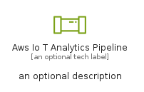

# AwsIoTAnalyticsPipeline


```text
aws-q2-2023/Resource/IoT/AwsIoTAnalyticsPipeline
```

```text
include('aws-q2-2023/Resource/IoT/AwsIoTAnalyticsPipeline')
```


| Illustration | AwsIoTAnalyticsPipeline | AwsIoTAnalyticsPipelineCard | AwsIoTAnalyticsPipelineGroup |
| :---: | :---: | :---: | :---: |
|  |  |  |  |


## Sprites
The item provides the following sriptes:

- `<$AwsIoTAnalyticsPipelineXs>`
- `<$AwsIoTAnalyticsPipelineSm>`
- `<$AwsIoTAnalyticsPipelineMd>`
- `<$AwsIoTAnalyticsPipelineLg>`


## AwsIoTAnalyticsPipeline

### Load remotely
```plantuml
@startuml
' configures the library
!global $LIB_BASE_LOCATION="https://raw.githubusercontent.com/tmorin/plantuml-libs/master/distribution"

' loads the library's bootstrap
!include $LIB_BASE_LOCATION/bootstrap.puml

' loads the package bootstrap
include('aws-q2-2023/bootstrap')

' loads the Item which embeds the element AwsIoTAnalyticsPipeline
include('aws-q2-2023/Resource/IoT/AwsIoTAnalyticsPipeline')

' renders the element
AwsIoTAnalyticsPipeline('AwsIoTAnalyticsPipeline', 'Aws Io T Analytics Pipeline', 'an optional tech label', 'an optional description')
@enduml
```

### Load locally
```plantuml
@startuml
' configures the library
!global $INCLUSION_MODE="local"
!global $LIB_BASE_LOCATION="../../.."

' loads the library's bootstrap
!include $LIB_BASE_LOCATION/bootstrap.puml

' loads the package bootstrap
include('aws-q2-2023/bootstrap')

' loads the Item which embeds the element AwsIoTAnalyticsPipeline
include('aws-q2-2023/Resource/IoT/AwsIoTAnalyticsPipeline')

' renders the element
AwsIoTAnalyticsPipeline('AwsIoTAnalyticsPipeline', 'Aws Io T Analytics Pipeline', 'an optional tech label', 'an optional description')
@enduml
```

## AwsIoTAnalyticsPipelineCard

### Load remotely
```plantuml
@startuml
' configures the library
!global $LIB_BASE_LOCATION="https://raw.githubusercontent.com/tmorin/plantuml-libs/master/distribution"

' loads the library's bootstrap
!include $LIB_BASE_LOCATION/bootstrap.puml

' loads the package bootstrap
include('aws-q2-2023/bootstrap')

' loads the Item which embeds the element AwsIoTAnalyticsPipelineCard
include('aws-q2-2023/Resource/IoT/AwsIoTAnalyticsPipeline')

' renders the element
AwsIoTAnalyticsPipelineCard('AwsIoTAnalyticsPipelineCard', 'Aws Io T Analytics Pipeline Card', 'an optional description')
@enduml
```

### Load locally
```plantuml
@startuml
' configures the library
!global $INCLUSION_MODE="local"
!global $LIB_BASE_LOCATION="../../.."

' loads the library's bootstrap
!include $LIB_BASE_LOCATION/bootstrap.puml

' loads the package bootstrap
include('aws-q2-2023/bootstrap')

' loads the Item which embeds the element AwsIoTAnalyticsPipelineCard
include('aws-q2-2023/Resource/IoT/AwsIoTAnalyticsPipeline')

' renders the element
AwsIoTAnalyticsPipelineCard('AwsIoTAnalyticsPipelineCard', 'Aws Io T Analytics Pipeline Card', 'an optional description')
@enduml
```

## AwsIoTAnalyticsPipelineGroup

### Load remotely
```plantuml
@startuml
' configures the library
!global $LIB_BASE_LOCATION="https://raw.githubusercontent.com/tmorin/plantuml-libs/master/distribution"

' loads the library's bootstrap
!include $LIB_BASE_LOCATION/bootstrap.puml

' loads the package bootstrap
include('aws-q2-2023/bootstrap')

' loads the Item which embeds the element AwsIoTAnalyticsPipelineGroup
include('aws-q2-2023/Resource/IoT/AwsIoTAnalyticsPipeline')

' renders the element
AwsIoTAnalyticsPipelineGroup('AwsIoTAnalyticsPipelineGroup', 'Aws Io T Analytics Pipeline Group', 'an optional tech label') {
    note as note
        the content of the group
    end note
}
@enduml
```

### Load locally
```plantuml
@startuml
' configures the library
!global $INCLUSION_MODE="local"
!global $LIB_BASE_LOCATION="../../.."

' loads the library's bootstrap
!include $LIB_BASE_LOCATION/bootstrap.puml

' loads the package bootstrap
include('aws-q2-2023/bootstrap')

' loads the Item which embeds the element AwsIoTAnalyticsPipelineGroup
include('aws-q2-2023/Resource/IoT/AwsIoTAnalyticsPipeline')

' renders the element
AwsIoTAnalyticsPipelineGroup('AwsIoTAnalyticsPipelineGroup', 'Aws Io T Analytics Pipeline Group', 'an optional tech label') {
    note as note
        the content of the group
    end note
}
@enduml
```

