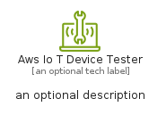
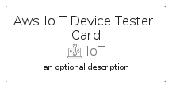

# AwsIoTDeviceTester


```text
aws-q2-2023/Resource/IoT/AwsIoTDeviceTester
```

```text
include('aws-q2-2023/Resource/IoT/AwsIoTDeviceTester')
```


| Illustration | AwsIoTDeviceTester | AwsIoTDeviceTesterCard | AwsIoTDeviceTesterGroup |
| :---: | :---: | :---: | :---: |
|  |  |  |  |


## Sprites
The item provides the following sriptes:

- `<$AwsIoTDeviceTesterXs>`
- `<$AwsIoTDeviceTesterSm>`
- `<$AwsIoTDeviceTesterMd>`
- `<$AwsIoTDeviceTesterLg>`


## AwsIoTDeviceTester

### Load remotely
```plantuml
@startuml
' configures the library
!global $LIB_BASE_LOCATION="https://raw.githubusercontent.com/tmorin/plantuml-libs/master/distribution"

' loads the library's bootstrap
!include $LIB_BASE_LOCATION/bootstrap.puml

' loads the package bootstrap
include('aws-q2-2023/bootstrap')

' loads the Item which embeds the element AwsIoTDeviceTester
include('aws-q2-2023/Resource/IoT/AwsIoTDeviceTester')

' renders the element
AwsIoTDeviceTester('AwsIoTDeviceTester', 'Aws Io T Device Tester', 'an optional tech label', 'an optional description')
@enduml
```

### Load locally
```plantuml
@startuml
' configures the library
!global $INCLUSION_MODE="local"
!global $LIB_BASE_LOCATION="../../.."

' loads the library's bootstrap
!include $LIB_BASE_LOCATION/bootstrap.puml

' loads the package bootstrap
include('aws-q2-2023/bootstrap')

' loads the Item which embeds the element AwsIoTDeviceTester
include('aws-q2-2023/Resource/IoT/AwsIoTDeviceTester')

' renders the element
AwsIoTDeviceTester('AwsIoTDeviceTester', 'Aws Io T Device Tester', 'an optional tech label', 'an optional description')
@enduml
```

## AwsIoTDeviceTesterCard

### Load remotely
```plantuml
@startuml
' configures the library
!global $LIB_BASE_LOCATION="https://raw.githubusercontent.com/tmorin/plantuml-libs/master/distribution"

' loads the library's bootstrap
!include $LIB_BASE_LOCATION/bootstrap.puml

' loads the package bootstrap
include('aws-q2-2023/bootstrap')

' loads the Item which embeds the element AwsIoTDeviceTesterCard
include('aws-q2-2023/Resource/IoT/AwsIoTDeviceTester')

' renders the element
AwsIoTDeviceTesterCard('AwsIoTDeviceTesterCard', 'Aws Io T Device Tester Card', 'an optional description')
@enduml
```

### Load locally
```plantuml
@startuml
' configures the library
!global $INCLUSION_MODE="local"
!global $LIB_BASE_LOCATION="../../.."

' loads the library's bootstrap
!include $LIB_BASE_LOCATION/bootstrap.puml

' loads the package bootstrap
include('aws-q2-2023/bootstrap')

' loads the Item which embeds the element AwsIoTDeviceTesterCard
include('aws-q2-2023/Resource/IoT/AwsIoTDeviceTester')

' renders the element
AwsIoTDeviceTesterCard('AwsIoTDeviceTesterCard', 'Aws Io T Device Tester Card', 'an optional description')
@enduml
```

## AwsIoTDeviceTesterGroup

### Load remotely
```plantuml
@startuml
' configures the library
!global $LIB_BASE_LOCATION="https://raw.githubusercontent.com/tmorin/plantuml-libs/master/distribution"

' loads the library's bootstrap
!include $LIB_BASE_LOCATION/bootstrap.puml

' loads the package bootstrap
include('aws-q2-2023/bootstrap')

' loads the Item which embeds the element AwsIoTDeviceTesterGroup
include('aws-q2-2023/Resource/IoT/AwsIoTDeviceTester')

' renders the element
AwsIoTDeviceTesterGroup('AwsIoTDeviceTesterGroup', 'Aws Io T Device Tester Group', 'an optional tech label') {
    note as note
        the content of the group
    end note
}
@enduml
```

### Load locally
```plantuml
@startuml
' configures the library
!global $INCLUSION_MODE="local"
!global $LIB_BASE_LOCATION="../../.."

' loads the library's bootstrap
!include $LIB_BASE_LOCATION/bootstrap.puml

' loads the package bootstrap
include('aws-q2-2023/bootstrap')

' loads the Item which embeds the element AwsIoTDeviceTesterGroup
include('aws-q2-2023/Resource/IoT/AwsIoTDeviceTester')

' renders the element
AwsIoTDeviceTesterGroup('AwsIoTDeviceTesterGroup', 'Aws Io T Device Tester Group', 'an optional tech label') {
    note as note
        the content of the group
    end note
}
@enduml
```

