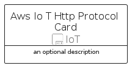
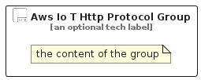

# AwsIoTHttpProtocol


```text
aws-q2-2023/Resource/IoT/AwsIoTHttpProtocol
```

```text
include('aws-q2-2023/Resource/IoT/AwsIoTHttpProtocol')
```


| Illustration | AwsIoTHttpProtocol | AwsIoTHttpProtocolCard | AwsIoTHttpProtocolGroup |
| :---: | :---: | :---: | :---: |
|  |  |  |  |


## Sprites
The item provides the following sriptes:

- `<$AwsIoTHttpProtocolXs>`
- `<$AwsIoTHttpProtocolSm>`
- `<$AwsIoTHttpProtocolMd>`
- `<$AwsIoTHttpProtocolLg>`


## AwsIoTHttpProtocol

### Load remotely
```plantuml
@startuml
' configures the library
!global $LIB_BASE_LOCATION="https://raw.githubusercontent.com/tmorin/plantuml-libs/master/distribution"

' loads the library's bootstrap
!include $LIB_BASE_LOCATION/bootstrap.puml

' loads the package bootstrap
include('aws-q2-2023/bootstrap')

' loads the Item which embeds the element AwsIoTHttpProtocol
include('aws-q2-2023/Resource/IoT/AwsIoTHttpProtocol')

' renders the element
AwsIoTHttpProtocol('AwsIoTHttpProtocol', 'Aws Io T Http Protocol', 'an optional tech label', 'an optional description')
@enduml
```

### Load locally
```plantuml
@startuml
' configures the library
!global $INCLUSION_MODE="local"
!global $LIB_BASE_LOCATION="../../.."

' loads the library's bootstrap
!include $LIB_BASE_LOCATION/bootstrap.puml

' loads the package bootstrap
include('aws-q2-2023/bootstrap')

' loads the Item which embeds the element AwsIoTHttpProtocol
include('aws-q2-2023/Resource/IoT/AwsIoTHttpProtocol')

' renders the element
AwsIoTHttpProtocol('AwsIoTHttpProtocol', 'Aws Io T Http Protocol', 'an optional tech label', 'an optional description')
@enduml
```

## AwsIoTHttpProtocolCard

### Load remotely
```plantuml
@startuml
' configures the library
!global $LIB_BASE_LOCATION="https://raw.githubusercontent.com/tmorin/plantuml-libs/master/distribution"

' loads the library's bootstrap
!include $LIB_BASE_LOCATION/bootstrap.puml

' loads the package bootstrap
include('aws-q2-2023/bootstrap')

' loads the Item which embeds the element AwsIoTHttpProtocolCard
include('aws-q2-2023/Resource/IoT/AwsIoTHttpProtocol')

' renders the element
AwsIoTHttpProtocolCard('AwsIoTHttpProtocolCard', 'Aws Io T Http Protocol Card', 'an optional description')
@enduml
```

### Load locally
```plantuml
@startuml
' configures the library
!global $INCLUSION_MODE="local"
!global $LIB_BASE_LOCATION="../../.."

' loads the library's bootstrap
!include $LIB_BASE_LOCATION/bootstrap.puml

' loads the package bootstrap
include('aws-q2-2023/bootstrap')

' loads the Item which embeds the element AwsIoTHttpProtocolCard
include('aws-q2-2023/Resource/IoT/AwsIoTHttpProtocol')

' renders the element
AwsIoTHttpProtocolCard('AwsIoTHttpProtocolCard', 'Aws Io T Http Protocol Card', 'an optional description')
@enduml
```

## AwsIoTHttpProtocolGroup

### Load remotely
```plantuml
@startuml
' configures the library
!global $LIB_BASE_LOCATION="https://raw.githubusercontent.com/tmorin/plantuml-libs/master/distribution"

' loads the library's bootstrap
!include $LIB_BASE_LOCATION/bootstrap.puml

' loads the package bootstrap
include('aws-q2-2023/bootstrap')

' loads the Item which embeds the element AwsIoTHttpProtocolGroup
include('aws-q2-2023/Resource/IoT/AwsIoTHttpProtocol')

' renders the element
AwsIoTHttpProtocolGroup('AwsIoTHttpProtocolGroup', 'Aws Io T Http Protocol Group', 'an optional tech label') {
    note as note
        the content of the group
    end note
}
@enduml
```

### Load locally
```plantuml
@startuml
' configures the library
!global $INCLUSION_MODE="local"
!global $LIB_BASE_LOCATION="../../.."

' loads the library's bootstrap
!include $LIB_BASE_LOCATION/bootstrap.puml

' loads the package bootstrap
include('aws-q2-2023/bootstrap')

' loads the Item which embeds the element AwsIoTHttpProtocolGroup
include('aws-q2-2023/Resource/IoT/AwsIoTHttpProtocol')

' renders the element
AwsIoTHttpProtocolGroup('AwsIoTHttpProtocolGroup', 'Aws Io T Http Protocol Group', 'an optional tech label') {
    note as note
        the content of the group
    end note
}
@enduml
```

