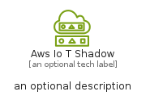
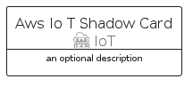
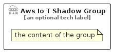

# AwsIoTShadow


```text
aws-q2-2023/Resource/IoT/AwsIoTShadow
```

```text
include('aws-q2-2023/Resource/IoT/AwsIoTShadow')
```


| Illustration | AwsIoTShadow | AwsIoTShadowCard | AwsIoTShadowGroup |
| :---: | :---: | :---: | :---: |
|  |  |  |  |


## Sprites
The item provides the following sriptes:

- `<$AwsIoTShadowXs>`
- `<$AwsIoTShadowSm>`
- `<$AwsIoTShadowMd>`
- `<$AwsIoTShadowLg>`


## AwsIoTShadow

### Load remotely
```plantuml
@startuml
' configures the library
!global $LIB_BASE_LOCATION="https://raw.githubusercontent.com/tmorin/plantuml-libs/master/distribution"

' loads the library's bootstrap
!include $LIB_BASE_LOCATION/bootstrap.puml

' loads the package bootstrap
include('aws-q2-2023/bootstrap')

' loads the Item which embeds the element AwsIoTShadow
include('aws-q2-2023/Resource/IoT/AwsIoTShadow')

' renders the element
AwsIoTShadow('AwsIoTShadow', 'Aws Io T Shadow', 'an optional tech label', 'an optional description')
@enduml
```

### Load locally
```plantuml
@startuml
' configures the library
!global $INCLUSION_MODE="local"
!global $LIB_BASE_LOCATION="../../.."

' loads the library's bootstrap
!include $LIB_BASE_LOCATION/bootstrap.puml

' loads the package bootstrap
include('aws-q2-2023/bootstrap')

' loads the Item which embeds the element AwsIoTShadow
include('aws-q2-2023/Resource/IoT/AwsIoTShadow')

' renders the element
AwsIoTShadow('AwsIoTShadow', 'Aws Io T Shadow', 'an optional tech label', 'an optional description')
@enduml
```

## AwsIoTShadowCard

### Load remotely
```plantuml
@startuml
' configures the library
!global $LIB_BASE_LOCATION="https://raw.githubusercontent.com/tmorin/plantuml-libs/master/distribution"

' loads the library's bootstrap
!include $LIB_BASE_LOCATION/bootstrap.puml

' loads the package bootstrap
include('aws-q2-2023/bootstrap')

' loads the Item which embeds the element AwsIoTShadowCard
include('aws-q2-2023/Resource/IoT/AwsIoTShadow')

' renders the element
AwsIoTShadowCard('AwsIoTShadowCard', 'Aws Io T Shadow Card', 'an optional description')
@enduml
```

### Load locally
```plantuml
@startuml
' configures the library
!global $INCLUSION_MODE="local"
!global $LIB_BASE_LOCATION="../../.."

' loads the library's bootstrap
!include $LIB_BASE_LOCATION/bootstrap.puml

' loads the package bootstrap
include('aws-q2-2023/bootstrap')

' loads the Item which embeds the element AwsIoTShadowCard
include('aws-q2-2023/Resource/IoT/AwsIoTShadow')

' renders the element
AwsIoTShadowCard('AwsIoTShadowCard', 'Aws Io T Shadow Card', 'an optional description')
@enduml
```

## AwsIoTShadowGroup

### Load remotely
```plantuml
@startuml
' configures the library
!global $LIB_BASE_LOCATION="https://raw.githubusercontent.com/tmorin/plantuml-libs/master/distribution"

' loads the library's bootstrap
!include $LIB_BASE_LOCATION/bootstrap.puml

' loads the package bootstrap
include('aws-q2-2023/bootstrap')

' loads the Item which embeds the element AwsIoTShadowGroup
include('aws-q2-2023/Resource/IoT/AwsIoTShadow')

' renders the element
AwsIoTShadowGroup('AwsIoTShadowGroup', 'Aws Io T Shadow Group', 'an optional tech label') {
    note as note
        the content of the group
    end note
}
@enduml
```

### Load locally
```plantuml
@startuml
' configures the library
!global $INCLUSION_MODE="local"
!global $LIB_BASE_LOCATION="../../.."

' loads the library's bootstrap
!include $LIB_BASE_LOCATION/bootstrap.puml

' loads the package bootstrap
include('aws-q2-2023/bootstrap')

' loads the Item which embeds the element AwsIoTShadowGroup
include('aws-q2-2023/Resource/IoT/AwsIoTShadow')

' renders the element
AwsIoTShadowGroup('AwsIoTShadowGroup', 'Aws Io T Shadow Group', 'an optional tech label') {
    note as note
        the content of the group
    end note
}
@enduml
```

