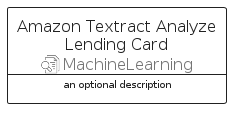

# AmazonTextractAnalyzeLending


```text
aws-q2-2023/Resource/MachineLearning/AmazonTextractAnalyzeLending
```

```text
include('aws-q2-2023/Resource/MachineLearning/AmazonTextractAnalyzeLending')
```


| Illustration | AmazonTextractAnalyzeLending | AmazonTextractAnalyzeLendingCard | AmazonTextractAnalyzeLendingGroup |
| :---: | :---: | :---: | :---: |
|  |  |  |  |


## Sprites
The item provides the following sriptes:

- `<$AmazonTextractAnalyzeLendingXs>`
- `<$AmazonTextractAnalyzeLendingSm>`
- `<$AmazonTextractAnalyzeLendingMd>`
- `<$AmazonTextractAnalyzeLendingLg>`


## AmazonTextractAnalyzeLending

### Load remotely
```plantuml
@startuml
' configures the library
!global $LIB_BASE_LOCATION="https://raw.githubusercontent.com/tmorin/plantuml-libs/master/distribution"

' loads the library's bootstrap
!include $LIB_BASE_LOCATION/bootstrap.puml

' loads the package bootstrap
include('aws-q2-2023/bootstrap')

' loads the Item which embeds the element AmazonTextractAnalyzeLending
include('aws-q2-2023/Resource/MachineLearning/AmazonTextractAnalyzeLending')

' renders the element
AmazonTextractAnalyzeLending('AmazonTextractAnalyzeLending', 'Amazon Textract Analyze Lending', 'an optional tech label', 'an optional description')
@enduml
```

### Load locally
```plantuml
@startuml
' configures the library
!global $INCLUSION_MODE="local"
!global $LIB_BASE_LOCATION="../../.."

' loads the library's bootstrap
!include $LIB_BASE_LOCATION/bootstrap.puml

' loads the package bootstrap
include('aws-q2-2023/bootstrap')

' loads the Item which embeds the element AmazonTextractAnalyzeLending
include('aws-q2-2023/Resource/MachineLearning/AmazonTextractAnalyzeLending')

' renders the element
AmazonTextractAnalyzeLending('AmazonTextractAnalyzeLending', 'Amazon Textract Analyze Lending', 'an optional tech label', 'an optional description')
@enduml
```

## AmazonTextractAnalyzeLendingCard

### Load remotely
```plantuml
@startuml
' configures the library
!global $LIB_BASE_LOCATION="https://raw.githubusercontent.com/tmorin/plantuml-libs/master/distribution"

' loads the library's bootstrap
!include $LIB_BASE_LOCATION/bootstrap.puml

' loads the package bootstrap
include('aws-q2-2023/bootstrap')

' loads the Item which embeds the element AmazonTextractAnalyzeLendingCard
include('aws-q2-2023/Resource/MachineLearning/AmazonTextractAnalyzeLending')

' renders the element
AmazonTextractAnalyzeLendingCard('AmazonTextractAnalyzeLendingCard', 'Amazon Textract Analyze Lending Card', 'an optional description')
@enduml
```

### Load locally
```plantuml
@startuml
' configures the library
!global $INCLUSION_MODE="local"
!global $LIB_BASE_LOCATION="../../.."

' loads the library's bootstrap
!include $LIB_BASE_LOCATION/bootstrap.puml

' loads the package bootstrap
include('aws-q2-2023/bootstrap')

' loads the Item which embeds the element AmazonTextractAnalyzeLendingCard
include('aws-q2-2023/Resource/MachineLearning/AmazonTextractAnalyzeLending')

' renders the element
AmazonTextractAnalyzeLendingCard('AmazonTextractAnalyzeLendingCard', 'Amazon Textract Analyze Lending Card', 'an optional description')
@enduml
```

## AmazonTextractAnalyzeLendingGroup

### Load remotely
```plantuml
@startuml
' configures the library
!global $LIB_BASE_LOCATION="https://raw.githubusercontent.com/tmorin/plantuml-libs/master/distribution"

' loads the library's bootstrap
!include $LIB_BASE_LOCATION/bootstrap.puml

' loads the package bootstrap
include('aws-q2-2023/bootstrap')

' loads the Item which embeds the element AmazonTextractAnalyzeLendingGroup
include('aws-q2-2023/Resource/MachineLearning/AmazonTextractAnalyzeLending')

' renders the element
AmazonTextractAnalyzeLendingGroup('AmazonTextractAnalyzeLendingGroup', 'Amazon Textract Analyze Lending Group', 'an optional tech label') {
    note as note
        the content of the group
    end note
}
@enduml
```

### Load locally
```plantuml
@startuml
' configures the library
!global $INCLUSION_MODE="local"
!global $LIB_BASE_LOCATION="../../.."

' loads the library's bootstrap
!include $LIB_BASE_LOCATION/bootstrap.puml

' loads the package bootstrap
include('aws-q2-2023/bootstrap')

' loads the Item which embeds the element AmazonTextractAnalyzeLendingGroup
include('aws-q2-2023/Resource/MachineLearning/AmazonTextractAnalyzeLending')

' renders the element
AmazonTextractAnalyzeLendingGroup('AmazonTextractAnalyzeLendingGroup', 'Amazon Textract Analyze Lending Group', 'an optional tech label') {
    note as note
        the content of the group
    end note
}
@enduml
```

