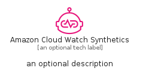
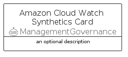
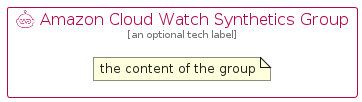

# AmazonCloudWatchSynthetics


```text
aws-q2-2023/Resource/ManagementGovernance/AmazonCloudWatchSynthetics
```

```text
include('aws-q2-2023/Resource/ManagementGovernance/AmazonCloudWatchSynthetics')
```


| Illustration | AmazonCloudWatchSynthetics | AmazonCloudWatchSyntheticsCard | AmazonCloudWatchSyntheticsGroup |
| :---: | :---: | :---: | :---: |
|  |  |  |  |


## Sprites
The item provides the following sriptes:

- `<$AmazonCloudWatchSyntheticsXs>`
- `<$AmazonCloudWatchSyntheticsSm>`
- `<$AmazonCloudWatchSyntheticsMd>`
- `<$AmazonCloudWatchSyntheticsLg>`


## AmazonCloudWatchSynthetics

### Load remotely
```plantuml
@startuml
' configures the library
!global $LIB_BASE_LOCATION="https://raw.githubusercontent.com/tmorin/plantuml-libs/master/distribution"

' loads the library's bootstrap
!include $LIB_BASE_LOCATION/bootstrap.puml

' loads the package bootstrap
include('aws-q2-2023/bootstrap')

' loads the Item which embeds the element AmazonCloudWatchSynthetics
include('aws-q2-2023/Resource/ManagementGovernance/AmazonCloudWatchSynthetics')

' renders the element
AmazonCloudWatchSynthetics('AmazonCloudWatchSynthetics', 'Amazon Cloud Watch Synthetics', 'an optional tech label', 'an optional description')
@enduml
```

### Load locally
```plantuml
@startuml
' configures the library
!global $INCLUSION_MODE="local"
!global $LIB_BASE_LOCATION="../../.."

' loads the library's bootstrap
!include $LIB_BASE_LOCATION/bootstrap.puml

' loads the package bootstrap
include('aws-q2-2023/bootstrap')

' loads the Item which embeds the element AmazonCloudWatchSynthetics
include('aws-q2-2023/Resource/ManagementGovernance/AmazonCloudWatchSynthetics')

' renders the element
AmazonCloudWatchSynthetics('AmazonCloudWatchSynthetics', 'Amazon Cloud Watch Synthetics', 'an optional tech label', 'an optional description')
@enduml
```

## AmazonCloudWatchSyntheticsCard

### Load remotely
```plantuml
@startuml
' configures the library
!global $LIB_BASE_LOCATION="https://raw.githubusercontent.com/tmorin/plantuml-libs/master/distribution"

' loads the library's bootstrap
!include $LIB_BASE_LOCATION/bootstrap.puml

' loads the package bootstrap
include('aws-q2-2023/bootstrap')

' loads the Item which embeds the element AmazonCloudWatchSyntheticsCard
include('aws-q2-2023/Resource/ManagementGovernance/AmazonCloudWatchSynthetics')

' renders the element
AmazonCloudWatchSyntheticsCard('AmazonCloudWatchSyntheticsCard', 'Amazon Cloud Watch Synthetics Card', 'an optional description')
@enduml
```

### Load locally
```plantuml
@startuml
' configures the library
!global $INCLUSION_MODE="local"
!global $LIB_BASE_LOCATION="../../.."

' loads the library's bootstrap
!include $LIB_BASE_LOCATION/bootstrap.puml

' loads the package bootstrap
include('aws-q2-2023/bootstrap')

' loads the Item which embeds the element AmazonCloudWatchSyntheticsCard
include('aws-q2-2023/Resource/ManagementGovernance/AmazonCloudWatchSynthetics')

' renders the element
AmazonCloudWatchSyntheticsCard('AmazonCloudWatchSyntheticsCard', 'Amazon Cloud Watch Synthetics Card', 'an optional description')
@enduml
```

## AmazonCloudWatchSyntheticsGroup

### Load remotely
```plantuml
@startuml
' configures the library
!global $LIB_BASE_LOCATION="https://raw.githubusercontent.com/tmorin/plantuml-libs/master/distribution"

' loads the library's bootstrap
!include $LIB_BASE_LOCATION/bootstrap.puml

' loads the package bootstrap
include('aws-q2-2023/bootstrap')

' loads the Item which embeds the element AmazonCloudWatchSyntheticsGroup
include('aws-q2-2023/Resource/ManagementGovernance/AmazonCloudWatchSynthetics')

' renders the element
AmazonCloudWatchSyntheticsGroup('AmazonCloudWatchSyntheticsGroup', 'Amazon Cloud Watch Synthetics Group', 'an optional tech label') {
    note as note
        the content of the group
    end note
}
@enduml
```

### Load locally
```plantuml
@startuml
' configures the library
!global $INCLUSION_MODE="local"
!global $LIB_BASE_LOCATION="../../.."

' loads the library's bootstrap
!include $LIB_BASE_LOCATION/bootstrap.puml

' loads the package bootstrap
include('aws-q2-2023/bootstrap')

' loads the Item which embeds the element AmazonCloudWatchSyntheticsGroup
include('aws-q2-2023/Resource/ManagementGovernance/AmazonCloudWatchSynthetics')

' renders the element
AmazonCloudWatchSyntheticsGroup('AmazonCloudWatchSyntheticsGroup', 'Amazon Cloud Watch Synthetics Group', 'an optional tech label') {
    note as note
        the content of the group
    end note
}
@enduml
```

