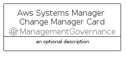

# AwsSystemsManagerChangeManager


```text
aws-q2-2023/Resource/ManagementGovernance/AwsSystemsManagerChangeManager
```

```text
include('aws-q2-2023/Resource/ManagementGovernance/AwsSystemsManagerChangeManager')
```


| Illustration | AwsSystemsManagerChangeManager | AwsSystemsManagerChangeManagerCard | AwsSystemsManagerChangeManagerGroup |
| :---: | :---: | :---: | :---: |
|  |  |  |  |


## Sprites
The item provides the following sriptes:

- `<$AwsSystemsManagerChangeManagerXs>`
- `<$AwsSystemsManagerChangeManagerSm>`
- `<$AwsSystemsManagerChangeManagerMd>`
- `<$AwsSystemsManagerChangeManagerLg>`


## AwsSystemsManagerChangeManager

### Load remotely
```plantuml
@startuml
' configures the library
!global $LIB_BASE_LOCATION="https://raw.githubusercontent.com/tmorin/plantuml-libs/master/distribution"

' loads the library's bootstrap
!include $LIB_BASE_LOCATION/bootstrap.puml

' loads the package bootstrap
include('aws-q2-2023/bootstrap')

' loads the Item which embeds the element AwsSystemsManagerChangeManager
include('aws-q2-2023/Resource/ManagementGovernance/AwsSystemsManagerChangeManager')

' renders the element
AwsSystemsManagerChangeManager('AwsSystemsManagerChangeManager', 'Aws Systems Manager Change Manager', 'an optional tech label', 'an optional description')
@enduml
```

### Load locally
```plantuml
@startuml
' configures the library
!global $INCLUSION_MODE="local"
!global $LIB_BASE_LOCATION="../../.."

' loads the library's bootstrap
!include $LIB_BASE_LOCATION/bootstrap.puml

' loads the package bootstrap
include('aws-q2-2023/bootstrap')

' loads the Item which embeds the element AwsSystemsManagerChangeManager
include('aws-q2-2023/Resource/ManagementGovernance/AwsSystemsManagerChangeManager')

' renders the element
AwsSystemsManagerChangeManager('AwsSystemsManagerChangeManager', 'Aws Systems Manager Change Manager', 'an optional tech label', 'an optional description')
@enduml
```

## AwsSystemsManagerChangeManagerCard

### Load remotely
```plantuml
@startuml
' configures the library
!global $LIB_BASE_LOCATION="https://raw.githubusercontent.com/tmorin/plantuml-libs/master/distribution"

' loads the library's bootstrap
!include $LIB_BASE_LOCATION/bootstrap.puml

' loads the package bootstrap
include('aws-q2-2023/bootstrap')

' loads the Item which embeds the element AwsSystemsManagerChangeManagerCard
include('aws-q2-2023/Resource/ManagementGovernance/AwsSystemsManagerChangeManager')

' renders the element
AwsSystemsManagerChangeManagerCard('AwsSystemsManagerChangeManagerCard', 'Aws Systems Manager Change Manager Card', 'an optional description')
@enduml
```

### Load locally
```plantuml
@startuml
' configures the library
!global $INCLUSION_MODE="local"
!global $LIB_BASE_LOCATION="../../.."

' loads the library's bootstrap
!include $LIB_BASE_LOCATION/bootstrap.puml

' loads the package bootstrap
include('aws-q2-2023/bootstrap')

' loads the Item which embeds the element AwsSystemsManagerChangeManagerCard
include('aws-q2-2023/Resource/ManagementGovernance/AwsSystemsManagerChangeManager')

' renders the element
AwsSystemsManagerChangeManagerCard('AwsSystemsManagerChangeManagerCard', 'Aws Systems Manager Change Manager Card', 'an optional description')
@enduml
```

## AwsSystemsManagerChangeManagerGroup

### Load remotely
```plantuml
@startuml
' configures the library
!global $LIB_BASE_LOCATION="https://raw.githubusercontent.com/tmorin/plantuml-libs/master/distribution"

' loads the library's bootstrap
!include $LIB_BASE_LOCATION/bootstrap.puml

' loads the package bootstrap
include('aws-q2-2023/bootstrap')

' loads the Item which embeds the element AwsSystemsManagerChangeManagerGroup
include('aws-q2-2023/Resource/ManagementGovernance/AwsSystemsManagerChangeManager')

' renders the element
AwsSystemsManagerChangeManagerGroup('AwsSystemsManagerChangeManagerGroup', 'Aws Systems Manager Change Manager Group', 'an optional tech label') {
    note as note
        the content of the group
    end note
}
@enduml
```

### Load locally
```plantuml
@startuml
' configures the library
!global $INCLUSION_MODE="local"
!global $LIB_BASE_LOCATION="../../.."

' loads the library's bootstrap
!include $LIB_BASE_LOCATION/bootstrap.puml

' loads the package bootstrap
include('aws-q2-2023/bootstrap')

' loads the Item which embeds the element AwsSystemsManagerChangeManagerGroup
include('aws-q2-2023/Resource/ManagementGovernance/AwsSystemsManagerChangeManager')

' renders the element
AwsSystemsManagerChangeManagerGroup('AwsSystemsManagerChangeManagerGroup', 'Aws Systems Manager Change Manager Group', 'an optional tech label') {
    note as note
        the content of the group
    end note
}
@enduml
```

