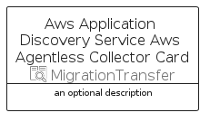

# AwsApplicationDiscoveryServiceAwsAgentlessCollector


```text
aws-q2-2023/Resource/MigrationTransfer/AwsApplicationDiscoveryServiceAwsAgentlessCollector
```

```text
include('aws-q2-2023/Resource/MigrationTransfer/AwsApplicationDiscoveryServiceAwsAgentlessCollector')
```


| Illustration | AwsApplicationDiscoveryServiceAwsAgentlessCollector | AwsApplicationDiscoveryServiceAwsAgentlessCollectorCard | AwsApplicationDiscoveryServiceAwsAgentlessCollectorGroup |
| :---: | :---: | :---: | :---: |
|  |  |  |  |


## Sprites
The item provides the following sriptes:

- `<$AwsApplicationDiscoveryServiceAwsAgentlessCollectorXs>`
- `<$AwsApplicationDiscoveryServiceAwsAgentlessCollectorSm>`
- `<$AwsApplicationDiscoveryServiceAwsAgentlessCollectorMd>`
- `<$AwsApplicationDiscoveryServiceAwsAgentlessCollectorLg>`


## AwsApplicationDiscoveryServiceAwsAgentlessCollector

### Load remotely
```plantuml
@startuml
' configures the library
!global $LIB_BASE_LOCATION="https://raw.githubusercontent.com/tmorin/plantuml-libs/master/distribution"

' loads the library's bootstrap
!include $LIB_BASE_LOCATION/bootstrap.puml

' loads the package bootstrap
include('aws-q2-2023/bootstrap')

' loads the Item which embeds the element AwsApplicationDiscoveryServiceAwsAgentlessCollector
include('aws-q2-2023/Resource/MigrationTransfer/AwsApplicationDiscoveryServiceAwsAgentlessCollector')

' renders the element
AwsApplicationDiscoveryServiceAwsAgentlessCollector('AwsApplicationDiscoveryServiceAwsAgentlessCollector', 'Aws Application Discovery Service Aws Agentless Collector', 'an optional tech label', 'an optional description')
@enduml
```

### Load locally
```plantuml
@startuml
' configures the library
!global $INCLUSION_MODE="local"
!global $LIB_BASE_LOCATION="../../.."

' loads the library's bootstrap
!include $LIB_BASE_LOCATION/bootstrap.puml

' loads the package bootstrap
include('aws-q2-2023/bootstrap')

' loads the Item which embeds the element AwsApplicationDiscoveryServiceAwsAgentlessCollector
include('aws-q2-2023/Resource/MigrationTransfer/AwsApplicationDiscoveryServiceAwsAgentlessCollector')

' renders the element
AwsApplicationDiscoveryServiceAwsAgentlessCollector('AwsApplicationDiscoveryServiceAwsAgentlessCollector', 'Aws Application Discovery Service Aws Agentless Collector', 'an optional tech label', 'an optional description')
@enduml
```

## AwsApplicationDiscoveryServiceAwsAgentlessCollectorCard

### Load remotely
```plantuml
@startuml
' configures the library
!global $LIB_BASE_LOCATION="https://raw.githubusercontent.com/tmorin/plantuml-libs/master/distribution"

' loads the library's bootstrap
!include $LIB_BASE_LOCATION/bootstrap.puml

' loads the package bootstrap
include('aws-q2-2023/bootstrap')

' loads the Item which embeds the element AwsApplicationDiscoveryServiceAwsAgentlessCollectorCard
include('aws-q2-2023/Resource/MigrationTransfer/AwsApplicationDiscoveryServiceAwsAgentlessCollector')

' renders the element
AwsApplicationDiscoveryServiceAwsAgentlessCollectorCard('AwsApplicationDiscoveryServiceAwsAgentlessCollectorCard', 'Aws Application Discovery Service Aws Agentless Collector Card', 'an optional description')
@enduml
```

### Load locally
```plantuml
@startuml
' configures the library
!global $INCLUSION_MODE="local"
!global $LIB_BASE_LOCATION="../../.."

' loads the library's bootstrap
!include $LIB_BASE_LOCATION/bootstrap.puml

' loads the package bootstrap
include('aws-q2-2023/bootstrap')

' loads the Item which embeds the element AwsApplicationDiscoveryServiceAwsAgentlessCollectorCard
include('aws-q2-2023/Resource/MigrationTransfer/AwsApplicationDiscoveryServiceAwsAgentlessCollector')

' renders the element
AwsApplicationDiscoveryServiceAwsAgentlessCollectorCard('AwsApplicationDiscoveryServiceAwsAgentlessCollectorCard', 'Aws Application Discovery Service Aws Agentless Collector Card', 'an optional description')
@enduml
```

## AwsApplicationDiscoveryServiceAwsAgentlessCollectorGroup

### Load remotely
```plantuml
@startuml
' configures the library
!global $LIB_BASE_LOCATION="https://raw.githubusercontent.com/tmorin/plantuml-libs/master/distribution"

' loads the library's bootstrap
!include $LIB_BASE_LOCATION/bootstrap.puml

' loads the package bootstrap
include('aws-q2-2023/bootstrap')

' loads the Item which embeds the element AwsApplicationDiscoveryServiceAwsAgentlessCollectorGroup
include('aws-q2-2023/Resource/MigrationTransfer/AwsApplicationDiscoveryServiceAwsAgentlessCollector')

' renders the element
AwsApplicationDiscoveryServiceAwsAgentlessCollectorGroup('AwsApplicationDiscoveryServiceAwsAgentlessCollectorGroup', 'Aws Application Discovery Service Aws Agentless Collector Group', 'an optional tech label') {
    note as note
        the content of the group
    end note
}
@enduml
```

### Load locally
```plantuml
@startuml
' configures the library
!global $INCLUSION_MODE="local"
!global $LIB_BASE_LOCATION="../../.."

' loads the library's bootstrap
!include $LIB_BASE_LOCATION/bootstrap.puml

' loads the package bootstrap
include('aws-q2-2023/bootstrap')

' loads the Item which embeds the element AwsApplicationDiscoveryServiceAwsAgentlessCollectorGroup
include('aws-q2-2023/Resource/MigrationTransfer/AwsApplicationDiscoveryServiceAwsAgentlessCollector')

' renders the element
AwsApplicationDiscoveryServiceAwsAgentlessCollectorGroup('AwsApplicationDiscoveryServiceAwsAgentlessCollectorGroup', 'Aws Application Discovery Service Aws Agentless Collector Group', 'an optional tech label') {
    note as note
        the content of the group
    end note
}
@enduml
```

