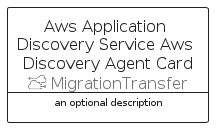

# AwsApplicationDiscoveryServiceAwsDiscoveryAgent


```text
aws-q2-2023/Resource/MigrationTransfer/AwsApplicationDiscoveryServiceAwsDiscoveryAgent
```

```text
include('aws-q2-2023/Resource/MigrationTransfer/AwsApplicationDiscoveryServiceAwsDiscoveryAgent')
```


| Illustration | AwsApplicationDiscoveryServiceAwsDiscoveryAgent | AwsApplicationDiscoveryServiceAwsDiscoveryAgentCard | AwsApplicationDiscoveryServiceAwsDiscoveryAgentGroup |
| :---: | :---: | :---: | :---: |
|  |  |  |  |


## Sprites
The item provides the following sriptes:

- `<$AwsApplicationDiscoveryServiceAwsDiscoveryAgentXs>`
- `<$AwsApplicationDiscoveryServiceAwsDiscoveryAgentSm>`
- `<$AwsApplicationDiscoveryServiceAwsDiscoveryAgentMd>`
- `<$AwsApplicationDiscoveryServiceAwsDiscoveryAgentLg>`


## AwsApplicationDiscoveryServiceAwsDiscoveryAgent

### Load remotely
```plantuml
@startuml
' configures the library
!global $LIB_BASE_LOCATION="https://raw.githubusercontent.com/tmorin/plantuml-libs/master/distribution"

' loads the library's bootstrap
!include $LIB_BASE_LOCATION/bootstrap.puml

' loads the package bootstrap
include('aws-q2-2023/bootstrap')

' loads the Item which embeds the element AwsApplicationDiscoveryServiceAwsDiscoveryAgent
include('aws-q2-2023/Resource/MigrationTransfer/AwsApplicationDiscoveryServiceAwsDiscoveryAgent')

' renders the element
AwsApplicationDiscoveryServiceAwsDiscoveryAgent('AwsApplicationDiscoveryServiceAwsDiscoveryAgent', 'Aws Application Discovery Service Aws Discovery Agent', 'an optional tech label', 'an optional description')
@enduml
```

### Load locally
```plantuml
@startuml
' configures the library
!global $INCLUSION_MODE="local"
!global $LIB_BASE_LOCATION="../../.."

' loads the library's bootstrap
!include $LIB_BASE_LOCATION/bootstrap.puml

' loads the package bootstrap
include('aws-q2-2023/bootstrap')

' loads the Item which embeds the element AwsApplicationDiscoveryServiceAwsDiscoveryAgent
include('aws-q2-2023/Resource/MigrationTransfer/AwsApplicationDiscoveryServiceAwsDiscoveryAgent')

' renders the element
AwsApplicationDiscoveryServiceAwsDiscoveryAgent('AwsApplicationDiscoveryServiceAwsDiscoveryAgent', 'Aws Application Discovery Service Aws Discovery Agent', 'an optional tech label', 'an optional description')
@enduml
```

## AwsApplicationDiscoveryServiceAwsDiscoveryAgentCard

### Load remotely
```plantuml
@startuml
' configures the library
!global $LIB_BASE_LOCATION="https://raw.githubusercontent.com/tmorin/plantuml-libs/master/distribution"

' loads the library's bootstrap
!include $LIB_BASE_LOCATION/bootstrap.puml

' loads the package bootstrap
include('aws-q2-2023/bootstrap')

' loads the Item which embeds the element AwsApplicationDiscoveryServiceAwsDiscoveryAgentCard
include('aws-q2-2023/Resource/MigrationTransfer/AwsApplicationDiscoveryServiceAwsDiscoveryAgent')

' renders the element
AwsApplicationDiscoveryServiceAwsDiscoveryAgentCard('AwsApplicationDiscoveryServiceAwsDiscoveryAgentCard', 'Aws Application Discovery Service Aws Discovery Agent Card', 'an optional description')
@enduml
```

### Load locally
```plantuml
@startuml
' configures the library
!global $INCLUSION_MODE="local"
!global $LIB_BASE_LOCATION="../../.."

' loads the library's bootstrap
!include $LIB_BASE_LOCATION/bootstrap.puml

' loads the package bootstrap
include('aws-q2-2023/bootstrap')

' loads the Item which embeds the element AwsApplicationDiscoveryServiceAwsDiscoveryAgentCard
include('aws-q2-2023/Resource/MigrationTransfer/AwsApplicationDiscoveryServiceAwsDiscoveryAgent')

' renders the element
AwsApplicationDiscoveryServiceAwsDiscoveryAgentCard('AwsApplicationDiscoveryServiceAwsDiscoveryAgentCard', 'Aws Application Discovery Service Aws Discovery Agent Card', 'an optional description')
@enduml
```

## AwsApplicationDiscoveryServiceAwsDiscoveryAgentGroup

### Load remotely
```plantuml
@startuml
' configures the library
!global $LIB_BASE_LOCATION="https://raw.githubusercontent.com/tmorin/plantuml-libs/master/distribution"

' loads the library's bootstrap
!include $LIB_BASE_LOCATION/bootstrap.puml

' loads the package bootstrap
include('aws-q2-2023/bootstrap')

' loads the Item which embeds the element AwsApplicationDiscoveryServiceAwsDiscoveryAgentGroup
include('aws-q2-2023/Resource/MigrationTransfer/AwsApplicationDiscoveryServiceAwsDiscoveryAgent')

' renders the element
AwsApplicationDiscoveryServiceAwsDiscoveryAgentGroup('AwsApplicationDiscoveryServiceAwsDiscoveryAgentGroup', 'Aws Application Discovery Service Aws Discovery Agent Group', 'an optional tech label') {
    note as note
        the content of the group
    end note
}
@enduml
```

### Load locally
```plantuml
@startuml
' configures the library
!global $INCLUSION_MODE="local"
!global $LIB_BASE_LOCATION="../../.."

' loads the library's bootstrap
!include $LIB_BASE_LOCATION/bootstrap.puml

' loads the package bootstrap
include('aws-q2-2023/bootstrap')

' loads the Item which embeds the element AwsApplicationDiscoveryServiceAwsDiscoveryAgentGroup
include('aws-q2-2023/Resource/MigrationTransfer/AwsApplicationDiscoveryServiceAwsDiscoveryAgent')

' renders the element
AwsApplicationDiscoveryServiceAwsDiscoveryAgentGroup('AwsApplicationDiscoveryServiceAwsDiscoveryAgentGroup', 'Aws Application Discovery Service Aws Discovery Agent Group', 'an optional tech label') {
    note as note
        the content of the group
    end note
}
@enduml
```

