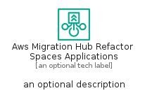

# AwsMigrationHubRefactorSpacesApplications


```text
aws-q2-2023/Resource/MigrationTransfer/AwsMigrationHubRefactorSpacesApplications
```

```text
include('aws-q2-2023/Resource/MigrationTransfer/AwsMigrationHubRefactorSpacesApplications')
```


| Illustration | AwsMigrationHubRefactorSpacesApplications | AwsMigrationHubRefactorSpacesApplicationsCard | AwsMigrationHubRefactorSpacesApplicationsGroup |
| :---: | :---: | :---: | :---: |
|  |  |  |  |


## Sprites
The item provides the following sriptes:

- `<$AwsMigrationHubRefactorSpacesApplicationsXs>`
- `<$AwsMigrationHubRefactorSpacesApplicationsSm>`
- `<$AwsMigrationHubRefactorSpacesApplicationsMd>`
- `<$AwsMigrationHubRefactorSpacesApplicationsLg>`


## AwsMigrationHubRefactorSpacesApplications

### Load remotely
```plantuml
@startuml
' configures the library
!global $LIB_BASE_LOCATION="https://raw.githubusercontent.com/tmorin/plantuml-libs/master/distribution"

' loads the library's bootstrap
!include $LIB_BASE_LOCATION/bootstrap.puml

' loads the package bootstrap
include('aws-q2-2023/bootstrap')

' loads the Item which embeds the element AwsMigrationHubRefactorSpacesApplications
include('aws-q2-2023/Resource/MigrationTransfer/AwsMigrationHubRefactorSpacesApplications')

' renders the element
AwsMigrationHubRefactorSpacesApplications('AwsMigrationHubRefactorSpacesApplications', 'Aws Migration Hub Refactor Spaces Applications', 'an optional tech label', 'an optional description')
@enduml
```

### Load locally
```plantuml
@startuml
' configures the library
!global $INCLUSION_MODE="local"
!global $LIB_BASE_LOCATION="../../.."

' loads the library's bootstrap
!include $LIB_BASE_LOCATION/bootstrap.puml

' loads the package bootstrap
include('aws-q2-2023/bootstrap')

' loads the Item which embeds the element AwsMigrationHubRefactorSpacesApplications
include('aws-q2-2023/Resource/MigrationTransfer/AwsMigrationHubRefactorSpacesApplications')

' renders the element
AwsMigrationHubRefactorSpacesApplications('AwsMigrationHubRefactorSpacesApplications', 'Aws Migration Hub Refactor Spaces Applications', 'an optional tech label', 'an optional description')
@enduml
```

## AwsMigrationHubRefactorSpacesApplicationsCard

### Load remotely
```plantuml
@startuml
' configures the library
!global $LIB_BASE_LOCATION="https://raw.githubusercontent.com/tmorin/plantuml-libs/master/distribution"

' loads the library's bootstrap
!include $LIB_BASE_LOCATION/bootstrap.puml

' loads the package bootstrap
include('aws-q2-2023/bootstrap')

' loads the Item which embeds the element AwsMigrationHubRefactorSpacesApplicationsCard
include('aws-q2-2023/Resource/MigrationTransfer/AwsMigrationHubRefactorSpacesApplications')

' renders the element
AwsMigrationHubRefactorSpacesApplicationsCard('AwsMigrationHubRefactorSpacesApplicationsCard', 'Aws Migration Hub Refactor Spaces Applications Card', 'an optional description')
@enduml
```

### Load locally
```plantuml
@startuml
' configures the library
!global $INCLUSION_MODE="local"
!global $LIB_BASE_LOCATION="../../.."

' loads the library's bootstrap
!include $LIB_BASE_LOCATION/bootstrap.puml

' loads the package bootstrap
include('aws-q2-2023/bootstrap')

' loads the Item which embeds the element AwsMigrationHubRefactorSpacesApplicationsCard
include('aws-q2-2023/Resource/MigrationTransfer/AwsMigrationHubRefactorSpacesApplications')

' renders the element
AwsMigrationHubRefactorSpacesApplicationsCard('AwsMigrationHubRefactorSpacesApplicationsCard', 'Aws Migration Hub Refactor Spaces Applications Card', 'an optional description')
@enduml
```

## AwsMigrationHubRefactorSpacesApplicationsGroup

### Load remotely
```plantuml
@startuml
' configures the library
!global $LIB_BASE_LOCATION="https://raw.githubusercontent.com/tmorin/plantuml-libs/master/distribution"

' loads the library's bootstrap
!include $LIB_BASE_LOCATION/bootstrap.puml

' loads the package bootstrap
include('aws-q2-2023/bootstrap')

' loads the Item which embeds the element AwsMigrationHubRefactorSpacesApplicationsGroup
include('aws-q2-2023/Resource/MigrationTransfer/AwsMigrationHubRefactorSpacesApplications')

' renders the element
AwsMigrationHubRefactorSpacesApplicationsGroup('AwsMigrationHubRefactorSpacesApplicationsGroup', 'Aws Migration Hub Refactor Spaces Applications Group', 'an optional tech label') {
    note as note
        the content of the group
    end note
}
@enduml
```

### Load locally
```plantuml
@startuml
' configures the library
!global $INCLUSION_MODE="local"
!global $LIB_BASE_LOCATION="../../.."

' loads the library's bootstrap
!include $LIB_BASE_LOCATION/bootstrap.puml

' loads the package bootstrap
include('aws-q2-2023/bootstrap')

' loads the Item which embeds the element AwsMigrationHubRefactorSpacesApplicationsGroup
include('aws-q2-2023/Resource/MigrationTransfer/AwsMigrationHubRefactorSpacesApplications')

' renders the element
AwsMigrationHubRefactorSpacesApplicationsGroup('AwsMigrationHubRefactorSpacesApplicationsGroup', 'Aws Migration Hub Refactor Spaces Applications Group', 'an optional tech label') {
    note as note
        the content of the group
    end note
}
@enduml
```

