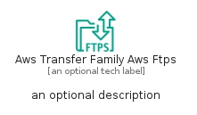
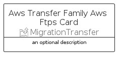

# AwsTransferFamilyAwsFtps


```text
aws-q2-2023/Resource/MigrationTransfer/AwsTransferFamilyAwsFtps
```

```text
include('aws-q2-2023/Resource/MigrationTransfer/AwsTransferFamilyAwsFtps')
```


| Illustration | AwsTransferFamilyAwsFtps | AwsTransferFamilyAwsFtpsCard | AwsTransferFamilyAwsFtpsGroup |
| :---: | :---: | :---: | :---: |
|  |  |  |  |


## Sprites
The item provides the following sriptes:

- `<$AwsTransferFamilyAwsFtpsXs>`
- `<$AwsTransferFamilyAwsFtpsSm>`
- `<$AwsTransferFamilyAwsFtpsMd>`
- `<$AwsTransferFamilyAwsFtpsLg>`


## AwsTransferFamilyAwsFtps

### Load remotely
```plantuml
@startuml
' configures the library
!global $LIB_BASE_LOCATION="https://raw.githubusercontent.com/tmorin/plantuml-libs/master/distribution"

' loads the library's bootstrap
!include $LIB_BASE_LOCATION/bootstrap.puml

' loads the package bootstrap
include('aws-q2-2023/bootstrap')

' loads the Item which embeds the element AwsTransferFamilyAwsFtps
include('aws-q2-2023/Resource/MigrationTransfer/AwsTransferFamilyAwsFtps')

' renders the element
AwsTransferFamilyAwsFtps('AwsTransferFamilyAwsFtps', 'Aws Transfer Family Aws Ftps', 'an optional tech label', 'an optional description')
@enduml
```

### Load locally
```plantuml
@startuml
' configures the library
!global $INCLUSION_MODE="local"
!global $LIB_BASE_LOCATION="../../.."

' loads the library's bootstrap
!include $LIB_BASE_LOCATION/bootstrap.puml

' loads the package bootstrap
include('aws-q2-2023/bootstrap')

' loads the Item which embeds the element AwsTransferFamilyAwsFtps
include('aws-q2-2023/Resource/MigrationTransfer/AwsTransferFamilyAwsFtps')

' renders the element
AwsTransferFamilyAwsFtps('AwsTransferFamilyAwsFtps', 'Aws Transfer Family Aws Ftps', 'an optional tech label', 'an optional description')
@enduml
```

## AwsTransferFamilyAwsFtpsCard

### Load remotely
```plantuml
@startuml
' configures the library
!global $LIB_BASE_LOCATION="https://raw.githubusercontent.com/tmorin/plantuml-libs/master/distribution"

' loads the library's bootstrap
!include $LIB_BASE_LOCATION/bootstrap.puml

' loads the package bootstrap
include('aws-q2-2023/bootstrap')

' loads the Item which embeds the element AwsTransferFamilyAwsFtpsCard
include('aws-q2-2023/Resource/MigrationTransfer/AwsTransferFamilyAwsFtps')

' renders the element
AwsTransferFamilyAwsFtpsCard('AwsTransferFamilyAwsFtpsCard', 'Aws Transfer Family Aws Ftps Card', 'an optional description')
@enduml
```

### Load locally
```plantuml
@startuml
' configures the library
!global $INCLUSION_MODE="local"
!global $LIB_BASE_LOCATION="../../.."

' loads the library's bootstrap
!include $LIB_BASE_LOCATION/bootstrap.puml

' loads the package bootstrap
include('aws-q2-2023/bootstrap')

' loads the Item which embeds the element AwsTransferFamilyAwsFtpsCard
include('aws-q2-2023/Resource/MigrationTransfer/AwsTransferFamilyAwsFtps')

' renders the element
AwsTransferFamilyAwsFtpsCard('AwsTransferFamilyAwsFtpsCard', 'Aws Transfer Family Aws Ftps Card', 'an optional description')
@enduml
```

## AwsTransferFamilyAwsFtpsGroup

### Load remotely
```plantuml
@startuml
' configures the library
!global $LIB_BASE_LOCATION="https://raw.githubusercontent.com/tmorin/plantuml-libs/master/distribution"

' loads the library's bootstrap
!include $LIB_BASE_LOCATION/bootstrap.puml

' loads the package bootstrap
include('aws-q2-2023/bootstrap')

' loads the Item which embeds the element AwsTransferFamilyAwsFtpsGroup
include('aws-q2-2023/Resource/MigrationTransfer/AwsTransferFamilyAwsFtps')

' renders the element
AwsTransferFamilyAwsFtpsGroup('AwsTransferFamilyAwsFtpsGroup', 'Aws Transfer Family Aws Ftps Group', 'an optional tech label') {
    note as note
        the content of the group
    end note
}
@enduml
```

### Load locally
```plantuml
@startuml
' configures the library
!global $INCLUSION_MODE="local"
!global $LIB_BASE_LOCATION="../../.."

' loads the library's bootstrap
!include $LIB_BASE_LOCATION/bootstrap.puml

' loads the package bootstrap
include('aws-q2-2023/bootstrap')

' loads the Item which embeds the element AwsTransferFamilyAwsFtpsGroup
include('aws-q2-2023/Resource/MigrationTransfer/AwsTransferFamilyAwsFtps')

' renders the element
AwsTransferFamilyAwsFtpsGroup('AwsTransferFamilyAwsFtpsGroup', 'Aws Transfer Family Aws Ftps Group', 'an optional tech label') {
    note as note
        the content of the group
    end note
}
@enduml
```

