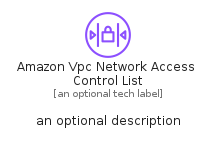
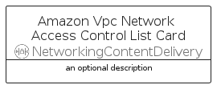

# AmazonVpcNetworkAccessControlList


```text
aws-q2-2023/Resource/NetworkingContentDelivery/AmazonVpcNetworkAccessControlList
```

```text
include('aws-q2-2023/Resource/NetworkingContentDelivery/AmazonVpcNetworkAccessControlList')
```


| Illustration | AmazonVpcNetworkAccessControlList | AmazonVpcNetworkAccessControlListCard | AmazonVpcNetworkAccessControlListGroup |
| :---: | :---: | :---: | :---: |
|  |  |  |  |


## Sprites
The item provides the following sriptes:

- `<$AmazonVpcNetworkAccessControlListXs>`
- `<$AmazonVpcNetworkAccessControlListSm>`
- `<$AmazonVpcNetworkAccessControlListMd>`
- `<$AmazonVpcNetworkAccessControlListLg>`


## AmazonVpcNetworkAccessControlList

### Load remotely
```plantuml
@startuml
' configures the library
!global $LIB_BASE_LOCATION="https://raw.githubusercontent.com/tmorin/plantuml-libs/master/distribution"

' loads the library's bootstrap
!include $LIB_BASE_LOCATION/bootstrap.puml

' loads the package bootstrap
include('aws-q2-2023/bootstrap')

' loads the Item which embeds the element AmazonVpcNetworkAccessControlList
include('aws-q2-2023/Resource/NetworkingContentDelivery/AmazonVpcNetworkAccessControlList')

' renders the element
AmazonVpcNetworkAccessControlList('AmazonVpcNetworkAccessControlList', 'Amazon Vpc Network Access Control List', 'an optional tech label', 'an optional description')
@enduml
```

### Load locally
```plantuml
@startuml
' configures the library
!global $INCLUSION_MODE="local"
!global $LIB_BASE_LOCATION="../../.."

' loads the library's bootstrap
!include $LIB_BASE_LOCATION/bootstrap.puml

' loads the package bootstrap
include('aws-q2-2023/bootstrap')

' loads the Item which embeds the element AmazonVpcNetworkAccessControlList
include('aws-q2-2023/Resource/NetworkingContentDelivery/AmazonVpcNetworkAccessControlList')

' renders the element
AmazonVpcNetworkAccessControlList('AmazonVpcNetworkAccessControlList', 'Amazon Vpc Network Access Control List', 'an optional tech label', 'an optional description')
@enduml
```

## AmazonVpcNetworkAccessControlListCard

### Load remotely
```plantuml
@startuml
' configures the library
!global $LIB_BASE_LOCATION="https://raw.githubusercontent.com/tmorin/plantuml-libs/master/distribution"

' loads the library's bootstrap
!include $LIB_BASE_LOCATION/bootstrap.puml

' loads the package bootstrap
include('aws-q2-2023/bootstrap')

' loads the Item which embeds the element AmazonVpcNetworkAccessControlListCard
include('aws-q2-2023/Resource/NetworkingContentDelivery/AmazonVpcNetworkAccessControlList')

' renders the element
AmazonVpcNetworkAccessControlListCard('AmazonVpcNetworkAccessControlListCard', 'Amazon Vpc Network Access Control List Card', 'an optional description')
@enduml
```

### Load locally
```plantuml
@startuml
' configures the library
!global $INCLUSION_MODE="local"
!global $LIB_BASE_LOCATION="../../.."

' loads the library's bootstrap
!include $LIB_BASE_LOCATION/bootstrap.puml

' loads the package bootstrap
include('aws-q2-2023/bootstrap')

' loads the Item which embeds the element AmazonVpcNetworkAccessControlListCard
include('aws-q2-2023/Resource/NetworkingContentDelivery/AmazonVpcNetworkAccessControlList')

' renders the element
AmazonVpcNetworkAccessControlListCard('AmazonVpcNetworkAccessControlListCard', 'Amazon Vpc Network Access Control List Card', 'an optional description')
@enduml
```

## AmazonVpcNetworkAccessControlListGroup

### Load remotely
```plantuml
@startuml
' configures the library
!global $LIB_BASE_LOCATION="https://raw.githubusercontent.com/tmorin/plantuml-libs/master/distribution"

' loads the library's bootstrap
!include $LIB_BASE_LOCATION/bootstrap.puml

' loads the package bootstrap
include('aws-q2-2023/bootstrap')

' loads the Item which embeds the element AmazonVpcNetworkAccessControlListGroup
include('aws-q2-2023/Resource/NetworkingContentDelivery/AmazonVpcNetworkAccessControlList')

' renders the element
AmazonVpcNetworkAccessControlListGroup('AmazonVpcNetworkAccessControlListGroup', 'Amazon Vpc Network Access Control List Group', 'an optional tech label') {
    note as note
        the content of the group
    end note
}
@enduml
```

### Load locally
```plantuml
@startuml
' configures the library
!global $INCLUSION_MODE="local"
!global $LIB_BASE_LOCATION="../../.."

' loads the library's bootstrap
!include $LIB_BASE_LOCATION/bootstrap.puml

' loads the package bootstrap
include('aws-q2-2023/bootstrap')

' loads the Item which embeds the element AmazonVpcNetworkAccessControlListGroup
include('aws-q2-2023/Resource/NetworkingContentDelivery/AmazonVpcNetworkAccessControlList')

' renders the element
AmazonVpcNetworkAccessControlListGroup('AmazonVpcNetworkAccessControlListGroup', 'Amazon Vpc Network Access Control List Group', 'an optional tech label') {
    note as note
        the content of the group
    end note
}
@enduml
```

