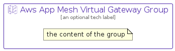

# AwsAppMeshVirtualGateway


```text
aws-q2-2023/Resource/NetworkingContentDelivery/AwsAppMeshVirtualGateway
```

```text
include('aws-q2-2023/Resource/NetworkingContentDelivery/AwsAppMeshVirtualGateway')
```


| Illustration | AwsAppMeshVirtualGateway | AwsAppMeshVirtualGatewayCard | AwsAppMeshVirtualGatewayGroup |
| :---: | :---: | :---: | :---: |
|  |  |  |  |


## Sprites
The item provides the following sriptes:

- `<$AwsAppMeshVirtualGatewayXs>`
- `<$AwsAppMeshVirtualGatewaySm>`
- `<$AwsAppMeshVirtualGatewayMd>`
- `<$AwsAppMeshVirtualGatewayLg>`


## AwsAppMeshVirtualGateway

### Load remotely
```plantuml
@startuml
' configures the library
!global $LIB_BASE_LOCATION="https://raw.githubusercontent.com/tmorin/plantuml-libs/master/distribution"

' loads the library's bootstrap
!include $LIB_BASE_LOCATION/bootstrap.puml

' loads the package bootstrap
include('aws-q2-2023/bootstrap')

' loads the Item which embeds the element AwsAppMeshVirtualGateway
include('aws-q2-2023/Resource/NetworkingContentDelivery/AwsAppMeshVirtualGateway')

' renders the element
AwsAppMeshVirtualGateway('AwsAppMeshVirtualGateway', 'Aws App Mesh Virtual Gateway', 'an optional tech label', 'an optional description')
@enduml
```

### Load locally
```plantuml
@startuml
' configures the library
!global $INCLUSION_MODE="local"
!global $LIB_BASE_LOCATION="../../.."

' loads the library's bootstrap
!include $LIB_BASE_LOCATION/bootstrap.puml

' loads the package bootstrap
include('aws-q2-2023/bootstrap')

' loads the Item which embeds the element AwsAppMeshVirtualGateway
include('aws-q2-2023/Resource/NetworkingContentDelivery/AwsAppMeshVirtualGateway')

' renders the element
AwsAppMeshVirtualGateway('AwsAppMeshVirtualGateway', 'Aws App Mesh Virtual Gateway', 'an optional tech label', 'an optional description')
@enduml
```

## AwsAppMeshVirtualGatewayCard

### Load remotely
```plantuml
@startuml
' configures the library
!global $LIB_BASE_LOCATION="https://raw.githubusercontent.com/tmorin/plantuml-libs/master/distribution"

' loads the library's bootstrap
!include $LIB_BASE_LOCATION/bootstrap.puml

' loads the package bootstrap
include('aws-q2-2023/bootstrap')

' loads the Item which embeds the element AwsAppMeshVirtualGatewayCard
include('aws-q2-2023/Resource/NetworkingContentDelivery/AwsAppMeshVirtualGateway')

' renders the element
AwsAppMeshVirtualGatewayCard('AwsAppMeshVirtualGatewayCard', 'Aws App Mesh Virtual Gateway Card', 'an optional description')
@enduml
```

### Load locally
```plantuml
@startuml
' configures the library
!global $INCLUSION_MODE="local"
!global $LIB_BASE_LOCATION="../../.."

' loads the library's bootstrap
!include $LIB_BASE_LOCATION/bootstrap.puml

' loads the package bootstrap
include('aws-q2-2023/bootstrap')

' loads the Item which embeds the element AwsAppMeshVirtualGatewayCard
include('aws-q2-2023/Resource/NetworkingContentDelivery/AwsAppMeshVirtualGateway')

' renders the element
AwsAppMeshVirtualGatewayCard('AwsAppMeshVirtualGatewayCard', 'Aws App Mesh Virtual Gateway Card', 'an optional description')
@enduml
```

## AwsAppMeshVirtualGatewayGroup

### Load remotely
```plantuml
@startuml
' configures the library
!global $LIB_BASE_LOCATION="https://raw.githubusercontent.com/tmorin/plantuml-libs/master/distribution"

' loads the library's bootstrap
!include $LIB_BASE_LOCATION/bootstrap.puml

' loads the package bootstrap
include('aws-q2-2023/bootstrap')

' loads the Item which embeds the element AwsAppMeshVirtualGatewayGroup
include('aws-q2-2023/Resource/NetworkingContentDelivery/AwsAppMeshVirtualGateway')

' renders the element
AwsAppMeshVirtualGatewayGroup('AwsAppMeshVirtualGatewayGroup', 'Aws App Mesh Virtual Gateway Group', 'an optional tech label') {
    note as note
        the content of the group
    end note
}
@enduml
```

### Load locally
```plantuml
@startuml
' configures the library
!global $INCLUSION_MODE="local"
!global $LIB_BASE_LOCATION="../../.."

' loads the library's bootstrap
!include $LIB_BASE_LOCATION/bootstrap.puml

' loads the package bootstrap
include('aws-q2-2023/bootstrap')

' loads the Item which embeds the element AwsAppMeshVirtualGatewayGroup
include('aws-q2-2023/Resource/NetworkingContentDelivery/AwsAppMeshVirtualGateway')

' renders the element
AwsAppMeshVirtualGatewayGroup('AwsAppMeshVirtualGatewayGroup', 'Aws App Mesh Virtual Gateway Group', 'an optional tech label') {
    note as note
        the content of the group
    end note
}
@enduml
```

