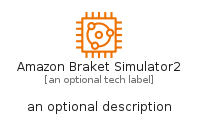
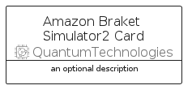

# AmazonBraketSimulator2


```text
aws-q2-2023/Resource/QuantumTechnologies/AmazonBraketSimulator2
```

```text
include('aws-q2-2023/Resource/QuantumTechnologies/AmazonBraketSimulator2')
```


| Illustration | AmazonBraketSimulator2 | AmazonBraketSimulator2Card | AmazonBraketSimulator2Group |
| :---: | :---: | :---: | :---: |
|  |  |  |  |


## Sprites
The item provides the following sriptes:

- `<$AmazonBraketSimulator2Xs>`
- `<$AmazonBraketSimulator2Sm>`
- `<$AmazonBraketSimulator2Md>`
- `<$AmazonBraketSimulator2Lg>`


## AmazonBraketSimulator2

### Load remotely
```plantuml
@startuml
' configures the library
!global $LIB_BASE_LOCATION="https://raw.githubusercontent.com/tmorin/plantuml-libs/master/distribution"

' loads the library's bootstrap
!include $LIB_BASE_LOCATION/bootstrap.puml

' loads the package bootstrap
include('aws-q2-2023/bootstrap')

' loads the Item which embeds the element AmazonBraketSimulator2
include('aws-q2-2023/Resource/QuantumTechnologies/AmazonBraketSimulator2')

' renders the element
AmazonBraketSimulator2('AmazonBraketSimulator2', 'Amazon Braket Simulator2', 'an optional tech label', 'an optional description')
@enduml
```

### Load locally
```plantuml
@startuml
' configures the library
!global $INCLUSION_MODE="local"
!global $LIB_BASE_LOCATION="../../.."

' loads the library's bootstrap
!include $LIB_BASE_LOCATION/bootstrap.puml

' loads the package bootstrap
include('aws-q2-2023/bootstrap')

' loads the Item which embeds the element AmazonBraketSimulator2
include('aws-q2-2023/Resource/QuantumTechnologies/AmazonBraketSimulator2')

' renders the element
AmazonBraketSimulator2('AmazonBraketSimulator2', 'Amazon Braket Simulator2', 'an optional tech label', 'an optional description')
@enduml
```

## AmazonBraketSimulator2Card

### Load remotely
```plantuml
@startuml
' configures the library
!global $LIB_BASE_LOCATION="https://raw.githubusercontent.com/tmorin/plantuml-libs/master/distribution"

' loads the library's bootstrap
!include $LIB_BASE_LOCATION/bootstrap.puml

' loads the package bootstrap
include('aws-q2-2023/bootstrap')

' loads the Item which embeds the element AmazonBraketSimulator2Card
include('aws-q2-2023/Resource/QuantumTechnologies/AmazonBraketSimulator2')

' renders the element
AmazonBraketSimulator2Card('AmazonBraketSimulator2Card', 'Amazon Braket Simulator2 Card', 'an optional description')
@enduml
```

### Load locally
```plantuml
@startuml
' configures the library
!global $INCLUSION_MODE="local"
!global $LIB_BASE_LOCATION="../../.."

' loads the library's bootstrap
!include $LIB_BASE_LOCATION/bootstrap.puml

' loads the package bootstrap
include('aws-q2-2023/bootstrap')

' loads the Item which embeds the element AmazonBraketSimulator2Card
include('aws-q2-2023/Resource/QuantumTechnologies/AmazonBraketSimulator2')

' renders the element
AmazonBraketSimulator2Card('AmazonBraketSimulator2Card', 'Amazon Braket Simulator2 Card', 'an optional description')
@enduml
```

## AmazonBraketSimulator2Group

### Load remotely
```plantuml
@startuml
' configures the library
!global $LIB_BASE_LOCATION="https://raw.githubusercontent.com/tmorin/plantuml-libs/master/distribution"

' loads the library's bootstrap
!include $LIB_BASE_LOCATION/bootstrap.puml

' loads the package bootstrap
include('aws-q2-2023/bootstrap')

' loads the Item which embeds the element AmazonBraketSimulator2Group
include('aws-q2-2023/Resource/QuantumTechnologies/AmazonBraketSimulator2')

' renders the element
AmazonBraketSimulator2Group('AmazonBraketSimulator2Group', 'Amazon Braket Simulator2 Group', 'an optional tech label') {
    note as note
        the content of the group
    end note
}
@enduml
```

### Load locally
```plantuml
@startuml
' configures the library
!global $INCLUSION_MODE="local"
!global $LIB_BASE_LOCATION="../../.."

' loads the library's bootstrap
!include $LIB_BASE_LOCATION/bootstrap.puml

' loads the package bootstrap
include('aws-q2-2023/bootstrap')

' loads the Item which embeds the element AmazonBraketSimulator2Group
include('aws-q2-2023/Resource/QuantumTechnologies/AmazonBraketSimulator2')

' renders the element
AmazonBraketSimulator2Group('AmazonBraketSimulator2Group', 'Amazon Braket Simulator2 Group', 'an optional tech label') {
    note as note
        the content of the group
    end note
}
@enduml
```

