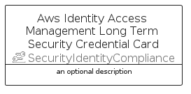

# AwsIdentityAccessManagementLongTermSecurityCredential


```text
aws-q2-2023/Resource/SecurityIdentityCompliance/AwsIdentityAccessManagementLongTermSecurityCredential
```

```text
include('aws-q2-2023/Resource/SecurityIdentityCompliance/AwsIdentityAccessManagementLongTermSecurityCredential')
```


| Illustration | AwsIdentityAccessManagementLongTermSecurityCredential | AwsIdentityAccessManagementLongTermSecurityCredentialCard | AwsIdentityAccessManagementLongTermSecurityCredentialGroup |
| :---: | :---: | :---: | :---: |
|  |  |  |  |


## Sprites
The item provides the following sriptes:

- `<$AwsIdentityAccessManagementLongTermSecurityCredentialXs>`
- `<$AwsIdentityAccessManagementLongTermSecurityCredentialSm>`
- `<$AwsIdentityAccessManagementLongTermSecurityCredentialMd>`
- `<$AwsIdentityAccessManagementLongTermSecurityCredentialLg>`


## AwsIdentityAccessManagementLongTermSecurityCredential

### Load remotely
```plantuml
@startuml
' configures the library
!global $LIB_BASE_LOCATION="https://raw.githubusercontent.com/tmorin/plantuml-libs/master/distribution"

' loads the library's bootstrap
!include $LIB_BASE_LOCATION/bootstrap.puml

' loads the package bootstrap
include('aws-q2-2023/bootstrap')

' loads the Item which embeds the element AwsIdentityAccessManagementLongTermSecurityCredential
include('aws-q2-2023/Resource/SecurityIdentityCompliance/AwsIdentityAccessManagementLongTermSecurityCredential')

' renders the element
AwsIdentityAccessManagementLongTermSecurityCredential('AwsIdentityAccessManagementLongTermSecurityCredential', 'Aws Identity Access Management Long Term Security Credential', 'an optional tech label', 'an optional description')
@enduml
```

### Load locally
```plantuml
@startuml
' configures the library
!global $INCLUSION_MODE="local"
!global $LIB_BASE_LOCATION="../../.."

' loads the library's bootstrap
!include $LIB_BASE_LOCATION/bootstrap.puml

' loads the package bootstrap
include('aws-q2-2023/bootstrap')

' loads the Item which embeds the element AwsIdentityAccessManagementLongTermSecurityCredential
include('aws-q2-2023/Resource/SecurityIdentityCompliance/AwsIdentityAccessManagementLongTermSecurityCredential')

' renders the element
AwsIdentityAccessManagementLongTermSecurityCredential('AwsIdentityAccessManagementLongTermSecurityCredential', 'Aws Identity Access Management Long Term Security Credential', 'an optional tech label', 'an optional description')
@enduml
```

## AwsIdentityAccessManagementLongTermSecurityCredentialCard

### Load remotely
```plantuml
@startuml
' configures the library
!global $LIB_BASE_LOCATION="https://raw.githubusercontent.com/tmorin/plantuml-libs/master/distribution"

' loads the library's bootstrap
!include $LIB_BASE_LOCATION/bootstrap.puml

' loads the package bootstrap
include('aws-q2-2023/bootstrap')

' loads the Item which embeds the element AwsIdentityAccessManagementLongTermSecurityCredentialCard
include('aws-q2-2023/Resource/SecurityIdentityCompliance/AwsIdentityAccessManagementLongTermSecurityCredential')

' renders the element
AwsIdentityAccessManagementLongTermSecurityCredentialCard('AwsIdentityAccessManagementLongTermSecurityCredentialCard', 'Aws Identity Access Management Long Term Security Credential Card', 'an optional description')
@enduml
```

### Load locally
```plantuml
@startuml
' configures the library
!global $INCLUSION_MODE="local"
!global $LIB_BASE_LOCATION="../../.."

' loads the library's bootstrap
!include $LIB_BASE_LOCATION/bootstrap.puml

' loads the package bootstrap
include('aws-q2-2023/bootstrap')

' loads the Item which embeds the element AwsIdentityAccessManagementLongTermSecurityCredentialCard
include('aws-q2-2023/Resource/SecurityIdentityCompliance/AwsIdentityAccessManagementLongTermSecurityCredential')

' renders the element
AwsIdentityAccessManagementLongTermSecurityCredentialCard('AwsIdentityAccessManagementLongTermSecurityCredentialCard', 'Aws Identity Access Management Long Term Security Credential Card', 'an optional description')
@enduml
```

## AwsIdentityAccessManagementLongTermSecurityCredentialGroup

### Load remotely
```plantuml
@startuml
' configures the library
!global $LIB_BASE_LOCATION="https://raw.githubusercontent.com/tmorin/plantuml-libs/master/distribution"

' loads the library's bootstrap
!include $LIB_BASE_LOCATION/bootstrap.puml

' loads the package bootstrap
include('aws-q2-2023/bootstrap')

' loads the Item which embeds the element AwsIdentityAccessManagementLongTermSecurityCredentialGroup
include('aws-q2-2023/Resource/SecurityIdentityCompliance/AwsIdentityAccessManagementLongTermSecurityCredential')

' renders the element
AwsIdentityAccessManagementLongTermSecurityCredentialGroup('AwsIdentityAccessManagementLongTermSecurityCredentialGroup', 'Aws Identity Access Management Long Term Security Credential Group', 'an optional tech label') {
    note as note
        the content of the group
    end note
}
@enduml
```

### Load locally
```plantuml
@startuml
' configures the library
!global $INCLUSION_MODE="local"
!global $LIB_BASE_LOCATION="../../.."

' loads the library's bootstrap
!include $LIB_BASE_LOCATION/bootstrap.puml

' loads the package bootstrap
include('aws-q2-2023/bootstrap')

' loads the Item which embeds the element AwsIdentityAccessManagementLongTermSecurityCredentialGroup
include('aws-q2-2023/Resource/SecurityIdentityCompliance/AwsIdentityAccessManagementLongTermSecurityCredential')

' renders the element
AwsIdentityAccessManagementLongTermSecurityCredentialGroup('AwsIdentityAccessManagementLongTermSecurityCredentialGroup', 'Aws Identity Access Management Long Term Security Credential Group', 'an optional tech label') {
    note as note
        the content of the group
    end note
}
@enduml
```

