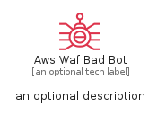

# AwsWafBadBot


```text
aws-q2-2023/Resource/SecurityIdentityCompliance/AwsWafBadBot
```

```text
include('aws-q2-2023/Resource/SecurityIdentityCompliance/AwsWafBadBot')
```


| Illustration | AwsWafBadBot | AwsWafBadBotCard | AwsWafBadBotGroup |
| :---: | :---: | :---: | :---: |
|  |  |  |  |


## Sprites
The item provides the following sriptes:

- `<$AwsWafBadBotXs>`
- `<$AwsWafBadBotSm>`
- `<$AwsWafBadBotMd>`
- `<$AwsWafBadBotLg>`


## AwsWafBadBot

### Load remotely
```plantuml
@startuml
' configures the library
!global $LIB_BASE_LOCATION="https://raw.githubusercontent.com/tmorin/plantuml-libs/master/distribution"

' loads the library's bootstrap
!include $LIB_BASE_LOCATION/bootstrap.puml

' loads the package bootstrap
include('aws-q2-2023/bootstrap')

' loads the Item which embeds the element AwsWafBadBot
include('aws-q2-2023/Resource/SecurityIdentityCompliance/AwsWafBadBot')

' renders the element
AwsWafBadBot('AwsWafBadBot', 'Aws Waf Bad Bot', 'an optional tech label', 'an optional description')
@enduml
```

### Load locally
```plantuml
@startuml
' configures the library
!global $INCLUSION_MODE="local"
!global $LIB_BASE_LOCATION="../../.."

' loads the library's bootstrap
!include $LIB_BASE_LOCATION/bootstrap.puml

' loads the package bootstrap
include('aws-q2-2023/bootstrap')

' loads the Item which embeds the element AwsWafBadBot
include('aws-q2-2023/Resource/SecurityIdentityCompliance/AwsWafBadBot')

' renders the element
AwsWafBadBot('AwsWafBadBot', 'Aws Waf Bad Bot', 'an optional tech label', 'an optional description')
@enduml
```

## AwsWafBadBotCard

### Load remotely
```plantuml
@startuml
' configures the library
!global $LIB_BASE_LOCATION="https://raw.githubusercontent.com/tmorin/plantuml-libs/master/distribution"

' loads the library's bootstrap
!include $LIB_BASE_LOCATION/bootstrap.puml

' loads the package bootstrap
include('aws-q2-2023/bootstrap')

' loads the Item which embeds the element AwsWafBadBotCard
include('aws-q2-2023/Resource/SecurityIdentityCompliance/AwsWafBadBot')

' renders the element
AwsWafBadBotCard('AwsWafBadBotCard', 'Aws Waf Bad Bot Card', 'an optional description')
@enduml
```

### Load locally
```plantuml
@startuml
' configures the library
!global $INCLUSION_MODE="local"
!global $LIB_BASE_LOCATION="../../.."

' loads the library's bootstrap
!include $LIB_BASE_LOCATION/bootstrap.puml

' loads the package bootstrap
include('aws-q2-2023/bootstrap')

' loads the Item which embeds the element AwsWafBadBotCard
include('aws-q2-2023/Resource/SecurityIdentityCompliance/AwsWafBadBot')

' renders the element
AwsWafBadBotCard('AwsWafBadBotCard', 'Aws Waf Bad Bot Card', 'an optional description')
@enduml
```

## AwsWafBadBotGroup

### Load remotely
```plantuml
@startuml
' configures the library
!global $LIB_BASE_LOCATION="https://raw.githubusercontent.com/tmorin/plantuml-libs/master/distribution"

' loads the library's bootstrap
!include $LIB_BASE_LOCATION/bootstrap.puml

' loads the package bootstrap
include('aws-q2-2023/bootstrap')

' loads the Item which embeds the element AwsWafBadBotGroup
include('aws-q2-2023/Resource/SecurityIdentityCompliance/AwsWafBadBot')

' renders the element
AwsWafBadBotGroup('AwsWafBadBotGroup', 'Aws Waf Bad Bot Group', 'an optional tech label') {
    note as note
        the content of the group
    end note
}
@enduml
```

### Load locally
```plantuml
@startuml
' configures the library
!global $INCLUSION_MODE="local"
!global $LIB_BASE_LOCATION="../../.."

' loads the library's bootstrap
!include $LIB_BASE_LOCATION/bootstrap.puml

' loads the package bootstrap
include('aws-q2-2023/bootstrap')

' loads the Item which embeds the element AwsWafBadBotGroup
include('aws-q2-2023/Resource/SecurityIdentityCompliance/AwsWafBadBot')

' renders the element
AwsWafBadBotGroup('AwsWafBadBotGroup', 'Aws Waf Bad Bot Group', 'an optional tech label') {
    note as note
        the content of the group
    end note
}
@enduml
```

