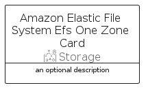

# AmazonElasticFileSystemEfsOneZone


```text
aws-q2-2023/Resource/Storage/AmazonElasticFileSystemEfsOneZone
```

```text
include('aws-q2-2023/Resource/Storage/AmazonElasticFileSystemEfsOneZone')
```


| Illustration | AmazonElasticFileSystemEfsOneZone | AmazonElasticFileSystemEfsOneZoneCard | AmazonElasticFileSystemEfsOneZoneGroup |
| :---: | :---: | :---: | :---: |
|  |  |  |  |


## Sprites
The item provides the following sriptes:

- `<$AmazonElasticFileSystemEfsOneZoneXs>`
- `<$AmazonElasticFileSystemEfsOneZoneSm>`
- `<$AmazonElasticFileSystemEfsOneZoneMd>`
- `<$AmazonElasticFileSystemEfsOneZoneLg>`


## AmazonElasticFileSystemEfsOneZone

### Load remotely
```plantuml
@startuml
' configures the library
!global $LIB_BASE_LOCATION="https://raw.githubusercontent.com/tmorin/plantuml-libs/master/distribution"

' loads the library's bootstrap
!include $LIB_BASE_LOCATION/bootstrap.puml

' loads the package bootstrap
include('aws-q2-2023/bootstrap')

' loads the Item which embeds the element AmazonElasticFileSystemEfsOneZone
include('aws-q2-2023/Resource/Storage/AmazonElasticFileSystemEfsOneZone')

' renders the element
AmazonElasticFileSystemEfsOneZone('AmazonElasticFileSystemEfsOneZone', 'Amazon Elastic File System Efs One Zone', 'an optional tech label', 'an optional description')
@enduml
```

### Load locally
```plantuml
@startuml
' configures the library
!global $INCLUSION_MODE="local"
!global $LIB_BASE_LOCATION="../../.."

' loads the library's bootstrap
!include $LIB_BASE_LOCATION/bootstrap.puml

' loads the package bootstrap
include('aws-q2-2023/bootstrap')

' loads the Item which embeds the element AmazonElasticFileSystemEfsOneZone
include('aws-q2-2023/Resource/Storage/AmazonElasticFileSystemEfsOneZone')

' renders the element
AmazonElasticFileSystemEfsOneZone('AmazonElasticFileSystemEfsOneZone', 'Amazon Elastic File System Efs One Zone', 'an optional tech label', 'an optional description')
@enduml
```

## AmazonElasticFileSystemEfsOneZoneCard

### Load remotely
```plantuml
@startuml
' configures the library
!global $LIB_BASE_LOCATION="https://raw.githubusercontent.com/tmorin/plantuml-libs/master/distribution"

' loads the library's bootstrap
!include $LIB_BASE_LOCATION/bootstrap.puml

' loads the package bootstrap
include('aws-q2-2023/bootstrap')

' loads the Item which embeds the element AmazonElasticFileSystemEfsOneZoneCard
include('aws-q2-2023/Resource/Storage/AmazonElasticFileSystemEfsOneZone')

' renders the element
AmazonElasticFileSystemEfsOneZoneCard('AmazonElasticFileSystemEfsOneZoneCard', 'Amazon Elastic File System Efs One Zone Card', 'an optional description')
@enduml
```

### Load locally
```plantuml
@startuml
' configures the library
!global $INCLUSION_MODE="local"
!global $LIB_BASE_LOCATION="../../.."

' loads the library's bootstrap
!include $LIB_BASE_LOCATION/bootstrap.puml

' loads the package bootstrap
include('aws-q2-2023/bootstrap')

' loads the Item which embeds the element AmazonElasticFileSystemEfsOneZoneCard
include('aws-q2-2023/Resource/Storage/AmazonElasticFileSystemEfsOneZone')

' renders the element
AmazonElasticFileSystemEfsOneZoneCard('AmazonElasticFileSystemEfsOneZoneCard', 'Amazon Elastic File System Efs One Zone Card', 'an optional description')
@enduml
```

## AmazonElasticFileSystemEfsOneZoneGroup

### Load remotely
```plantuml
@startuml
' configures the library
!global $LIB_BASE_LOCATION="https://raw.githubusercontent.com/tmorin/plantuml-libs/master/distribution"

' loads the library's bootstrap
!include $LIB_BASE_LOCATION/bootstrap.puml

' loads the package bootstrap
include('aws-q2-2023/bootstrap')

' loads the Item which embeds the element AmazonElasticFileSystemEfsOneZoneGroup
include('aws-q2-2023/Resource/Storage/AmazonElasticFileSystemEfsOneZone')

' renders the element
AmazonElasticFileSystemEfsOneZoneGroup('AmazonElasticFileSystemEfsOneZoneGroup', 'Amazon Elastic File System Efs One Zone Group', 'an optional tech label') {
    note as note
        the content of the group
    end note
}
@enduml
```

### Load locally
```plantuml
@startuml
' configures the library
!global $INCLUSION_MODE="local"
!global $LIB_BASE_LOCATION="../../.."

' loads the library's bootstrap
!include $LIB_BASE_LOCATION/bootstrap.puml

' loads the package bootstrap
include('aws-q2-2023/bootstrap')

' loads the Item which embeds the element AmazonElasticFileSystemEfsOneZoneGroup
include('aws-q2-2023/Resource/Storage/AmazonElasticFileSystemEfsOneZone')

' renders the element
AmazonElasticFileSystemEfsOneZoneGroup('AmazonElasticFileSystemEfsOneZoneGroup', 'Amazon Elastic File System Efs One Zone Group', 'an optional tech label') {
    note as note
        the content of the group
    end note
}
@enduml
```

