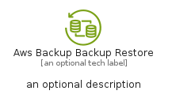

# AwsBackupBackupRestore


```text
aws-q2-2023/Resource/Storage/AwsBackupBackupRestore
```

```text
include('aws-q2-2023/Resource/Storage/AwsBackupBackupRestore')
```


| Illustration | AwsBackupBackupRestore | AwsBackupBackupRestoreCard | AwsBackupBackupRestoreGroup |
| :---: | :---: | :---: | :---: |
|  |  |  |  |


## Sprites
The item provides the following sriptes:

- `<$AwsBackupBackupRestoreXs>`
- `<$AwsBackupBackupRestoreSm>`
- `<$AwsBackupBackupRestoreMd>`
- `<$AwsBackupBackupRestoreLg>`


## AwsBackupBackupRestore

### Load remotely
```plantuml
@startuml
' configures the library
!global $LIB_BASE_LOCATION="https://raw.githubusercontent.com/tmorin/plantuml-libs/master/distribution"

' loads the library's bootstrap
!include $LIB_BASE_LOCATION/bootstrap.puml

' loads the package bootstrap
include('aws-q2-2023/bootstrap')

' loads the Item which embeds the element AwsBackupBackupRestore
include('aws-q2-2023/Resource/Storage/AwsBackupBackupRestore')

' renders the element
AwsBackupBackupRestore('AwsBackupBackupRestore', 'Aws Backup Backup Restore', 'an optional tech label', 'an optional description')
@enduml
```

### Load locally
```plantuml
@startuml
' configures the library
!global $INCLUSION_MODE="local"
!global $LIB_BASE_LOCATION="../../.."

' loads the library's bootstrap
!include $LIB_BASE_LOCATION/bootstrap.puml

' loads the package bootstrap
include('aws-q2-2023/bootstrap')

' loads the Item which embeds the element AwsBackupBackupRestore
include('aws-q2-2023/Resource/Storage/AwsBackupBackupRestore')

' renders the element
AwsBackupBackupRestore('AwsBackupBackupRestore', 'Aws Backup Backup Restore', 'an optional tech label', 'an optional description')
@enduml
```

## AwsBackupBackupRestoreCard

### Load remotely
```plantuml
@startuml
' configures the library
!global $LIB_BASE_LOCATION="https://raw.githubusercontent.com/tmorin/plantuml-libs/master/distribution"

' loads the library's bootstrap
!include $LIB_BASE_LOCATION/bootstrap.puml

' loads the package bootstrap
include('aws-q2-2023/bootstrap')

' loads the Item which embeds the element AwsBackupBackupRestoreCard
include('aws-q2-2023/Resource/Storage/AwsBackupBackupRestore')

' renders the element
AwsBackupBackupRestoreCard('AwsBackupBackupRestoreCard', 'Aws Backup Backup Restore Card', 'an optional description')
@enduml
```

### Load locally
```plantuml
@startuml
' configures the library
!global $INCLUSION_MODE="local"
!global $LIB_BASE_LOCATION="../../.."

' loads the library's bootstrap
!include $LIB_BASE_LOCATION/bootstrap.puml

' loads the package bootstrap
include('aws-q2-2023/bootstrap')

' loads the Item which embeds the element AwsBackupBackupRestoreCard
include('aws-q2-2023/Resource/Storage/AwsBackupBackupRestore')

' renders the element
AwsBackupBackupRestoreCard('AwsBackupBackupRestoreCard', 'Aws Backup Backup Restore Card', 'an optional description')
@enduml
```

## AwsBackupBackupRestoreGroup

### Load remotely
```plantuml
@startuml
' configures the library
!global $LIB_BASE_LOCATION="https://raw.githubusercontent.com/tmorin/plantuml-libs/master/distribution"

' loads the library's bootstrap
!include $LIB_BASE_LOCATION/bootstrap.puml

' loads the package bootstrap
include('aws-q2-2023/bootstrap')

' loads the Item which embeds the element AwsBackupBackupRestoreGroup
include('aws-q2-2023/Resource/Storage/AwsBackupBackupRestore')

' renders the element
AwsBackupBackupRestoreGroup('AwsBackupBackupRestoreGroup', 'Aws Backup Backup Restore Group', 'an optional tech label') {
    note as note
        the content of the group
    end note
}
@enduml
```

### Load locally
```plantuml
@startuml
' configures the library
!global $INCLUSION_MODE="local"
!global $LIB_BASE_LOCATION="../../.."

' loads the library's bootstrap
!include $LIB_BASE_LOCATION/bootstrap.puml

' loads the package bootstrap
include('aws-q2-2023/bootstrap')

' loads the Item which embeds the element AwsBackupBackupRestoreGroup
include('aws-q2-2023/Resource/Storage/AwsBackupBackupRestore')

' renders the element
AwsBackupBackupRestoreGroup('AwsBackupBackupRestoreGroup', 'Aws Backup Backup Restore Group', 'an optional tech label') {
    note as note
        the content of the group
    end note
}
@enduml
```

