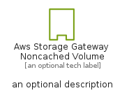
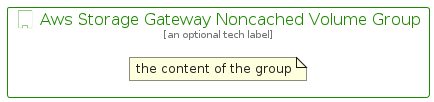

# AwsStorageGatewayNoncachedVolume


```text
aws-q2-2023/Resource/Storage/AwsStorageGatewayNoncachedVolume
```

```text
include('aws-q2-2023/Resource/Storage/AwsStorageGatewayNoncachedVolume')
```


| Illustration | AwsStorageGatewayNoncachedVolume | AwsStorageGatewayNoncachedVolumeCard | AwsStorageGatewayNoncachedVolumeGroup |
| :---: | :---: | :---: | :---: |
|  |  |  |  |


## Sprites
The item provides the following sriptes:

- `<$AwsStorageGatewayNoncachedVolumeXs>`
- `<$AwsStorageGatewayNoncachedVolumeSm>`
- `<$AwsStorageGatewayNoncachedVolumeMd>`
- `<$AwsStorageGatewayNoncachedVolumeLg>`


## AwsStorageGatewayNoncachedVolume

### Load remotely
```plantuml
@startuml
' configures the library
!global $LIB_BASE_LOCATION="https://raw.githubusercontent.com/tmorin/plantuml-libs/master/distribution"

' loads the library's bootstrap
!include $LIB_BASE_LOCATION/bootstrap.puml

' loads the package bootstrap
include('aws-q2-2023/bootstrap')

' loads the Item which embeds the element AwsStorageGatewayNoncachedVolume
include('aws-q2-2023/Resource/Storage/AwsStorageGatewayNoncachedVolume')

' renders the element
AwsStorageGatewayNoncachedVolume('AwsStorageGatewayNoncachedVolume', 'Aws Storage Gateway Noncached Volume', 'an optional tech label', 'an optional description')
@enduml
```

### Load locally
```plantuml
@startuml
' configures the library
!global $INCLUSION_MODE="local"
!global $LIB_BASE_LOCATION="../../.."

' loads the library's bootstrap
!include $LIB_BASE_LOCATION/bootstrap.puml

' loads the package bootstrap
include('aws-q2-2023/bootstrap')

' loads the Item which embeds the element AwsStorageGatewayNoncachedVolume
include('aws-q2-2023/Resource/Storage/AwsStorageGatewayNoncachedVolume')

' renders the element
AwsStorageGatewayNoncachedVolume('AwsStorageGatewayNoncachedVolume', 'Aws Storage Gateway Noncached Volume', 'an optional tech label', 'an optional description')
@enduml
```

## AwsStorageGatewayNoncachedVolumeCard

### Load remotely
```plantuml
@startuml
' configures the library
!global $LIB_BASE_LOCATION="https://raw.githubusercontent.com/tmorin/plantuml-libs/master/distribution"

' loads the library's bootstrap
!include $LIB_BASE_LOCATION/bootstrap.puml

' loads the package bootstrap
include('aws-q2-2023/bootstrap')

' loads the Item which embeds the element AwsStorageGatewayNoncachedVolumeCard
include('aws-q2-2023/Resource/Storage/AwsStorageGatewayNoncachedVolume')

' renders the element
AwsStorageGatewayNoncachedVolumeCard('AwsStorageGatewayNoncachedVolumeCard', 'Aws Storage Gateway Noncached Volume Card', 'an optional description')
@enduml
```

### Load locally
```plantuml
@startuml
' configures the library
!global $INCLUSION_MODE="local"
!global $LIB_BASE_LOCATION="../../.."

' loads the library's bootstrap
!include $LIB_BASE_LOCATION/bootstrap.puml

' loads the package bootstrap
include('aws-q2-2023/bootstrap')

' loads the Item which embeds the element AwsStorageGatewayNoncachedVolumeCard
include('aws-q2-2023/Resource/Storage/AwsStorageGatewayNoncachedVolume')

' renders the element
AwsStorageGatewayNoncachedVolumeCard('AwsStorageGatewayNoncachedVolumeCard', 'Aws Storage Gateway Noncached Volume Card', 'an optional description')
@enduml
```

## AwsStorageGatewayNoncachedVolumeGroup

### Load remotely
```plantuml
@startuml
' configures the library
!global $LIB_BASE_LOCATION="https://raw.githubusercontent.com/tmorin/plantuml-libs/master/distribution"

' loads the library's bootstrap
!include $LIB_BASE_LOCATION/bootstrap.puml

' loads the package bootstrap
include('aws-q2-2023/bootstrap')

' loads the Item which embeds the element AwsStorageGatewayNoncachedVolumeGroup
include('aws-q2-2023/Resource/Storage/AwsStorageGatewayNoncachedVolume')

' renders the element
AwsStorageGatewayNoncachedVolumeGroup('AwsStorageGatewayNoncachedVolumeGroup', 'Aws Storage Gateway Noncached Volume Group', 'an optional tech label') {
    note as note
        the content of the group
    end note
}
@enduml
```

### Load locally
```plantuml
@startuml
' configures the library
!global $INCLUSION_MODE="local"
!global $LIB_BASE_LOCATION="../../.."

' loads the library's bootstrap
!include $LIB_BASE_LOCATION/bootstrap.puml

' loads the package bootstrap
include('aws-q2-2023/bootstrap')

' loads the Item which embeds the element AwsStorageGatewayNoncachedVolumeGroup
include('aws-q2-2023/Resource/Storage/AwsStorageGatewayNoncachedVolume')

' renders the element
AwsStorageGatewayNoncachedVolumeGroup('AwsStorageGatewayNoncachedVolumeGroup', 'Aws Storage Gateway Noncached Volume Group', 'an optional tech label') {
    note as note
        the content of the group
    end note
}
@enduml
```

