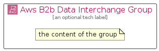

# AwsB2BDataInterchange


```text
aws-q2-2024/Architecture/AppIntegration/AwsB2BDataInterchange
```

```text
include('aws-q2-2024/Architecture/AppIntegration/AwsB2BDataInterchange')
```


| Illustration | AwsB2BDataInterchange | AwsB2BDataInterchangeCard | AwsB2BDataInterchangeGroup |
| :---: | :---: | :---: | :---: |
|  |  |  |  |


## Sprites
The item provides the following sriptes:

- `<$AwsB2BDataInterchangeXs>`
- `<$AwsB2BDataInterchangeSm>`
- `<$AwsB2BDataInterchangeMd>`
- `<$AwsB2BDataInterchangeLg>`


## AwsB2BDataInterchange

### Load remotely
```plantuml
@startuml
' configures the library
!global $LIB_BASE_LOCATION="https://raw.githubusercontent.com/tmorin/plantuml-libs/master/distribution"

' loads the library's bootstrap
!include $LIB_BASE_LOCATION/bootstrap.puml

' loads the package bootstrap
include('aws-q2-2024/bootstrap')

' loads the Item which embeds the element AwsB2BDataInterchange
include('aws-q2-2024/Architecture/AppIntegration/AwsB2BDataInterchange')

' renders the element
AwsB2BDataInterchange('AwsB2bDataInterchange', 'Aws B2b Data Interchange', 'an optional tech label', 'an optional description')
@enduml
```

### Load locally
```plantuml
@startuml
' configures the library
!global $INCLUSION_MODE="local"
!global $LIB_BASE_LOCATION="../../.."

' loads the library's bootstrap
!include $LIB_BASE_LOCATION/bootstrap.puml

' loads the package bootstrap
include('aws-q2-2024/bootstrap')

' loads the Item which embeds the element AwsB2BDataInterchange
include('aws-q2-2024/Architecture/AppIntegration/AwsB2BDataInterchange')

' renders the element
AwsB2BDataInterchange('AwsB2bDataInterchange', 'Aws B2b Data Interchange', 'an optional tech label', 'an optional description')
@enduml
```

## AwsB2BDataInterchangeCard

### Load remotely
```plantuml
@startuml
' configures the library
!global $LIB_BASE_LOCATION="https://raw.githubusercontent.com/tmorin/plantuml-libs/master/distribution"

' loads the library's bootstrap
!include $LIB_BASE_LOCATION/bootstrap.puml

' loads the package bootstrap
include('aws-q2-2024/bootstrap')

' loads the Item which embeds the element AwsB2BDataInterchangeCard
include('aws-q2-2024/Architecture/AppIntegration/AwsB2BDataInterchange')

' renders the element
AwsB2BDataInterchangeCard('AwsB2bDataInterchangeCard', 'Aws B2b Data Interchange Card', 'an optional description')
@enduml
```

### Load locally
```plantuml
@startuml
' configures the library
!global $INCLUSION_MODE="local"
!global $LIB_BASE_LOCATION="../../.."

' loads the library's bootstrap
!include $LIB_BASE_LOCATION/bootstrap.puml

' loads the package bootstrap
include('aws-q2-2024/bootstrap')

' loads the Item which embeds the element AwsB2BDataInterchangeCard
include('aws-q2-2024/Architecture/AppIntegration/AwsB2BDataInterchange')

' renders the element
AwsB2BDataInterchangeCard('AwsB2bDataInterchangeCard', 'Aws B2b Data Interchange Card', 'an optional description')
@enduml
```

## AwsB2BDataInterchangeGroup

### Load remotely
```plantuml
@startuml
' configures the library
!global $LIB_BASE_LOCATION="https://raw.githubusercontent.com/tmorin/plantuml-libs/master/distribution"

' loads the library's bootstrap
!include $LIB_BASE_LOCATION/bootstrap.puml

' loads the package bootstrap
include('aws-q2-2024/bootstrap')

' loads the Item which embeds the element AwsB2BDataInterchangeGroup
include('aws-q2-2024/Architecture/AppIntegration/AwsB2BDataInterchange')

' renders the element
AwsB2BDataInterchangeGroup('AwsB2bDataInterchangeGroup', 'Aws B2b Data Interchange Group', 'an optional tech label') {
    note as note
        the content of the group
    end note
}
@enduml
```

### Load locally
```plantuml
@startuml
' configures the library
!global $INCLUSION_MODE="local"
!global $LIB_BASE_LOCATION="../../.."

' loads the library's bootstrap
!include $LIB_BASE_LOCATION/bootstrap.puml

' loads the package bootstrap
include('aws-q2-2024/bootstrap')

' loads the Item which embeds the element AwsB2BDataInterchangeGroup
include('aws-q2-2024/Architecture/AppIntegration/AwsB2BDataInterchange')

' renders the element
AwsB2BDataInterchangeGroup('AwsB2bDataInterchangeGroup', 'Aws B2b Data Interchange Group', 'an optional tech label') {
    note as note
        the content of the group
    end note
}
@enduml
```

