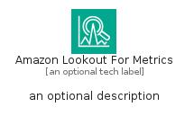
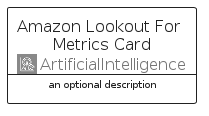
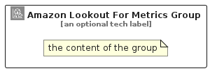

# AmazonLookoutForMetrics


```text
aws-q2-2024/Architecture/ArtificialIntelligence/AmazonLookoutForMetrics
```

```text
include('aws-q2-2024/Architecture/ArtificialIntelligence/AmazonLookoutForMetrics')
```


| Illustration | AmazonLookoutForMetrics | AmazonLookoutForMetricsCard | AmazonLookoutForMetricsGroup |
| :---: | :---: | :---: | :---: |
|  |  |  |  |


## Sprites
The item provides the following sriptes:

- `<$AmazonLookoutForMetricsXs>`
- `<$AmazonLookoutForMetricsSm>`
- `<$AmazonLookoutForMetricsMd>`
- `<$AmazonLookoutForMetricsLg>`


## AmazonLookoutForMetrics

### Load remotely
```plantuml
@startuml
' configures the library
!global $LIB_BASE_LOCATION="https://raw.githubusercontent.com/tmorin/plantuml-libs/master/distribution"

' loads the library's bootstrap
!include $LIB_BASE_LOCATION/bootstrap.puml

' loads the package bootstrap
include('aws-q2-2024/bootstrap')

' loads the Item which embeds the element AmazonLookoutForMetrics
include('aws-q2-2024/Architecture/ArtificialIntelligence/AmazonLookoutForMetrics')

' renders the element
AmazonLookoutForMetrics('AmazonLookoutForMetrics', 'Amazon Lookout For Metrics', 'an optional tech label', 'an optional description')
@enduml
```

### Load locally
```plantuml
@startuml
' configures the library
!global $INCLUSION_MODE="local"
!global $LIB_BASE_LOCATION="../../.."

' loads the library's bootstrap
!include $LIB_BASE_LOCATION/bootstrap.puml

' loads the package bootstrap
include('aws-q2-2024/bootstrap')

' loads the Item which embeds the element AmazonLookoutForMetrics
include('aws-q2-2024/Architecture/ArtificialIntelligence/AmazonLookoutForMetrics')

' renders the element
AmazonLookoutForMetrics('AmazonLookoutForMetrics', 'Amazon Lookout For Metrics', 'an optional tech label', 'an optional description')
@enduml
```

## AmazonLookoutForMetricsCard

### Load remotely
```plantuml
@startuml
' configures the library
!global $LIB_BASE_LOCATION="https://raw.githubusercontent.com/tmorin/plantuml-libs/master/distribution"

' loads the library's bootstrap
!include $LIB_BASE_LOCATION/bootstrap.puml

' loads the package bootstrap
include('aws-q2-2024/bootstrap')

' loads the Item which embeds the element AmazonLookoutForMetricsCard
include('aws-q2-2024/Architecture/ArtificialIntelligence/AmazonLookoutForMetrics')

' renders the element
AmazonLookoutForMetricsCard('AmazonLookoutForMetricsCard', 'Amazon Lookout For Metrics Card', 'an optional description')
@enduml
```

### Load locally
```plantuml
@startuml
' configures the library
!global $INCLUSION_MODE="local"
!global $LIB_BASE_LOCATION="../../.."

' loads the library's bootstrap
!include $LIB_BASE_LOCATION/bootstrap.puml

' loads the package bootstrap
include('aws-q2-2024/bootstrap')

' loads the Item which embeds the element AmazonLookoutForMetricsCard
include('aws-q2-2024/Architecture/ArtificialIntelligence/AmazonLookoutForMetrics')

' renders the element
AmazonLookoutForMetricsCard('AmazonLookoutForMetricsCard', 'Amazon Lookout For Metrics Card', 'an optional description')
@enduml
```

## AmazonLookoutForMetricsGroup

### Load remotely
```plantuml
@startuml
' configures the library
!global $LIB_BASE_LOCATION="https://raw.githubusercontent.com/tmorin/plantuml-libs/master/distribution"

' loads the library's bootstrap
!include $LIB_BASE_LOCATION/bootstrap.puml

' loads the package bootstrap
include('aws-q2-2024/bootstrap')

' loads the Item which embeds the element AmazonLookoutForMetricsGroup
include('aws-q2-2024/Architecture/ArtificialIntelligence/AmazonLookoutForMetrics')

' renders the element
AmazonLookoutForMetricsGroup('AmazonLookoutForMetricsGroup', 'Amazon Lookout For Metrics Group', 'an optional tech label') {
    note as note
        the content of the group
    end note
}
@enduml
```

### Load locally
```plantuml
@startuml
' configures the library
!global $INCLUSION_MODE="local"
!global $LIB_BASE_LOCATION="../../.."

' loads the library's bootstrap
!include $LIB_BASE_LOCATION/bootstrap.puml

' loads the package bootstrap
include('aws-q2-2024/bootstrap')

' loads the Item which embeds the element AmazonLookoutForMetricsGroup
include('aws-q2-2024/Architecture/ArtificialIntelligence/AmazonLookoutForMetrics')

' renders the element
AmazonLookoutForMetricsGroup('AmazonLookoutForMetricsGroup', 'Amazon Lookout For Metrics Group', 'an optional tech label') {
    note as note
        the content of the group
    end note
}
@enduml
```

