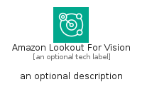
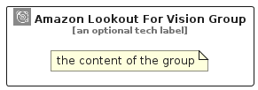

# AmazonLookoutForVision


```text
aws-q2-2024/Architecture/ArtificialIntelligence/AmazonLookoutForVision
```

```text
include('aws-q2-2024/Architecture/ArtificialIntelligence/AmazonLookoutForVision')
```


| Illustration | AmazonLookoutForVision | AmazonLookoutForVisionCard | AmazonLookoutForVisionGroup |
| :---: | :---: | :---: | :---: |
|  |  |  |  |


## Sprites
The item provides the following sriptes:

- `<$AmazonLookoutForVisionXs>`
- `<$AmazonLookoutForVisionSm>`
- `<$AmazonLookoutForVisionMd>`
- `<$AmazonLookoutForVisionLg>`


## AmazonLookoutForVision

### Load remotely
```plantuml
@startuml
' configures the library
!global $LIB_BASE_LOCATION="https://raw.githubusercontent.com/tmorin/plantuml-libs/master/distribution"

' loads the library's bootstrap
!include $LIB_BASE_LOCATION/bootstrap.puml

' loads the package bootstrap
include('aws-q2-2024/bootstrap')

' loads the Item which embeds the element AmazonLookoutForVision
include('aws-q2-2024/Architecture/ArtificialIntelligence/AmazonLookoutForVision')

' renders the element
AmazonLookoutForVision('AmazonLookoutForVision', 'Amazon Lookout For Vision', 'an optional tech label', 'an optional description')
@enduml
```

### Load locally
```plantuml
@startuml
' configures the library
!global $INCLUSION_MODE="local"
!global $LIB_BASE_LOCATION="../../.."

' loads the library's bootstrap
!include $LIB_BASE_LOCATION/bootstrap.puml

' loads the package bootstrap
include('aws-q2-2024/bootstrap')

' loads the Item which embeds the element AmazonLookoutForVision
include('aws-q2-2024/Architecture/ArtificialIntelligence/AmazonLookoutForVision')

' renders the element
AmazonLookoutForVision('AmazonLookoutForVision', 'Amazon Lookout For Vision', 'an optional tech label', 'an optional description')
@enduml
```

## AmazonLookoutForVisionCard

### Load remotely
```plantuml
@startuml
' configures the library
!global $LIB_BASE_LOCATION="https://raw.githubusercontent.com/tmorin/plantuml-libs/master/distribution"

' loads the library's bootstrap
!include $LIB_BASE_LOCATION/bootstrap.puml

' loads the package bootstrap
include('aws-q2-2024/bootstrap')

' loads the Item which embeds the element AmazonLookoutForVisionCard
include('aws-q2-2024/Architecture/ArtificialIntelligence/AmazonLookoutForVision')

' renders the element
AmazonLookoutForVisionCard('AmazonLookoutForVisionCard', 'Amazon Lookout For Vision Card', 'an optional description')
@enduml
```

### Load locally
```plantuml
@startuml
' configures the library
!global $INCLUSION_MODE="local"
!global $LIB_BASE_LOCATION="../../.."

' loads the library's bootstrap
!include $LIB_BASE_LOCATION/bootstrap.puml

' loads the package bootstrap
include('aws-q2-2024/bootstrap')

' loads the Item which embeds the element AmazonLookoutForVisionCard
include('aws-q2-2024/Architecture/ArtificialIntelligence/AmazonLookoutForVision')

' renders the element
AmazonLookoutForVisionCard('AmazonLookoutForVisionCard', 'Amazon Lookout For Vision Card', 'an optional description')
@enduml
```

## AmazonLookoutForVisionGroup

### Load remotely
```plantuml
@startuml
' configures the library
!global $LIB_BASE_LOCATION="https://raw.githubusercontent.com/tmorin/plantuml-libs/master/distribution"

' loads the library's bootstrap
!include $LIB_BASE_LOCATION/bootstrap.puml

' loads the package bootstrap
include('aws-q2-2024/bootstrap')

' loads the Item which embeds the element AmazonLookoutForVisionGroup
include('aws-q2-2024/Architecture/ArtificialIntelligence/AmazonLookoutForVision')

' renders the element
AmazonLookoutForVisionGroup('AmazonLookoutForVisionGroup', 'Amazon Lookout For Vision Group', 'an optional tech label') {
    note as note
        the content of the group
    end note
}
@enduml
```

### Load locally
```plantuml
@startuml
' configures the library
!global $INCLUSION_MODE="local"
!global $LIB_BASE_LOCATION="../../.."

' loads the library's bootstrap
!include $LIB_BASE_LOCATION/bootstrap.puml

' loads the package bootstrap
include('aws-q2-2024/bootstrap')

' loads the Item which embeds the element AmazonLookoutForVisionGroup
include('aws-q2-2024/Architecture/ArtificialIntelligence/AmazonLookoutForVision')

' renders the element
AmazonLookoutForVisionGroup('AmazonLookoutForVisionGroup', 'Amazon Lookout For Vision Group', 'an optional tech label') {
    note as note
        the content of the group
    end note
}
@enduml
```

