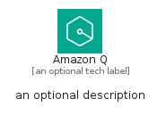
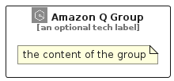

# AmazonQ


```text
aws-q2-2024/Architecture/ArtificialIntelligence/AmazonQ
```

```text
include('aws-q2-2024/Architecture/ArtificialIntelligence/AmazonQ')
```


| Illustration | AmazonQ | AmazonQCard | AmazonQGroup |
| :---: | :---: | :---: | :---: |
|  |  |  |  |


## Sprites
The item provides the following sriptes:

- `<$AmazonQXs>`
- `<$AmazonQSm>`
- `<$AmazonQMd>`
- `<$AmazonQLg>`


## AmazonQ

### Load remotely
```plantuml
@startuml
' configures the library
!global $LIB_BASE_LOCATION="https://raw.githubusercontent.com/tmorin/plantuml-libs/master/distribution"

' loads the library's bootstrap
!include $LIB_BASE_LOCATION/bootstrap.puml

' loads the package bootstrap
include('aws-q2-2024/bootstrap')

' loads the Item which embeds the element AmazonQ
include('aws-q2-2024/Architecture/ArtificialIntelligence/AmazonQ')

' renders the element
AmazonQ('AmazonQ', 'Amazon Q', 'an optional tech label', 'an optional description')
@enduml
```

### Load locally
```plantuml
@startuml
' configures the library
!global $INCLUSION_MODE="local"
!global $LIB_BASE_LOCATION="../../.."

' loads the library's bootstrap
!include $LIB_BASE_LOCATION/bootstrap.puml

' loads the package bootstrap
include('aws-q2-2024/bootstrap')

' loads the Item which embeds the element AmazonQ
include('aws-q2-2024/Architecture/ArtificialIntelligence/AmazonQ')

' renders the element
AmazonQ('AmazonQ', 'Amazon Q', 'an optional tech label', 'an optional description')
@enduml
```

## AmazonQCard

### Load remotely
```plantuml
@startuml
' configures the library
!global $LIB_BASE_LOCATION="https://raw.githubusercontent.com/tmorin/plantuml-libs/master/distribution"

' loads the library's bootstrap
!include $LIB_BASE_LOCATION/bootstrap.puml

' loads the package bootstrap
include('aws-q2-2024/bootstrap')

' loads the Item which embeds the element AmazonQCard
include('aws-q2-2024/Architecture/ArtificialIntelligence/AmazonQ')

' renders the element
AmazonQCard('AmazonQCard', 'Amazon Q Card', 'an optional description')
@enduml
```

### Load locally
```plantuml
@startuml
' configures the library
!global $INCLUSION_MODE="local"
!global $LIB_BASE_LOCATION="../../.."

' loads the library's bootstrap
!include $LIB_BASE_LOCATION/bootstrap.puml

' loads the package bootstrap
include('aws-q2-2024/bootstrap')

' loads the Item which embeds the element AmazonQCard
include('aws-q2-2024/Architecture/ArtificialIntelligence/AmazonQ')

' renders the element
AmazonQCard('AmazonQCard', 'Amazon Q Card', 'an optional description')
@enduml
```

## AmazonQGroup

### Load remotely
```plantuml
@startuml
' configures the library
!global $LIB_BASE_LOCATION="https://raw.githubusercontent.com/tmorin/plantuml-libs/master/distribution"

' loads the library's bootstrap
!include $LIB_BASE_LOCATION/bootstrap.puml

' loads the package bootstrap
include('aws-q2-2024/bootstrap')

' loads the Item which embeds the element AmazonQGroup
include('aws-q2-2024/Architecture/ArtificialIntelligence/AmazonQ')

' renders the element
AmazonQGroup('AmazonQGroup', 'Amazon Q Group', 'an optional tech label') {
    note as note
        the content of the group
    end note
}
@enduml
```

### Load locally
```plantuml
@startuml
' configures the library
!global $INCLUSION_MODE="local"
!global $LIB_BASE_LOCATION="../../.."

' loads the library's bootstrap
!include $LIB_BASE_LOCATION/bootstrap.puml

' loads the package bootstrap
include('aws-q2-2024/bootstrap')

' loads the Item which embeds the element AmazonQGroup
include('aws-q2-2024/Architecture/ArtificialIntelligence/AmazonQ')

' renders the element
AmazonQGroup('AmazonQGroup', 'Amazon Q Group', 'an optional tech label') {
    note as note
        the content of the group
    end note
}
@enduml
```

