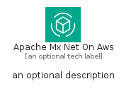
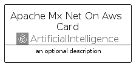
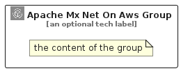

# ApacheMxNetOnAws


```text
aws-q2-2024/Architecture/ArtificialIntelligence/ApacheMxNetOnAws
```

```text
include('aws-q2-2024/Architecture/ArtificialIntelligence/ApacheMxNetOnAws')
```


| Illustration | ApacheMxNetOnAws | ApacheMxNetOnAwsCard | ApacheMxNetOnAwsGroup |
| :---: | :---: | :---: | :---: |
|  |  |  |  |


## Sprites
The item provides the following sriptes:

- `<$ApacheMxNetOnAwsXs>`
- `<$ApacheMxNetOnAwsSm>`
- `<$ApacheMxNetOnAwsMd>`
- `<$ApacheMxNetOnAwsLg>`


## ApacheMxNetOnAws

### Load remotely
```plantuml
@startuml
' configures the library
!global $LIB_BASE_LOCATION="https://raw.githubusercontent.com/tmorin/plantuml-libs/master/distribution"

' loads the library's bootstrap
!include $LIB_BASE_LOCATION/bootstrap.puml

' loads the package bootstrap
include('aws-q2-2024/bootstrap')

' loads the Item which embeds the element ApacheMxNetOnAws
include('aws-q2-2024/Architecture/ArtificialIntelligence/ApacheMxNetOnAws')

' renders the element
ApacheMxNetOnAws('ApacheMxNetOnAws', 'Apache Mx Net On Aws', 'an optional tech label', 'an optional description')
@enduml
```

### Load locally
```plantuml
@startuml
' configures the library
!global $INCLUSION_MODE="local"
!global $LIB_BASE_LOCATION="../../.."

' loads the library's bootstrap
!include $LIB_BASE_LOCATION/bootstrap.puml

' loads the package bootstrap
include('aws-q2-2024/bootstrap')

' loads the Item which embeds the element ApacheMxNetOnAws
include('aws-q2-2024/Architecture/ArtificialIntelligence/ApacheMxNetOnAws')

' renders the element
ApacheMxNetOnAws('ApacheMxNetOnAws', 'Apache Mx Net On Aws', 'an optional tech label', 'an optional description')
@enduml
```

## ApacheMxNetOnAwsCard

### Load remotely
```plantuml
@startuml
' configures the library
!global $LIB_BASE_LOCATION="https://raw.githubusercontent.com/tmorin/plantuml-libs/master/distribution"

' loads the library's bootstrap
!include $LIB_BASE_LOCATION/bootstrap.puml

' loads the package bootstrap
include('aws-q2-2024/bootstrap')

' loads the Item which embeds the element ApacheMxNetOnAwsCard
include('aws-q2-2024/Architecture/ArtificialIntelligence/ApacheMxNetOnAws')

' renders the element
ApacheMxNetOnAwsCard('ApacheMxNetOnAwsCard', 'Apache Mx Net On Aws Card', 'an optional description')
@enduml
```

### Load locally
```plantuml
@startuml
' configures the library
!global $INCLUSION_MODE="local"
!global $LIB_BASE_LOCATION="../../.."

' loads the library's bootstrap
!include $LIB_BASE_LOCATION/bootstrap.puml

' loads the package bootstrap
include('aws-q2-2024/bootstrap')

' loads the Item which embeds the element ApacheMxNetOnAwsCard
include('aws-q2-2024/Architecture/ArtificialIntelligence/ApacheMxNetOnAws')

' renders the element
ApacheMxNetOnAwsCard('ApacheMxNetOnAwsCard', 'Apache Mx Net On Aws Card', 'an optional description')
@enduml
```

## ApacheMxNetOnAwsGroup

### Load remotely
```plantuml
@startuml
' configures the library
!global $LIB_BASE_LOCATION="https://raw.githubusercontent.com/tmorin/plantuml-libs/master/distribution"

' loads the library's bootstrap
!include $LIB_BASE_LOCATION/bootstrap.puml

' loads the package bootstrap
include('aws-q2-2024/bootstrap')

' loads the Item which embeds the element ApacheMxNetOnAwsGroup
include('aws-q2-2024/Architecture/ArtificialIntelligence/ApacheMxNetOnAws')

' renders the element
ApacheMxNetOnAwsGroup('ApacheMxNetOnAwsGroup', 'Apache Mx Net On Aws Group', 'an optional tech label') {
    note as note
        the content of the group
    end note
}
@enduml
```

### Load locally
```plantuml
@startuml
' configures the library
!global $INCLUSION_MODE="local"
!global $LIB_BASE_LOCATION="../../.."

' loads the library's bootstrap
!include $LIB_BASE_LOCATION/bootstrap.puml

' loads the package bootstrap
include('aws-q2-2024/bootstrap')

' loads the Item which embeds the element ApacheMxNetOnAwsGroup
include('aws-q2-2024/Architecture/ArtificialIntelligence/ApacheMxNetOnAws')

' renders the element
ApacheMxNetOnAwsGroup('ApacheMxNetOnAwsGroup', 'Apache Mx Net On Aws Group', 'an optional tech label') {
    note as note
        the content of the group
    end note
}
@enduml
```

