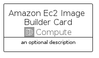
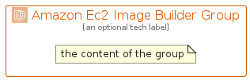

# AmazonEc2ImageBuilder


```text
aws-q2-2024/Architecture/Compute/AmazonEc2ImageBuilder
```

```text
include('aws-q2-2024/Architecture/Compute/AmazonEc2ImageBuilder')
```


| Illustration | AmazonEc2ImageBuilder | AmazonEc2ImageBuilderCard | AmazonEc2ImageBuilderGroup |
| :---: | :---: | :---: | :---: |
|  |  |  |  |


## Sprites
The item provides the following sriptes:

- `<$AmazonEc2ImageBuilderXs>`
- `<$AmazonEc2ImageBuilderSm>`
- `<$AmazonEc2ImageBuilderMd>`
- `<$AmazonEc2ImageBuilderLg>`


## AmazonEc2ImageBuilder

### Load remotely
```plantuml
@startuml
' configures the library
!global $LIB_BASE_LOCATION="https://raw.githubusercontent.com/tmorin/plantuml-libs/master/distribution"

' loads the library's bootstrap
!include $LIB_BASE_LOCATION/bootstrap.puml

' loads the package bootstrap
include('aws-q2-2024/bootstrap')

' loads the Item which embeds the element AmazonEc2ImageBuilder
include('aws-q2-2024/Architecture/Compute/AmazonEc2ImageBuilder')

' renders the element
AmazonEc2ImageBuilder('AmazonEc2ImageBuilder', 'Amazon Ec2 Image Builder', 'an optional tech label', 'an optional description')
@enduml
```

### Load locally
```plantuml
@startuml
' configures the library
!global $INCLUSION_MODE="local"
!global $LIB_BASE_LOCATION="../../.."

' loads the library's bootstrap
!include $LIB_BASE_LOCATION/bootstrap.puml

' loads the package bootstrap
include('aws-q2-2024/bootstrap')

' loads the Item which embeds the element AmazonEc2ImageBuilder
include('aws-q2-2024/Architecture/Compute/AmazonEc2ImageBuilder')

' renders the element
AmazonEc2ImageBuilder('AmazonEc2ImageBuilder', 'Amazon Ec2 Image Builder', 'an optional tech label', 'an optional description')
@enduml
```

## AmazonEc2ImageBuilderCard

### Load remotely
```plantuml
@startuml
' configures the library
!global $LIB_BASE_LOCATION="https://raw.githubusercontent.com/tmorin/plantuml-libs/master/distribution"

' loads the library's bootstrap
!include $LIB_BASE_LOCATION/bootstrap.puml

' loads the package bootstrap
include('aws-q2-2024/bootstrap')

' loads the Item which embeds the element AmazonEc2ImageBuilderCard
include('aws-q2-2024/Architecture/Compute/AmazonEc2ImageBuilder')

' renders the element
AmazonEc2ImageBuilderCard('AmazonEc2ImageBuilderCard', 'Amazon Ec2 Image Builder Card', 'an optional description')
@enduml
```

### Load locally
```plantuml
@startuml
' configures the library
!global $INCLUSION_MODE="local"
!global $LIB_BASE_LOCATION="../../.."

' loads the library's bootstrap
!include $LIB_BASE_LOCATION/bootstrap.puml

' loads the package bootstrap
include('aws-q2-2024/bootstrap')

' loads the Item which embeds the element AmazonEc2ImageBuilderCard
include('aws-q2-2024/Architecture/Compute/AmazonEc2ImageBuilder')

' renders the element
AmazonEc2ImageBuilderCard('AmazonEc2ImageBuilderCard', 'Amazon Ec2 Image Builder Card', 'an optional description')
@enduml
```

## AmazonEc2ImageBuilderGroup

### Load remotely
```plantuml
@startuml
' configures the library
!global $LIB_BASE_LOCATION="https://raw.githubusercontent.com/tmorin/plantuml-libs/master/distribution"

' loads the library's bootstrap
!include $LIB_BASE_LOCATION/bootstrap.puml

' loads the package bootstrap
include('aws-q2-2024/bootstrap')

' loads the Item which embeds the element AmazonEc2ImageBuilderGroup
include('aws-q2-2024/Architecture/Compute/AmazonEc2ImageBuilder')

' renders the element
AmazonEc2ImageBuilderGroup('AmazonEc2ImageBuilderGroup', 'Amazon Ec2 Image Builder Group', 'an optional tech label') {
    note as note
        the content of the group
    end note
}
@enduml
```

### Load locally
```plantuml
@startuml
' configures the library
!global $INCLUSION_MODE="local"
!global $LIB_BASE_LOCATION="../../.."

' loads the library's bootstrap
!include $LIB_BASE_LOCATION/bootstrap.puml

' loads the package bootstrap
include('aws-q2-2024/bootstrap')

' loads the Item which embeds the element AmazonEc2ImageBuilderGroup
include('aws-q2-2024/Architecture/Compute/AmazonEc2ImageBuilder')

' renders the element
AmazonEc2ImageBuilderGroup('AmazonEc2ImageBuilderGroup', 'Amazon Ec2 Image Builder Group', 'an optional tech label') {
    note as note
        the content of the group
    end note
}
@enduml
```

