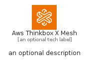
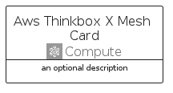
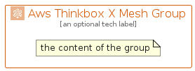

# AwsThinkboxXMesh


```text
aws-q2-2024/Architecture/Compute/AwsThinkboxXMesh
```

```text
include('aws-q2-2024/Architecture/Compute/AwsThinkboxXMesh')
```


| Illustration | AwsThinkboxXMesh | AwsThinkboxXMeshCard | AwsThinkboxXMeshGroup |
| :---: | :---: | :---: | :---: |
|  |  |  |  |


## Sprites
The item provides the following sriptes:

- `<$AwsThinkboxXMeshXs>`
- `<$AwsThinkboxXMeshSm>`
- `<$AwsThinkboxXMeshMd>`
- `<$AwsThinkboxXMeshLg>`


## AwsThinkboxXMesh

### Load remotely
```plantuml
@startuml
' configures the library
!global $LIB_BASE_LOCATION="https://raw.githubusercontent.com/tmorin/plantuml-libs/master/distribution"

' loads the library's bootstrap
!include $LIB_BASE_LOCATION/bootstrap.puml

' loads the package bootstrap
include('aws-q2-2024/bootstrap')

' loads the Item which embeds the element AwsThinkboxXMesh
include('aws-q2-2024/Architecture/Compute/AwsThinkboxXMesh')

' renders the element
AwsThinkboxXMesh('AwsThinkboxXMesh', 'Aws Thinkbox X Mesh', 'an optional tech label', 'an optional description')
@enduml
```

### Load locally
```plantuml
@startuml
' configures the library
!global $INCLUSION_MODE="local"
!global $LIB_BASE_LOCATION="../../.."

' loads the library's bootstrap
!include $LIB_BASE_LOCATION/bootstrap.puml

' loads the package bootstrap
include('aws-q2-2024/bootstrap')

' loads the Item which embeds the element AwsThinkboxXMesh
include('aws-q2-2024/Architecture/Compute/AwsThinkboxXMesh')

' renders the element
AwsThinkboxXMesh('AwsThinkboxXMesh', 'Aws Thinkbox X Mesh', 'an optional tech label', 'an optional description')
@enduml
```

## AwsThinkboxXMeshCard

### Load remotely
```plantuml
@startuml
' configures the library
!global $LIB_BASE_LOCATION="https://raw.githubusercontent.com/tmorin/plantuml-libs/master/distribution"

' loads the library's bootstrap
!include $LIB_BASE_LOCATION/bootstrap.puml

' loads the package bootstrap
include('aws-q2-2024/bootstrap')

' loads the Item which embeds the element AwsThinkboxXMeshCard
include('aws-q2-2024/Architecture/Compute/AwsThinkboxXMesh')

' renders the element
AwsThinkboxXMeshCard('AwsThinkboxXMeshCard', 'Aws Thinkbox X Mesh Card', 'an optional description')
@enduml
```

### Load locally
```plantuml
@startuml
' configures the library
!global $INCLUSION_MODE="local"
!global $LIB_BASE_LOCATION="../../.."

' loads the library's bootstrap
!include $LIB_BASE_LOCATION/bootstrap.puml

' loads the package bootstrap
include('aws-q2-2024/bootstrap')

' loads the Item which embeds the element AwsThinkboxXMeshCard
include('aws-q2-2024/Architecture/Compute/AwsThinkboxXMesh')

' renders the element
AwsThinkboxXMeshCard('AwsThinkboxXMeshCard', 'Aws Thinkbox X Mesh Card', 'an optional description')
@enduml
```

## AwsThinkboxXMeshGroup

### Load remotely
```plantuml
@startuml
' configures the library
!global $LIB_BASE_LOCATION="https://raw.githubusercontent.com/tmorin/plantuml-libs/master/distribution"

' loads the library's bootstrap
!include $LIB_BASE_LOCATION/bootstrap.puml

' loads the package bootstrap
include('aws-q2-2024/bootstrap')

' loads the Item which embeds the element AwsThinkboxXMeshGroup
include('aws-q2-2024/Architecture/Compute/AwsThinkboxXMesh')

' renders the element
AwsThinkboxXMeshGroup('AwsThinkboxXMeshGroup', 'Aws Thinkbox X Mesh Group', 'an optional tech label') {
    note as note
        the content of the group
    end note
}
@enduml
```

### Load locally
```plantuml
@startuml
' configures the library
!global $INCLUSION_MODE="local"
!global $LIB_BASE_LOCATION="../../.."

' loads the library's bootstrap
!include $LIB_BASE_LOCATION/bootstrap.puml

' loads the package bootstrap
include('aws-q2-2024/bootstrap')

' loads the Item which embeds the element AwsThinkboxXMeshGroup
include('aws-q2-2024/Architecture/Compute/AwsThinkboxXMesh')

' renders the element
AwsThinkboxXMeshGroup('AwsThinkboxXMeshGroup', 'Aws Thinkbox X Mesh Group', 'an optional tech label') {
    note as note
        the content of the group
    end note
}
@enduml
```

