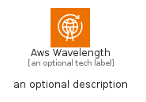
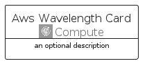
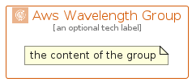

# AwsWavelength


```text
aws-q2-2024/Architecture/Compute/AwsWavelength
```

```text
include('aws-q2-2024/Architecture/Compute/AwsWavelength')
```


| Illustration | AwsWavelength | AwsWavelengthCard | AwsWavelengthGroup |
| :---: | :---: | :---: | :---: |
|  |  |  |  |


## Sprites
The item provides the following sriptes:

- `<$AwsWavelengthXs>`
- `<$AwsWavelengthSm>`
- `<$AwsWavelengthMd>`
- `<$AwsWavelengthLg>`


## AwsWavelength

### Load remotely
```plantuml
@startuml
' configures the library
!global $LIB_BASE_LOCATION="https://raw.githubusercontent.com/tmorin/plantuml-libs/master/distribution"

' loads the library's bootstrap
!include $LIB_BASE_LOCATION/bootstrap.puml

' loads the package bootstrap
include('aws-q2-2024/bootstrap')

' loads the Item which embeds the element AwsWavelength
include('aws-q2-2024/Architecture/Compute/AwsWavelength')

' renders the element
AwsWavelength('AwsWavelength', 'Aws Wavelength', 'an optional tech label', 'an optional description')
@enduml
```

### Load locally
```plantuml
@startuml
' configures the library
!global $INCLUSION_MODE="local"
!global $LIB_BASE_LOCATION="../../.."

' loads the library's bootstrap
!include $LIB_BASE_LOCATION/bootstrap.puml

' loads the package bootstrap
include('aws-q2-2024/bootstrap')

' loads the Item which embeds the element AwsWavelength
include('aws-q2-2024/Architecture/Compute/AwsWavelength')

' renders the element
AwsWavelength('AwsWavelength', 'Aws Wavelength', 'an optional tech label', 'an optional description')
@enduml
```

## AwsWavelengthCard

### Load remotely
```plantuml
@startuml
' configures the library
!global $LIB_BASE_LOCATION="https://raw.githubusercontent.com/tmorin/plantuml-libs/master/distribution"

' loads the library's bootstrap
!include $LIB_BASE_LOCATION/bootstrap.puml

' loads the package bootstrap
include('aws-q2-2024/bootstrap')

' loads the Item which embeds the element AwsWavelengthCard
include('aws-q2-2024/Architecture/Compute/AwsWavelength')

' renders the element
AwsWavelengthCard('AwsWavelengthCard', 'Aws Wavelength Card', 'an optional description')
@enduml
```

### Load locally
```plantuml
@startuml
' configures the library
!global $INCLUSION_MODE="local"
!global $LIB_BASE_LOCATION="../../.."

' loads the library's bootstrap
!include $LIB_BASE_LOCATION/bootstrap.puml

' loads the package bootstrap
include('aws-q2-2024/bootstrap')

' loads the Item which embeds the element AwsWavelengthCard
include('aws-q2-2024/Architecture/Compute/AwsWavelength')

' renders the element
AwsWavelengthCard('AwsWavelengthCard', 'Aws Wavelength Card', 'an optional description')
@enduml
```

## AwsWavelengthGroup

### Load remotely
```plantuml
@startuml
' configures the library
!global $LIB_BASE_LOCATION="https://raw.githubusercontent.com/tmorin/plantuml-libs/master/distribution"

' loads the library's bootstrap
!include $LIB_BASE_LOCATION/bootstrap.puml

' loads the package bootstrap
include('aws-q2-2024/bootstrap')

' loads the Item which embeds the element AwsWavelengthGroup
include('aws-q2-2024/Architecture/Compute/AwsWavelength')

' renders the element
AwsWavelengthGroup('AwsWavelengthGroup', 'Aws Wavelength Group', 'an optional tech label') {
    note as note
        the content of the group
    end note
}
@enduml
```

### Load locally
```plantuml
@startuml
' configures the library
!global $INCLUSION_MODE="local"
!global $LIB_BASE_LOCATION="../../.."

' loads the library's bootstrap
!include $LIB_BASE_LOCATION/bootstrap.puml

' loads the package bootstrap
include('aws-q2-2024/bootstrap')

' loads the Item which embeds the element AwsWavelengthGroup
include('aws-q2-2024/Architecture/Compute/AwsWavelength')

' renders the element
AwsWavelengthGroup('AwsWavelengthGroup', 'Aws Wavelength Group', 'an optional tech label') {
    note as note
        the content of the group
    end note
}
@enduml
```

